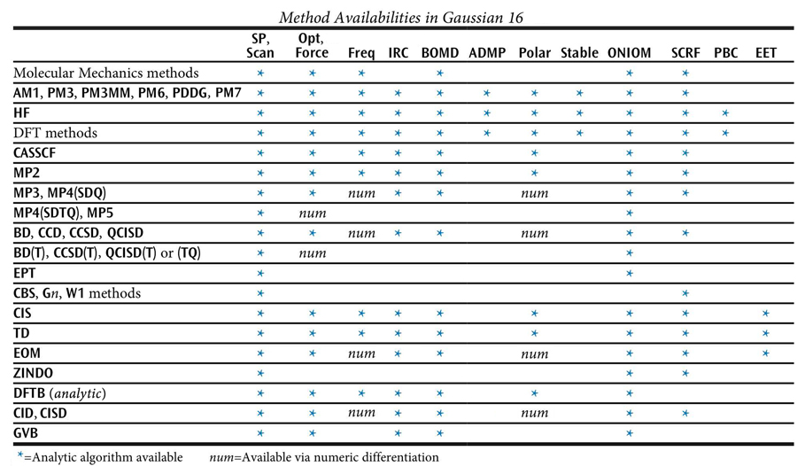

### 2.1 Model Chemistries

The combination of method and basis set specifies a model chemistry to Gaussian, specifying the level of theory. Every Gaussian job must specify both a method and basis set. This is usually accomplished via two separate keywords within the route section of the input file, although a few method keywords imply a choice of basis set. Some jobs using a density functional method may also include a density fitting set (see Basis Sets for more information). The following table lists methods which are available in Gaussian, along with the job types for which each one may be used. An asterisk indicates analytic calculations, while numerical-only calculations are indicated by *num* (see the discussion of the specific keyword in question for details).

If no method keyword is specified, HF is assumed. Most method keywords may be prefaced by R for closed-shell restricted wavefunctions, U for unrestricted open-shell wavefunctions, or RO for restricted openshell wavefunctions: for example, ROHF, UMP2, or RQCISD. RO is available only for Hartree-Fock and Density Functional methods, and AM1, PM3, PM3MM, PM6, and PDDG energies and gradients, and MP2, MP3, MP4, and CCSD energies. In general, *only a single method keyword should be specified*, and including more than one of them will produce *bizarre* results. However, there are exceptions:

- CASSCF may be specified along with MP2 to request a CASSCF calculation including dynamic electron correlation.
- ONIOM and IRCMax jobs require multiple method specifications. However, they are given as options to the corresponding keyword.
- The form *model2 // model1* described in Job Type may be used to generate an automatic optimization followed by a single point calculation at the optimized geometry.
