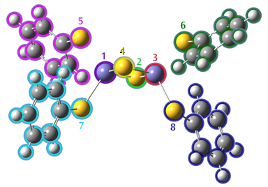

### 5.40 Guess

The Guess keyword controls the initial guess for the Hartree-Fock wavefunction. This keyword is not meaningful without an option. By default, a Harris guess is used.

#### 5.40.1 Options

Algorithm-Related Options

**Harris**

Diagonalize the Harris functional [471] for the initial guess. This is the default for all HF and DFT calculations.

**Huckel**

Requests that a Huckel guess be generated. This is the default for CNDO, INDO, MNDO, and MINDO3. The Huckel guess should be considered for PM6 calculations involving many second-row atoms.

**RdScale**

Read in the scale factor on atomic hardnesses used in iterative extended Huckel. The default is 7.0 times the QEq value.

**OldHuckel**

Use the old Huckel guess (pre-Gaussian 03) instead of CNDO or the updated Huckel.

**INDO**

Use the Gaussian 98 default guess: INDO for first-row systems, CNDO for second-row, and Huckel for third-row and beyond.

**AM1**

Do an AM1 calculation for the initial guess (currently only works with sparse matrix code). Guess=(AM1, Always) causes later steps in a geometry optimization to generate a new guess at each point and compare the energies with the density from the old point and the new guess and take the best one.

**Core**

Requests that the core Hamiltonian be diagonalized to form the initial guess. This is the default for AM1, PM3, PM3MM, PM6, and PDDG.

**TightConvergence**

Change the defaults to 10−10 convergence on SCF and 10−8 for CIS, TD and CC. CPHF convergence is not changed.

Orbital-Related Options

**Permute**

Read in a permutation of orbitals in the initial guess. The numbers of the generated guess orbitals are given in the order in which they should be used in the SCF. Ranges (e.g. 7–12) can be used, and all orbitals not listed are put in after the listed orbitals in their original order. Separate permutation lists for α and β orbitals must be specified (each list separated by a blank line) for open shell systems.

**Alter**

Indicates that the orbitals selected for occupation in the Hartree-Fock wavefunction should not be those

of lowest energy. Normally, the occupied orbitals are selected as those with lowest eigenvalues for the one-electron Hamiltonian used in the initial guess programs. The alteration sections consist of a set of transpositions indicating that one of these occupied orbitals is to be replaced by one of the other (virtual) orbitals. Each such transposition is on a separate line and has two integers *N* 1 and *N* 2 (free format, separated by spaces or a comma as usual) indicating that orbital *N* 1 is to be swapped with orbital *N* 2. The list of orbital transpositions is terminated by the blank line at the end of the input section. For UHF calculations, two such orbital alteration sections are required, the first specifying transpositions of α orbitals and the second specifying transpositions of β orbitals. Both sections are always required. Thus, even if only α transpositions are needed, the β section is required even though it is empty (and vice-versa). The second blank line to indicate an empty β section must be included.

**Mix**

Requests that the HOMO and LUMO be mixed so as to destroy α −β and spatial symmetries. This is useful in producing UHF wavefunctions for singlet states. Mixing orbitals is only done by default when generating a complex initial guess. NoMix says to not mix orbitals.

**DensityMix[=_N_]**

Whether to mix occupied and virtual orbital contributions in forming the initial guess density. *N* defaults to -3 (use Huckel eigenvalues to decide which orbitals to mix).

**CopyChk**

Copy the MOs and density unedited, unprojected and unchecked from the checkpoint file for the guess. Useful when importing from matrix element files.

**Biorthogonalize**

For an unrestricted guess, biorthogonalize the α and β MOs to maximally pair electrons of opposite spin. Done automatically when a UHF wavefunction is read-in as a guess for ROHF. This option is also useful in the combination of Guess=(BiOrth,Read,Only,Save) to replace the canonical UHF orbitals with ones which have alpha and beta orbitals matched up as much as possible for viewing in GaussView or other visualization packages.

**NaturalOrbitals**

Include natural orbitals in the checkpoint file. This must be accomplished via a separate job step specifying this option as well as Only and Save. See the discussion of the Population keyword for details.

Procedural Options

**Only**

Guess=Only functions as a calculation type keyword and requests that the calculation terminate once the initial guess is computed and printed. Note that the amount of orbital information that is printed is controlled by the Pop keyword. Guess=Only may not be used with the MOPAC-based semi-empirical methods (INDO, CNDO, MNDO, MINDO3). This option is useful in preliminary runs to check if configuration alteration is necessary. For example, Guess=Only may be specified with CASSCF in order to obtain information on the number of CI configurations in the CAS active space (as well as the initial orbitals). Guess=(Only,Read) may also be used to produce population and other post-calculation analyses from the data in a checkpoint file. For example, these options alone will produce a population analysis using the wavefunction in the checkpoint file. Guess(Only,Read) Prop will cause electrostatic properties to be

calculated using the wavefunction in the checkpoint file.

**Always**

Requests that a new initial guess be generated at each point of an optimization. By default, the SCF results from the last point are used for the guess at the next point.

**Fragment=_N_**

Generate a guess built from fragment guesses or SCF solutions. The guess is saved on the checkpoint file regardless of if it is used in the current calculation, allowing it to be used in subsequent ones. This option is usually combined with Guess=Only to generate a guess from fragment guess orbitals (otherwise a full SCF calculation is performed for each fragment). Assignment of atoms to fragments and fragment charges and multiplicities are specified as described in Molecule Specifications, except that a negative spin multiplicity means that the unpaired orbitals for the fragment are to become β spin orbitals in the combined set.

**Local**

Requests that orbitals be localized using the Boys method [184]. Occupied and virtual orbitals are localized separately, and the irreducible representations (after possible merging using LowSymm or NoSymm) are not mixed. Localized orbital analysis of a converged SCF wavefunction may then be done using a second job step, which includes Guess(Read,Local,Only) and Pop=Full in its route section.

**Sparse**

Perform a sparse SE calculation for the initial guess. This option may be useful for very, very large HF or DFT calculations using the sparse matrix facility.

**Extra**

Do an extra, new initial guess when reading orbitals from the RWF (i.e., during geometry optimizations). By default, this is done if the default Harris guess is allowed, no alteration of configuration was requested, and the optimization did not take a small step as flagged by variable 4 in `ILSW`. Use NoExtra to disable this feature.

**Fock**

Reuse Fock matrices rather than orbitals when reading from previous results from the read-write or checkpoint files. This is the default for periodic boundary conditions calculations if Guess=Alter is not specified. NoFock disables this behavior, and it is the default for non-PBC calculations.

Guess Reading/Saving Options

**Read**

Requests that the initial guess be read from the checkpoint file (Guess=Read is often specified along with Geom=Checkpoint). This option may be combined with Alter, in which case the orbitals are read from the checkpoint file, projected onto the current basis set, and then the specified alterations are made. Checkpoint is a synonym for Read. The TCheck option says to attempt to read a guess from the checkpoint file but to generate a new one if necessary.

**Alpha**

Use alpha orbitals for both alpha and beta guess during Guess=Read.

**Translate**

Translate requests that the coordinates of the atoms used to produce a guess, which is read in, be translated to the current atomic coordinates. This is the default. It may fail in unusual cases, such as when a wave-

function is used as a guess for a system with a different stoichiometry, in which case Guess=NoTranslate should be specified.

**Cards**

Specifies that after the initial guess is generated, some or all of the orbitals will be replaced with ones read from the input stream. This option can be used to read a complete initial guess from the input stream by replacing every orbital. The replacement orbitals are placed in the input section following the guess alteration commands, if any. For UHF, there are separate α and β replacement orbital input sections. The replacement orbitals input section (the α replacement orbitals section for UHF) begins with a line specifying the Fortran format with which to read the replacement orbital input, enclosed in parentheses. For example: (`4E20.8`). The remainder of the section contains one or more instances of the following:

*IVecOrbital to replace (0=end, -1=replace all orbitals in order).* *(A(I,IVec),I=1,N)New orbital in the format specified in the first line.*

The format for the line containing *IVec* is Fortran I5. The β orbital replacement section for UHF calculations differs only in that it omits the initial format specification line. See the examples section for sample replacement orbital input.

**Input**

Read a line from the input file containing the name of a checkpoint file. Instead of a filename, you can specify one of the following keywords:

- generate says to generate a guess as usual.
- read and chk say to retrieve data from the job’s checkpoint file. They are thus equivalent to Guess=Read, and use the checkpoint file specified to %Chk or %OldChk as usual.
- none says to skip generating a guess at all.
- dummy generates a dummy guess that does not require any work. See the examples section for information about using this option with ONIOM.

**Restart**

Start a new SCF calculation using the restart data saved on the checkpoint file from a job with a different geometry and/or basis set. (The option name is a bit of a misnomer.)

**Save**

Save the generated initial guess back into the checkpoint file at the conclusion of a Guess=Only run. This option is useful for saving localized orbitals.

**Print**

Print the initial guess.

Symmetry-Related Options

**LowSymm**

Requests that irreducible representations of the molecular point group be combined in the symmetry information used in the *N* 3 steps in the SCF to allow lowered symmetry of the wavefunction. This enables the orbitals (and possibly but not necessarily the total wavefunction) to have lower symmetry than the full molecular point group. This option is available only for GVB calculations, where it is often necessary for calculations on symmetric systems (see the discussion of the GVB keyword below for an example using this option).

The option expects a single line of input (in the format `16I2`) giving the *numbers* of the irreducible representations to combine, with the new groups separated by 0; the list itself must be terminated by a 9. The numbers correspond to the order in which the representations are listed by Link 301 in the output file (see the examples subsection below). Since this input section is always exactly one line long, it is not terminated by a blank line. Note that irreducible representations are combined before orbital localization is done and that localized orbitals retain whatever symmetry is kept. Guess=NoSymm removes all orbital symmetry constraints without reading any input.

**NoSymm**

Requests that all orbital symmetry constraints be lifted. Synonymous with SCF=NoSymm and Symm=NoSCF.

**ForceAbelianSymmetry**

Force the initial guess orbitals to transform according to irreducible representations of the Abelian point group. NoForceAbelianSymmetry is the default.

Valid Option Combinations Only reasonable combinations are valid. For example Guess=(Always,Alter) and Guess=(Read,Alter) work as expected (in the former case, alterations are read once and the same interchanges are applied at each geometry). Conversely, Guess=(Always,Read) is contradictory and will lead to unpredictable results. Refer to the input sections order table at the beginning of this chapter to determine the ordering of the input sections for combinations of options like Guess=(Cards,Alter).

#### 5.40.2 Restrictions

Guess=Only may not be used with the MOPAC-based semi-empirical methods: INDO, CNDO, MNDO, and MINDO3.

#### 5.40.3 Related Keywords

Geom, Pop

#### 5.40.4 Examples

Transposing Two Orbitals with Guess=Alter This example finds the UHF/STO-3G structure of the 2 *A* 1 excited state of the amino radical. First, a Guess=Only calculation is run to determine whether any alter (reordering) instructions are needed to obtain the desired electronic state. The HF/STO-3G theoretical model is used by default:

```
#Guess=OnlyTest
Aminoradicaltestofinitialguess
02
n
h1nh
h1nh2hnh
```

```
nh1.03
hnh120.0
```

Here is the orbital symmetry summary output from the job, which comes immediately before the population analysis in the output:

```
Initialguessorbitalsymmetries:
AlphaOrbitals:
Occupied(A1)(A1)(B2)(A1)(B1)
Virtual(A1)(B2)
BetaOrbitals:
Occupied(A1)(A1)(B2)(A1)
Virtual(B1)(A1)(B2)
Theelectronicstateoftheinitialguessis2-B1.
Initialguess<Sx>=0.0000<Sy>=0.0000<Sz>=0.5000<S**2>=0.7500S=0.5000
```

Since a doublet state is involved, α and β orbitals are given separately. From the orbital symmetries, the electron configuration in the initial guess is *a* 21 *a* 21 *b* 22 *a* 21 *b* 11, yielding a 2 *B* 1 wavefunction. This is indeed the ground state of NH2. The expectation value of S2 for the unrestricted initial guess is printed, in this case, that corresponding to a pure doublet: 0.75. Since we want to model the 2 *A* 1 excited state of the amino radical, we will need to alter this initial orbital configuration: a β electron must be moved from orbital 4 to orbital 5 (the electron configuration is then *a* 21 *a* 21 *b* 22 *b* 21 *a* 11).

Guess=Alter may be used to accomplish this. Here is the input for the geometry optimization:

```
#UHF/6-31G(d)OptGuess=Alter
Aminoradical:HF/6-31G(d)
Structureof2-A1state
02
n
h1nh
h1nh2hnh
Variables:
nh1.03
hnh120.0
```

*Blank line ends the molecule specification section.* *Blank line ends the alpha section (empty in this case).* `4 5` *Transpose orbitals 4 and 5.* *End of the beta alteration section.*

Note that an extra blank line – line 14 – is necessary to indicate an empty α alteration section. The final two lines then constitute the β alteration section. The initial guess program prints a list of orbitals that were interchanged as a result of the Alter option:

```
HarrisfunctionalwithIExCor=205diagonalizedforinitialguess.
```

···

```
NoAlphaorbitalsswitched.
PairsofBetaorbitalsswitched:
45
Initialguessorbitalsymmetries:
AlphaOrbitals:
Occupied(A1)(A1)(B2)(A1)(B1)
Virtual(A1)(B2)(B1)(A1)(B2)(A1)(B2)(A1)(A2)(A1)
(B1)(A1)(B2)(A1)
BetaOrbitals:
Occupied(A1)(A1)(B2)(B1)
Virtual(A1)(A1)(B2)(B1)(A1)(B2)(A1)(B2)(A1)(A2)
(A1)(B1)(A1)(B2)(A1)
Theelectronicstateoftheinitialguessis2-A1.
Initialguess<Sx>=0.0000<Sy>=0.0000<Sz>=0.5000<S**2>=0.7500S=0.5000
```

The SCF calculation follows, and the energy and S2 eigenvalue for the UHF wavefunction are printed. The S2 value which results if contamination of the wavefunction from the next possible spin multiplicity (quartets for doublets, quintets for triplets, etc.) is removed is also printed:

```
SCFDone:E(UHF)=-55.4915172451A.U.after12cycles
Convg=0.2693D-08-V/T=2.0038
<Sx>=0.0000<Sy>=0.0000<Sz>=0.5000<S**2>=0.7534S=0.5017
<L.S>=0.000000000000E+00
Annihilationofthefirstspincontaminant:
S**2beforeannihilation0.7534,after0.7500
```

Although this calculation does in fact converge correctly to 2 *A* 1 state, it sometimes happens that the order of orbital symmetries switches during the course of the SCF iterations. If the orbital symmetries of the final wavefunction are different from those in the initial guess (whether or not you are using Guess=Alter), we recommend using the direct minimization routine, specified with the SCF=QC or SCF=DM keywords, which usually holds symmetry from one iteration to the next.

Reordering Orbitals with Guess=Permute This option is often is the easiest way to perform a complex modification of the initial guess, as in this example:

```
#CASSCF/6-31G(d,p)OptGuess=PermutePop=Reg
CASjob
01
```

*molecule specification*

`1-60 65 63 64 66 68 67 61-62 69` *Specify new orbital ordering.*

Here, we have rearranged orbitals 61-68. Listing the final orbital (69) is not really necessary, but it helps to make the input easier to understand for humans.

Specifying Calculation-Specific Guesses for ONIOM with Guess=Input The Guess=Input is useful for ONIOM jobs where the SCF is hard to converge for some of the subcalculations at the initial geometry. Convergence can be accomplished using a procedure like the following:

**Step 1.** Use ONIOM=OnlyInput to print out input files for the individual calculations.

**Step 2.** Converge the SCF for the problem step separately (for example, using Stable=Opt).

**Step 3.** After verifying that the correct state has been found, run an ONIOM calculation with Guess=Input to

retrieve the correct initial guesses for the individual states. In the ONIOM input file, you will then have a line for the guess for each calculation (i.e., 3 lines for a 2-layer MO:MO), where each line can be a checkpoint file name or read (for Guess=Read from the regular checkpoint file) or generate (generate a new initial guess), as appropriate. For example, if only the high level calculation on the model system was problematic, the input would be:

*generateLow level calculation on the real system.* *Blank line.* *guess_for_high.chkHigh level calculation on the model system.* *Blank line.* *generateLow level calculation on the model system.*

Reading in Orbitals with Guess=Cards

Some or all of the orbitals may be replaced, after the initial guess is generated, using Guess=Cards. Here is some sample input for this option, which replaces orbitals 1 and 4 (note that the format for the third and following lines is specified in line 1):

```
(3E20.8)
1
0.5809834509E+000.4612416518E+00-0.6437319952E-04
0.1724432549E-020.1282235396E-140.5417658499E-13
0.1639966912E-02-0.9146282229E-15-0.6407549694E-13
-0.4538843604E-030.6038992958E-04-0.1131035485E-03
0.6038992969E-04-0.1131035471E-03
4
0.7700779642E-130.1240395916E-12-0.3110890228E-12
-0.4479190461E-12-0.1478805861E-130.5807753928E+00
0.6441113412E-12-0.3119296374E-140.1554735923E+00
-0.1190754528E-110.2567325943E+000.1459733219E+00
-0.2567325943E+00-0.1459733219E+00
0
```

An orbital number of zero ends the replacement orbital input.

Antiferromagnetic Coupling

Here is an example of a fragment guess job. The first step generates guesses for each one of the fragments and then combines them together into a guess for the SCF on the full molecule. The second step reads in that guess for a subsequent calculation. The charge and multiplicity line has the overall molecular charge and multiplicity first, followed by those for each fragment.

This example is Fe2S2 + 4 S-R ligands, where R is a phenyl group. It is a singlet with an overall charge of -2. The guess does each bare sulfur as S(2−) closed-shell (fragments 2 and 4), the two irons as Fe(3+) sextets antiferromagnetically coupled (fragments 1 and 3, with 1 being alpha-spin and 3 beta-spin), and each of the S-R fragments (5-8) as closed-shell singlet anions. Figure 5.1: Fragment Assignments

```
%chk=FragGuess
%mem=64mw
#PUBP86/6-311G(d)Guess=(Fragment=8,Only)Pop=None
Fe2S2clusterwithphenylthiolates.
Step1:Generatefragmentguess
-2,13,6-2,13,-6-2,1-1,1-1,1-1,1-1,1
H(Fragment=7)23.50102.28738.5744
S(Fragment=2)14.84951.14907.0431
Fe(Fragment=3)17.04301.00917.0068
S(Fragment=4)17.4565-1.14907.0431
S(Fragment=5)14.3762-2.15818.7983
C(Fragment=5)12.5993-2.18488.6878
H(Fragment=5)12.3743-3.651310.1678
C(Fragment=5)10.4994-3.11229.4309
H(Fragment=5)9.9929-3.757910.0022
C(Fragment=5)9.8049-2.27918.5639
H(Fragment=5)8.8050-2.28738.5744
C(Fragment=5)10.4833-1.41467.6615
H(Fragment=5)9.9730-0.85257.0106
```



```
S(Fragment=8)14.3794-1.80915.0446
C(Fragment=5)11.9048-1.36757.7057
H(Fragment=5)12.4158-0.78437.0743
C(Fragment=6)17.29993.42654.6624
C(Fragment=6)16.63764.19675.6090
H(Fragment=6)16.50223.84946.5369
C(Fragment=6)16.15305.48565.2463
H(Fragment=6)15.66656.04725.9155
C(Fragment=6)16.34685.92574.0431
H(Fragment=6)16.02366.84083.8020
C(Fragment=6)17.00915.13983.0522
H(Fragment=6)17.13305.49442.1254
C(Fragment=6)17.47753.88233.3884
H(Fragment=6)17.94003.31492.7071
S(Fragment=7)17.92982.15818.7983
C(Fragment=7)19.70672.18488.6878
C(Fragment=7)20.41743.06509.5194
H(Fragment=7)19.93173.651310.1678
C(Fragment=7)21.80663.11229.4309
H(Fragment=7)22.31323.757910.0022
C(Fragment=7)22.50112.27918.5639
C(Fragment=7)21.82271.41467.6615
H(Fragment=7)22.33300.85257.0106
C(Fragment=7)20.40121.36757.7057
H(Fragment=7)19.89020.78437.0743
C(Fragment=8)15.0061-3.42654.6624
Fe(Fragment=1)15.2630-1.00917.0068
C(Fragment=8)15.6684-4.19675.6090
H(Fragment=8)15.8038-3.84946.5369
C(Fragment=8)16.1530-5.48565.2463
H(Fragment=8)16.6395-6.04725.9155
C(Fragment=5)11.8886-3.06509.5194
C(Fragment=8)15.9592-5.92574.0431
H(Fragment=8)16.2824-6.84083.8020
C(Fragment=8)15.2969-5.13983.0522
H(Fragment=8)15.1730-5.49442.1254
C(Fragment=8)14.8285-3.88233.3884
H(Fragment=8)14.3660-3.31492.7071
S(Fragment=6)17.92661.80915.0446
--Link1--
%chk=FragGuess
%mem=64mw
```

`#P UBP86/6-311G*/Auto Guess=Read Geom=AllCheck` ···
