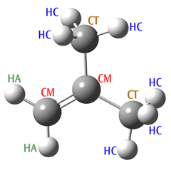
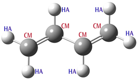

### 5.53 MM (Molecular Mechanics) Methods

There are three Molecular Mechanics methods available in Gaussian. They were implemented for use in ONIOM calculations, but they are also available as independent methods. No basis set keyword should be specified with these keywords. The following force fields are available:

- Amber: The Amber force field as described in [Cornell95]. The actual parameters (*parm96.dat*) have been updated slightly since the publication of this paper. We use this current version from the Amber web site (`ambermd.org`).
- Dreiding: The Dreiding force field as described in [Mayo90].
- UFF: The UFF force field as described in [Rappe92].

#### 5.53.1 Availability

Analytic energies, gradients, and frequencies.

#### 5.53.2 Atom Types & Charges

Molecular Mechanics Molecule Specifications Molecular Mechanics calculations use atom types to determine the functions and parameters which make up the force field. For a single element, such as carbon, there can be many different MM atom types. Which one to use depends on aspects such as the hybridization, chemical environment, and so on. Gaussian will attempt to assign atom types automatically for UFF and Dreiding calculations. However, Amber calculations require that all atom types be explicitly specified within the molecule specification section, as in these examples:

```
C-CT Specifies an SP3 aliphatic carbon atom, denoted by the Amber CT keyword.
C-CT-0.32 Specifies an SP3 aliphatic carbon atom with a partial charge of +0.32.
O-O-0.5 Specifies a carbonyl group oxygen atom (type O) with a partial charge of -0.5.
```

The atom type keyword is specified following the element symbol and a separating hyphen. Consult the Amber paper [528] for definitions of atom types and their associated keywords. As the second and third lines in the example illustrate, partial charges may also be specified, as the third component of the atom description, preceded again by a hyphen separator. Partial atomic (point) charges are used to compute the electrostatic interactions. Gaussian can assign these charges automatically using the QEq

formalism [529]. Request this by specifying the QEq option to the MM keyword: e.g., Dreiding=QEq. Note that these charges depend on the geometry and are computed at the beginning of the calculation; however, they are not updated during the course of an optimization or other process that changes the geometry. Atom types and charges may also be provided for UFF and Dreiding calculations if desired. Be aware that the automatic assignment of UFF and Dreiding atom types is only reliable for well-defined systems, and it is often safer to specify them explicitly. When using MM methods, and especially when you are modifying force field terms or defining new ones (as discussed below), it is often necessary to specify the connectivity between atoms explicitly, using Geom=Connectivity. Note that GaussView includes this input section automatically when it constructs input files.

Charge Assignment-Related Options

Unless set in the molecule specification input, no charges are assigned to atoms by default when using any molecular mechanics force field. Options are available to estimate charges at the initial point using the QEq algorithm [529], under control of the following options, for any of the mechanics keywords:

**QEq**

Assign charges to all atoms using the QEq method [529]. OldQEq requests an older version which was default in G09 Rev. C [530].

**UnTyped**

Assign QEq charges only to those atoms for which the user did not specify a particular type in the input.

**UnCharged**

Assign QEq charges only for atoms which have MM charge zero (i.e., all atoms which were untyped or which were given a type but not a charge in the input), constraining the other atoms to retain their specified charges.

#### 5.53.3 Options

Parameter Precedence Options

*Terminology*: Gaussian contains built-in parameter sets for the built-in force fields listed above; these are referred to as *hard-wired* parameters. *Soft* parameters are ones specified by the user in the input stream for the current job (or a previous job when reading parameters from the checkpoint file). By default, when no relevant option is given, the hard-wired parameters are the *only ones* used. This topic is discussed in detail in Specifications tab.

**HardFirst**

Read additional parameters from the input stream, with hard-wired parameters having priority over the read-in, soft ones. Hence, read-in parameters are used only if there is no corresponding hard-wired value. Note that wildcard matches within the hard-wired parameter set take precedence over soft parameters, even when the latter contains an exact match for the same item. Use SoftFirst if you want to override hard-wired parameter matches.

**SoftFirst**

Read additional parameters from the input stream, with soft (read-in) parameters having priority over the hard-wired values.

**SoftOnly**

Read parameters from the input stream and use only them, ignoring hard-wired parameters.

Handling Multiple Parameter Specification Matches

Since parameters can be specified using wildcards (see the Specifying Force Fields tab), it is possible for more than one parameter specification to match a given structure. The default is to abort if there are any ambiguities in the force field. The following options specify other ways of dealing with multiple matches.

**FirstEquiv**

If there are equivalent matches for a required parameter, use the first one found.

**LastEquiv**

If there are equivalent matches for a required parameter, use the last one found.

Reading MM Parameters from the Checkpoint File

By default, when the geometry is read-in from the checkpoint file with Geom=Check or Geom=AllCheck, any non-standard (soft) parameters present in the checkpoint file are also retrieved. These read-in parameters are used with higher priority than corresponding hard-wired parameters, unless HardFirst is also specified. The following options can be used to modify this default behavior.

**ChkParameters**

Read only the MM parameters from the checkpoint file. Any non-standard (soft) parameters present in the checkpoint file are used with higher priority than corresponding hard-wired parameters, unless HardFirst is also specified. Not valid with Geom=Check or Geom=AllCheck.

**NewParameters**

Ignore any parameters in the checkpoint file when reading the geometry.

**Modify**

Read additional parameter specifications and modifications after combining any soft parameters from the checkpoint file and the hard-wired parameters (as controlled by the precedence options). This option works analogously to Geom=Modify.

Printing MM Parameters

**Print**

By default, only the contributions to the energy are printed (i.e., from bond stretches, bends, electrostatics, etc.) when #P is specified. The Print option will also print the energy contributions and the force field parameters at the first geometry, and the energy contributions at later ones (since the parameters don’t change). It will print two sets of parameters for ONIOM(MO:MM) since different parameters are assigned for the model and real systems (i.e., since H may replace a C link atom). Note that the parameters are printed for all atoms in the system, but not in a form suitable for input. The internally stored parameters are already provided in the form of input files in the main Gaussian directory (*amber.prm*, *uff.prm*, etc.), along with files for some force fields which are not stored internally (*amber98.prm* and *oplsaa.prm*). Printing for all atoms in the current job is still useful because complex rules are involved in deciding what parameters are actually applied to a given bond, dihedral, etc.

Switching Functions Options

**VRange=_N_**

Set the van der Waals cutoff to *N* Å. This is ROff if soft cutoffs are used, which is the default. *N*<0 for

hard cutoffs.

**CRange=_N_**

Set the Coulomb cutoff to *N* Å. Negative for hard cutoffs. The potential is (*QiQ j*(1−*R* 2/*N* 2)2)/*R*

**CutRad=_M_**

Use soft cutoffs with radius *M* (in Å), with either van der Waals or Coulomb if VRange or CRange was set. Thus with N, M the soft cutoffs have ROn=*N-M*, ROff=*N*.

**Switch=_value_**

Switch=YK means use the York-Karplus function, which is the default. Switch=CHARMM means use CHARMM-style switching for van der Waals. Switch=CHARMMSq means to use CHARMM-style expression but with R2 instead of R for van der Waals switching. Switch=*N* means use switching function number *N*.

#### 5.53.4 MM Potential Functions

Gaussian offers a tremendous amount of flexibility to users that want to modify or otherwise customize MM force fields. This section discusses the specifics of doing so, and it begins with some required background information necessary for understanding the function and parameter input. A basic MM potential function is usually of the form: () *Kr* (*r* −*req*)2 *K* θ (θ −θ *eq*)2 *VnAijij* −*Bijij* + *qiq jEtotal*= ∑+ ∑+ ∑2 [1+cos(*n* ϕ −γ)]+ ∑ *r* 12 *r* 6ε *rij* *bondsanglesdihedralsi*<*j* stretch termsbend termstorsional termsnon-bonded interactions *Molecular Mechanics Potential Function*

As noted, the terms of the expansion are the stretch terms (bonds), bend terms (bond angles), torsional terms (dihedral angles), and non-bonded interactions. The particular forms of the individual functions in this equation are from the Amber force field, which uses simple harmonic functions for stretches and bends, a cosine function for torsions, and the standard functions for electrostatic and van der Waals interactions. Other force fields use different functions, and some include additional types of terms not included by Amber, such as dipole interactions or stretch-bend couplings. In order to evaluate the MM potential function, Gaussian needs to know which structures – stretches, bends, and torsion – are present in the system, as well as the functions and parameters to be used for them. The structures can be identified from the molecular connectivity. By default, Gaussian determines which atoms are bonded and the corresponding bond orders (single, double, and so on). It does a good job when the input geometry is reasonable and the bond orders (single, double, etc.) are all well defined. However, if the calculation is started with a more approximate geometry, or if there are bonds whose orders are not easy to identify, it is safer to specify the connectivity list explicitly in the input stream, using Geom=Connectivity.

Viewing the MM Functions

A useful way to begin consideration of this topic is to examine the output from a Gaussian MM job. Here is the input file we used for an Amber calculation on methane:

```
#PAmber=PrintGeom=Connectivity
Methane
```

```
01
C-CT--0.4-0.850.420.00
H-HC-0.1-0.50-0.570.00
H-HC-0.1-0.500.930.87
H-HC-0.1-0.500.93-0.87
H-HC-0.1-1.920.420.00
```

Note that the atoms types are CT for the carbon atom and HC for the hydrogen atoms. We have also assigned partial charges to each atom. Here is the portion of the output produced by Amber=Print in the job’s route section:

```
Atomic parameters: MM functions for single atoms.
CenterVDW
11.9080.1094000
21.4870.0157000
31.4870.0157000
41.4870.0157000
51.4870.0157000
Molecular mechanics terms: MM functions of 2 of more atoms.
NBDir 3 1 0 0 Non-bonded interactions master function.
HrmStr1 1-2 340.00 1.0900 Stretch terms.
HrmStr11-3340.001.0900
HrmStr11-4340.001.0900
HrmStr11-5340.001.0900
HrmBnd1 2-1-3 35.00 109.50 Bend terms.
HrmBnd12-1-435.00109.50
HrmBnd12-1-535.00109.50
HrmBnd13-1-435.00109.50
HrmBnd13-1-535.00109.50
HrmBnd14-1-535.00109.50
NBPair 2-1 3 1 0 0 -1.000 -1.000 Non-bonded interactions
NBPair 3-1 3 1 0 0 -1.000 -1.000 of close neighbors.
NBPair3-23100-1.000-1.000
NBPair4-13100-1.000-1.000
NBPair4-23100-1.000-1.000
NBPair4-33100-1.000-1.000
NBPair5-13100-1.000-1.000
NBPair5-23100-1.000-1.000
NBPair5-33100-1.000-1.000
NBPair5-43100-1.000-1.000
```

Atomic Parameters

Some MM functions depend only on the atom type of the atom in question. In our example, Amber includes the van der Waals interaction for each atom, and the resulting values are listed in the preceding output under Atomic parameters. The center number corresponds to the atom position within the molecule specifica-

tion. The DREIDING and UFF force fields contain only terms of this type. *Force Field Terms* lists terms within the total potential that describe the interactions of multiple atoms. For example, there are stretch terms involving each bonded pair of atoms (1-2, 1-3 and 1-4), computed via the function called HrmStr1, using a force constant value of 340 kcal/(mol-Å2) and an equilibrium bond length of 1.09 Å. These parameter values are determined from the atom types of centers 1 and 2: CT and HC (respectively). The particular function and parameters are chosen as follows: from the connectivity, the program knows that a bond exists between centers 1 and 2. The Amber force field calls for a stretch term between all bonded pairs of atoms, and the various functions and parameters are stored in internal tables within the program. In the simplest case, Gaussian uses the two atom types to look up functions and parameters to use. In this case, the entry

```
HrmStr1CTHC3401.09
```

is used since it corresponds to the two atom types in the C-H bond in methane. The force constant and equilibrium bond length specified in the entry are then used within the computation. When we look up this function in the reference section below, we see that the actual term will be computed as *ForceC* ∗(*R*−*Req*)2 where *ForceC* is the force constant, *Req* is the equilibrium bond length and R is the bond length; in this case, this becomes 340.0*(R-1.09)2.

The list of terms includes stretch terms for all bonded pairs of atoms and bend terms for all corresponding bond angles.

Non-Bonded Interaction Terms The remaining terms in the list are those corresponding to non-bonded interactions: contributions to the potential arising from interactions between atoms which are not bonded. Before considering them specifically, we need to look at how they are computed. In general, the list of non-bonded terms is formed from all possible pairs of atoms, and thus the number of terms scales quadratically with the number of atoms. However, interactions between atoms that are close together, based on the number of bonds that separate them, are usually scaled down. Typically, one- and twobond separated interactions are scaled to zero (since these interactions are described by stretch and bend terms). Similarly, three-bond separated interactions are scaled with a factor between zero and one, depending on the force field. It is clear that for larger systems, the list of non-bonded terms can become very long. In most MM programs, cutoffs are used the keep the list manageable. In Gaussian, we use a less common approach to efficiently deal with the non-bonded interactions. The total non-bonded energy in the system can be written as follows: [] *Nj*<*i* *ENB* =∑∑*svdWEvdW*+*sQijEQ* *i jijij* *ij* [][()()] *j*<*ij*<*iNN* *EvdW*+*EQ* 1−*svdWEvdW* 1−*sQEQ*=∑∑+∑∑+ *i jijijijijij* *ijij* all pairs“overcounted” pairs *Total Non-Bonded Energy Expression*

Where *EvdW* and *EQ* are the van der Waals and electrostatic interactions between the two centers (respectively), and the corresponding s values are the associated scaling factors. The first equation is expressed in the usual form for the non-bonded interactions, and the second one is an

equivalent expression where all possible non-bonded interactions (regardless of distance) are evaluated without scaling (first term) followed by subtraction of the overcounted pairs (second term). This reformulation has significant computational advantages. The first term can be evaluated in an efficient manner, using linear scaling and other techniques. In addition, most of the pairs in the second term give a zero interaction (provided the system is not too small), because the scaling factor *si j* is 1 for most pairs. The program simply keeps a list of those pairs that give non-zero interactions to compute the second term. The result is an efficient algorithm that does not use cutoffs, and requires only a list whose length scales linearly with the size of the system. The functions NBDir and NBTerm are used when forming these two non-bonded interaction terms. As the previous methane job output illustrates, a single NBDir function describes the complete set of interactions between all pairs of atoms, i.e., the first term of the rewritten equation. The various NBTerm entries comprise the second term in the equation. The final two parameters to these functions are the scale factors for van der Waals and Coulomb interactions (respectively). In the methane example, both scale factors are 1 for all terms since no atoms are separated by more than two bonds in methane, and the final non-bonded interaction is accordingly 0.

#### 5.53.5 Specifying Force Fields

Adding and Replacing Parameters When hard-wired parameters are not available, either from incomplete tables or the introduction of new atom types, they need to be specified in the input stream. Determining the appropriate parameters to use can be challenging. They can often be found in the literature; otherwise they need to be derived from experimental or accurate computational data (this topic is beyond the scope of our discussion here). To specify new parameters, use the Amber=HardFirst keyword, and then add them to the input file in a separate section. In this case, we define *HrmBnd1* functions for the missing atom type sequences. The 2-methylpropene job then looks like:

```
#Amber=HardFirst
2-methylpropene
01
C-CM-2.530.190.00
```

*molecule specification continues*···

```
HrmBnd1CTCMCT70.0120.0
HrmBnd1HACMHA40.0120.0
```

The parameter values used in this example are a rough guess based on existing Amber parameters. The HardFirst option indicates that the usual Amber hard-wired parameters tables are checked first for functions – referred to as the hard parameters – and that functions defined in the input file are to be used only when no match is present. With the SoftFirst option, one can replace parameters from the hard-wired set. Note that the ordering specified by HardFirst and SoftFirst only matters when one or more functions is defined in both parameter lists. Finally, the SoftOnly option indicates that the complete force field definition will be provided

in the input file, ignoring the hard-wired set completely.

Specifying Missing Parameters Consider the following molecule: 2-methylpropene. We’ve set up an Amber calculation for this system, specifying the SP2 hybridized carbons as atom type *CM*, and the SP3 hybridized carbons as *CT*. Figure 5.2: 2-MethylPropene

```
#Amber
2-methylpropene
01
C-CM-2.530.190.00
H-HA-2.00-0.730.00
H-HA-3.600.190.00
C-CM-1.861.370.00
C-CT-2.632.700.00
H-HC-1.933.510.07
H-HC-3.242.76-0.88
H-HC-3.242.760.85
C-CT-0.321.370.00
H-HC0.031.87-0.83
H-HC0.031.870.81
H-HC0.030.36-0.00
```

When we run this job, the program terminates with the following error message:

```
Anglebendundefinedbetweenatoms213
Anglebendundefinedbetweenatoms549
MMfunctionnotcomplete
```

Atoms 2-1-3 correspond to types *HA-CM-HA*, and 5-4-9 correspond to *CT-CM-CT*. Even though the atom types and the sequence are chemically reasonable, there are no entries for these bending terms in the hard-wired



tables. The reason is that the Amber force field has been developed specifically for biochemical systems, in which these particular sequences of atom types do not occur. Hence, the parameters have not been defined by Amber. Note that Gaussian only checks if functions are found for all the stretches and bends; torsional and other terms are simply left out of the total potential function if no entries exist in the tables.

Using External Parameter Files

It is possible to include MM function entries within an external file by replacing the entries within the input file with the usual Gaussian include file mechanism: e.g., @oplsaa.prm. Parameter files for various force fields are included within the main Gaussian directory (i.e., *$g16root/g16*). If you want to specify the entire force field via an external file, use an input file like the following:

```
#UFF=SoftOnly
Read-inforcefieldexample
```

*molecule specification*

```
@$g16root/g16/oplsaa.prm
```

Note that the choice of a molecular mechanics keyword is arbitrary as the entire force field depends on the read-in functions and parameters and not on any internal ones (in other words, specifying Amber would yield the same result as UFF).

Wildcards within Function Specifications

Wildcards can be used in function specifications given in the input file. For example, this Amber bend function specifies that all the bends with a central carbon atom of type *CM* will have the same parameter values:

```
HrmBnd1*CM*70.0120.0
```

One could also include a generic entry using wildcards as well as other more specific entries:

```
HrmBnd1*CM*70.0120.0
HrmBnd1HACMHA40.0120.0
```

By default, the program uses the most specific entry that applies to a specific structure (here, a bond angle centered on a *CM* carbon). Relative specificity is determined by the number of wildcards within an entry. If there happen to be different entries that are equally specific, the program terminates with a multiple matching entries error message. In such cases, you can direct the program to use either the first or last match with the FirstEquiv or LastEquiv options, respectively. Be aware, however, that the multiple matching entries message typically indicates some inconsistency in the soft parameter set which needs to be investigated and resolved. Note that wildcards/entry specificity do not affect whether an entry from the hard-wired or soft set is used. Thus, when SoftFirst is specified, an entry in the input file with three wildcards will be used even if there is an entry containing the exact atom type sequence in question within the hard-wired set.

Substructures: Using Bond Orders and Other Structural Features to Select Parameters

Substructures provide a mechanism for using additional structural information like bond orders and bond angle values to determine which parameters are used. Consider butadiene (illustrated below). The carbon atoms

are all of type *CM*, but two bonds are formally double, and one is single. By default, Amber uses the same force constant and equilibrium bond length for the stretching term for each defined atom type combination. However, substructures can be used to assign different values for the different types of bonds. Substructure numbers are appended to the function name, separated by a hyphen: e.g., *HrmStr-1*, *HrmStr-* *2*, and so on. In this case, the numbers refer to the bond order (see substructure definitions below). Sometimes, multiple substructure suffixes will be used (e.g., *AmbTrs-1-2*). The butadiene calculations input file is shown below the molecular structure: Figure 5.3: Butadiene Molecule

```
#Amber=SoftFirstGeom=Connectivity
Butadiene
01
C-CM-2.49-0.070.00
H-HA-1.96-1.000.00
H-HA-3.56-0.070.00
C-CM-1.821.090.00
H-HA-2.352.020.00
C-CM-0.281.090.00
H-HA0.240.160.00
C-CM0.392.26-0.00
H-HA-0.133.190.00
H-HA1.462.26-0.00
121.031.042.0
2
3
451.061.0
5
671.082.0
7
891.0101.0
9
10
```



`HrmBnd1 HA CM HA 40.0 120.0` *Parameters values for illustration purposes only!*

```
HrmBnd1CMCMCM70.0120.0
```

`HrmStr1-1 CM CM 350.0 1.51` *Substructures: bond order-specific stretch parameters.*

```
HrmStr1-2CMCM500.01.37
```

This example specifies a larger force constant value and a smaller equilibrium bond length for double bonds for use with the *HrmStr1* function. Note that the values used for the parameters in this example are only for illustration purposes only. In fact, for a production calculation, we would also need to define torsional parameters that are specific for single or double central bonds, using the same substructures mechanism. Besides the bond order, other examples of substructures are whether the term lies in a cyclic structure, how many hydrogen atoms are connected to it, and the like. Note that multiple substructure suffixes can be used with many functions: e.g., *HrmStr1-1-0-4*. Substructure slots have relatively consistent meanings in the contexts of different functions. The first substructure suffix defines the bond order or angle range, the second specifies the number of atoms bonded to the current atom, and the third describes the ring environment (if any). A 0 value in any substructure slot acts are a wildcard/placeholder and means that the particular substructure is to be ignored for that entry. Unneeded terminal substructures can be similarly set to 0 or be simply omitted. The following substructure applies to functions that depend only on the atom type:

Third substructure: ring context (the first and second substructures must be 0): -0-0-1None of the following ring contexts apply -0-0-3Atom is in a 3-membered ring -0-0-4Atom is in a 4-membered ring -0-0-5Atom is in a 5-membered ring

The following substructures apply to functions related to bond stretches:

First substructure: bond order -0Ignore this substructure (substructure “wildcard”) -1Single bond: 0.00 ≤bond order < 1.50 -2Double bond: 1.50 ≤bond order < 2.50 -3Triple bond: bond order ≥2.50 Third substructure: ring context (if used, the second substructure must be 0): -*x*-0-1None of the following ring contexts apply -*x*-0-3Bond is in a 3-membered ring -*x*-0-4Bond is in a 4-membered ring -*x*-0-5Bond is in a 5-membered ring

The following substructures apply to functions for bond angles (angle values are in degrees):

First substructure: angle value range 0 *o* ≤θ ≤45 *o* -1 45 *o* < θ ≤135 *o* -2

135 *o* < θ ≤180 *o* -3 Second substructure: numbers of bonded atoms -*x*-0Ignore this substructure (substructure “wildcard”) -*x-nn* is the number of atoms bonded to the central atom Third substructure: ring context -*x-y*-0Ignore this substructure (substructure “wildcard”) -*x-y*-1None of the following ring contexts apply -*x-y*-3Bend is in a 3-membered ring -*x-y*-4Bend is in a 4-membered ring -*x-y*-5Bend is in a 5-membered ring Fourth substructure: number of bonded hydrogens *x-y-z-n* There are *n*+1 hydrogen atoms bonded to the central atom (other than ones comprising the bond angle itself)

The following substructures apply to functions involving dihedral angles.

First substructure: bond order -0Skip this substructure (substructure “wildcard”) -1Single central bond: 0.00 ≤bond order < 1.50 -2Double central bond: 1.50 ≤bond order < 2.50 -3Triple central bond: bond order ≥2.50 Second substructure: bond type of the central bond -x-0Skip this substructure (substructure “wildcard”) -x-1Resonance central bond (1.30 ≤bond order ≤1.70) -x-2Amide central bond (priority over resonance) -x-3Other central bond type Third substructure: ring context -*x-y*-1None of the following ring contexts apply -*x-y*-4Dihedral is in a 4-membered ring -*x-y*-5Dihedral is in a 5-membered ring

For example, *HrmStr1-2-0-4* specifies that the *HrmStr1* term applies only to a stretch that involves a double bond that lies in a four-membered ring (compare to *HrmStr1-2* which applies to all double bonds). A substructure value of zero is similar to a wildcard: *HrnStr1-0-0-4* specifies that the term applies to a stretch of any bond order, but it must be in a four-membered ring.

Note that substructures are not always needed. Some functions explicitly include bond orders and similar structural information within their definitions. For example, the *HrmStr3* stretch term from the UFF force field includes the bond order as its third parameter. This parameter can be passed to this function during a UFF calculation for each bond by specifying -1.0 as the value, using a specification like the following in the input file (and the appropriate option to the UFF keyword):

```
HrmStr3**-1.00.1332
```

Defining New Atom Types Gaussian understands the standard MM atom types from the Dreiding, UFF, and Amber force fields. However, when a system is studied that these force fields are not parametrized for, none of the available atom types may be suitable. In that case, one can define a new atom type simply by using a new atom type label within the molecule specification. Naturally, since any new atom types will not exist in the hard-wired tables, you will need to also define all required functions using them within the input file.

The Non-Bonded Interaction Master Function As we’ve seen, specifying non-bonded interaction terms can be quite lengthy, requiring many *NBTerm* terms. When non-bonded interactions are specified in the input (using one of the options to the MM keyword), they can be specified using the *NonBon* function. This function uses a single entry to define the non-bonded interaction, and it is expanded automatically by the program into the appropriate *NBDir* and *NBTerm* entries. This function has the following general form: `NonBon` *V-Type C-Type V-Cutoff C-Cutoff VScale1 VScale2 VScale3 CScale1 CScale2 CScale3* *V-Type* and *C-Type* are integers indicating the kind of van der Waals and Coulomb interactions to be used (respectively). The remaining terms are cutoff values and three scale factors for each of the two interaction types; the latter are scale factors for atoms separated by 1, 2 and 3 or more bonds (respectively). When any scale factor is <0, a scale factor of 1.0/|*scale-factor*| is used. As an example, here is the function used for the standard Amber force field:

```
NonBon31000.00.00.50.00.0-1.2
```

This function specifies the Amber arithmetic van der Waals interaction, 1/R Coulomb interaction, and no cutoffs. Van der Waals interactions are scaled by 0.5 for atoms more than 2 bonds distant and are removed for nearer pairs. Coulomb interactions are scaled by 1.0/1.2 for atoms more than 2 bonds distant and are also removed for nearer pairs.

Global Parameters In some cases, a parameter needed for the potential function is not related to a specific atom type at all. One example is the dielectric constant. For such cases, we use global parameters: defined values which may be used as parameters within potential functions. Any defined global parameters are listed in the MM force field definition section of the output (requested with the Print option). Here is an example definition of the dielectric constant:

```
Dielc78.39
```

Global parameters also can be specified in vector or matrix format. The following extract from the MM2 force field definition illustrates the use of a matrix in functions which specify the shift of the hydrogen (i.e., interatomic distance scaling) when calculating van der Waals interactions: *By default, use index value 1 with VDWShf2*`VDWShf1 * 1 0.0`

```
VDWShf1 MM5 2 -1.0 Use index value 2 for atom type MM5
VDWShf1 MM36 3 -1.0 Use index value 3 for atom type MM36
VDWShf2 1 2 0.915 Scale factor: matrix element (1,2)
VDWShf2 1 3 0.915 Scale factor: matrix element (1,3)
```

We’ll consider these two functions in reverse order. *VDWShf2* sets up a lower triangular matrix of scale

factors for the interatomic distance. The elements (1,2) and (1,3) are both set to 0.915; the other elements – (1,1), (2,2), (2,3) and (3,3) – are left as the default value, meaning that the distance is unscaled in the van der Waals interaction computation. Note that this formulation is independent of atom type. The *VDWShf1* function defines which matrix elements to use for various atom types. The first entry specifies the default index value as 1, and the remaining two entries specify index values 2 and 3 for atom types *MM5* and *MM36*. The third parameter to this function specifies the second center involved in the interaction. In the first entry, the 0.0 value functions as a wildcard, while in the other two entries, the value of -1 tells the program to enter the appropriate center automatically. These functions result in only bonds involving an atom of type *MM5* (H) or *MM36* (D) and another of a different type being shifted. When these functions are evaluated, interactions of type *MM5-X* use element (1,2) and ones of type *MM36-X* use (1,3). Interactions involving other types use (1,1), while *MM5-MM5*, *MM5-MM36* and *MM36-MM36* use (2,2), (2,3) and (3,3), respectively – all of which use unscaled interatomic distances. Using this mechanism, parameter specification is much clearer and compact. Without it, an entry for every *pair* of atoms would have been needed to achieve the same goal.

Step-Down Tables Wildcards provide a mechanism for specifying generic parameters/defaults that do not explicitly depend on each of the atom types involved in a particular term. Step-down tables have the same purpose, but are more sophisticated. Consider the following example, which is taken from the UFF force field. In these entries, the *UseTable* and *StepDown* entries are not potential functions and do not contain parameters, but instead describe the step-down mechanism that is used to process entries that do refer to potential functions and contain parameters. In the following example, the first set of *UFFBnd3* lines define potential functions, while the *UFFBnd2* lines and the second set of *UFFBnd3* lines use the step-down mechanism: `UseTable UFFBnd2 #3` *Specify step-down table used for specified functions*

```
UseTableUFFBnd3#3
```

`StepDown UFFBnd2 0 1 0` *Matching rules for specified functions*

```
StepDownUFFBnd2020
StepDownUFFBnd3010
StepDownUFFBnd3020
```

`Table #3 C_RTrig` *Define alternate atoms types*

```
Table#3N_RTrig
Table#3H_Lin
Table#3LiLin
```

`UFFBnd30 C_30 109.471-1.0 -1.0 0.1332` *Functions defined with* `UFFBnd30 N_30 106.700-1.0 -1.0 0.1332` *explicit atom types*

```
UFFBnd30N_20111.200-1.0-1.00.1332
UFFBnd30O_30104.510-1.0-1.00.1332
```

`UFFBnd2-0-20 Lin0 2-1.0 -1.0 0.1332` *Functions defined with step-* `UFFBnd2-0-30 Trig0 3-1.0 -1.0 0.1332` *down types & substructures*

```
UFFBnd3-0-30Lin0180.0-1.0-1.00.1332
UFFBnd3-0-40Lin0180.0-1.0-1.00.1332
UFFBnd3-0-50Lin0180.0-1.0-1.00.1332
```

```
UFFBnd3-0-60Lin0180.0-1.0-1.00.1332
UFFBnd3-0-20Trig0120.0-1.0-1.00.1332
UFFBnd3-0-40Trig0120.0-1.0-1.00.1332
UFFBnd3-0-50Trig0120.0-1.0-1.00.1332
UFFBnd3-0-60Trig0120.0-1.0-1.00.1332
```

*H_* and *N_R* are UFF atom types in the UFF force field. If there is a bond angle involving such atoms in the molecule – *H_-N_R-H_* – the program needs to determine the appropriate function and parameters to use. First, it determines the appropriate step-down tables for the available bend function. In this example, table #3 is used for both available bend functions: *UFFBnd2* and *UFFBnd3*. The *Table* entries define alternate types for specified atom types. Typically, they map many specific atom types to a more generic pseudo-type (e.g., *Lin* and *Trig* in the example). These alternate types allow wideranging default values to be specified for function parameters, effectively enabling undefined parameters to be automatically estimated. The *StepDown* entries specify matching rules for selecting specific function entries. In this example, both bend functions use the same two entries: 0 1 0 and 0 2 0. They specify that first the program should look for an entry specifying the original atom type as the center atom (zero values function as wild cards). If no such entry is present, then an entry specifying the first alternate atom type as the central atom should be used. In the example, the program would look for bend functions specifying *N_R* as the central atom, but none is defined. Next, it would look for functions with *Trig* as the type of the central atom. There are four such functions: *UFFBnd2-0-3* and *UFFBnd3-0* with second substructures 2, 4 and 5. Which one is used will depend on the number of atoms bonded to the central nitrogen atom. Note that in practice, step-down tables can specify multiple alternates for the various atom types and also include many more types mapped to each listed alternate. When a step-down table is in use, then any wildcards within other function specifications are ignored. In other words, of you choose to use a step-down table, then wildcards cannot be used anywhere else.

#### 5.53.6 Force Field Terms

Preliminary Notes

- *Units*: Unless otherwise indicated, distances are in Angstroms, angles are in degrees, energies are in kcal/mol and charges are in atomic units.
- In equations, R refers to distances and θ refers to angles. Numerical and variable subscripts refer to centers, and “eq” refers to equilibrium: e.g., *R* 12 and *Rij* are the bond distances between atoms 1 and 2 and atoms *i* and *j* (respectively), *Ri* is the bond radii for atom *i*, *Req* and θ *eq* are the equilibrium bond length and bond angle, and *Req* 12 is the equilibrium bond length between atoms 1 and 2 (typically used in an angle term).
- Wildcards may be used in any function definition. They are indicated by a 0 or an asterisk.
- Function equivalencies to those found in standard force fields are indicated in parentheses following the description.

**VDW** : van der Waals parameters, used for NBDir and NBTerm (See MMFF94 below for MMFF94-type van

der Waals parameters)

```
VDW Atom-type Radius Well-depth
```

**VDW94** : MMFF94 type van der Waals parameters (used for NBDir and NBTerm)

```
VDW94 Atom-type Atomic-pol NE Scale1 Scale2 DFlag
```

*Atomic-pol* Atomic polarizability (Angstrom3). *NE* Slater-Kirkwood effective number of valence electrons (dimensionless). Scale factor (Angstrom1/4).*Scale1* *Scale2* Scale factor (dimensionless). *DFlag* 1.0 for donor type atom, 2.0 for acceptor type, otherwise 0.0.

**Buf94** : MMFF94 electrostatic buffering

```
Buf94 Atom-type Value
```

**NonBon** : Non-bonded interaction master function. This function will be expanded into pairs and a direct

function (NBDir and NBTerm) before evaluation of the MM energy.

```
NonBon V-Type C-Type, V-Cutoff C-Cutoff VScale1 VScale2 VScale3 CScale1 CScale2 CScale3
```

*V-Type* is the van der Waals type:

*0* No van der Waals *1* Arithmetic (as for Dreiding) *2* Geometric (as for UFF) *3* Arithmetic (as for Amber) *4* MMFF94-type van der Waals *5* MM2-type van der Waals *6* OPLS-type van der Waals

*C-Type* is the Coulomb type:

*0* No Coulomb *1* 1/R *2* 1/R2 *3* 1/R buffered (MMFF94) *10* Form dipole-dipole interactions without cutoffs

*V-Cutoff* and *C-Cutoff* are the van der Waals and Coulomb cutoffs (respectively):

*0* No cutoff *>0* Hard cutoff *<0* Soft cutoff

*Vscale1-3* are van der Waals scale factors for 1- to 3-bond separated pairs. *CScale1-3* are Coulomb scale factors for 1- to 3-bond separated pairs. If any scale factor < 0.0, then 1.0/|*scale-factor*| scaling is used (e.g., a scale factor specified as -1.2 results in scaling of 1.0/1.2).

**NBDir** : Coulomb and van der Waals direct (evaluated for all atom pairs)

```
NBDir V-Type C-Type V-Cutoff C-Cutoff
```

*V-Type*, *C-Type*, *V-Cutoff*, and *C-Cutoff* as above.

**NBTerm** : Coulomb and van der Waals single term cutoffs

```
NBTerm Atom-type1 Atom-type2 V-Type C-Type V-Cutoff C-Cutoff V-Scale C-Scale
```

*V-Type*, *C-Type*, *V-Cutoff*, *C-Cutoff*, *V-Scale*, and *C-Scale* as above.

**AtRad** : Atomic single bond radius

```
AtRad Atom-type Radius
```

**EffChg** : Effective charge (UFF)

```
EffChg Atom-type Charge
```

**EleNeg** : GMP Electronegativity (UFF)

```
EleNeg Atom-type Value
```

**Table** : Step down table

```
Table Original-atom-type Stepping-down-type(s)
```

**HrmStr1** : Harmonic stretch I (Amber 1): *ForceC* ∗(*R*−*Req*)2

```
HrmStr1 Atom-type1 Atom-type2 ForceC R eq
```

*ForceC* Force constant *Req* Equilibrium bond length

**HrmStr2** : Harmonic stretch II (Dreiding 4a): *ForceC* ∗[*R*−(*Ri* +*R j* −*Delta*)]2

```
HrmStr2 Atom-type1 Atom-type2 ForceC Delta
```

*ForceC* Force constant *Delta* Delta

*Ri* and *R j* are atomic bond radii specified with AtRad.

**HrmStr3** : Harmonic stretch III (UFF 1a): *k* ∗(*R*−*Rij*)2

Equilibrium bond length *Rij* = (1−*PropC* ∗*lnBO*)∗(*Ri* +*R j*)−*Ren* Force constant *k* = 664.12∗*Zi* ∗*Z j*/(*R* 3 *ij*) Electronegativity correction *Ren* = *Ri* ∗*R j* ∗[*SQRT*(*Xi*)−*SQRT*(*Xj*)]2/(*Xi* ∗*Ri* +*Xj* ∗*R j*)

```
HrmStr3 Atom-type1 Atom-type2 BO PropC
```

*BO* Bond order (if <0, it is determined on-the-fly) *PropC* Proportionality constant

*Ri* and *R j* are atomic bond radii defined with AtRad. *Xi* and *Xj* are GMP electronegativity values defined with EleNeg. *Zi* and *Z j* are the effective atomic charges defined with EffChg.

**MrsStr1** : Morse stretch I (Amber): *DLim*∗(*e*−*a*(*R*−*Req*) −1)2 where *a* = SQRT(*ForceC*/*DLim*)

```
MrsStr1 Atom-type1 Atom-type2 ForceC R eq DLim
```

*ForceC* Force constant *Req* Equilibrium bond length *DLim* Dissociation limit

**MrsStr2** : Morse stretch II (Dreiding 5a): *DLim*∗(*e*−*a*(*Ri*+*R j*−*Delta*) −1)2 where *a* = SQRT(*ForceC*/*DLim*)

```
MrsStr2 Atom-type1 Atom-type2 ForceC Delta DLim
```

*ForceC* Force constant *Delta* Delta

*DLim* Dissociation limit

*Ri* and *R j* are atomic bond radii defined with AtRad.

**MrsStr3** : Morse stretch III (UFF 1b): *BO*∗*DLim*∗(*e*−*a*(*R*−*Rij*) −1)2 where *a* = SQRT(k/[*BO***DLim*])

Equilibrium bond length *Rij* = (1−*PropC* ∗*lnBO*)∗(*Ri* +*R j*)−*Ren* Force constant *k* = 664.12∗*Zi* ∗*Z j*/(*R* 3 *ij*) Electronegativity correction *Ren* = *Ri* ∗*R j* ∗[*SQRT*(*Xi*)−*SQRT*(*Xj*)]2/(*Xi* ∗*Ri* +*Xj* ∗*R j*)

```
MrsStr3 Atom-type1 Atom-type2 BO PropC DLim
```

*BO* Bond order (if <0, it is determined on-the-fly) *PropC* Proportionality constant *DLim* Dissociation limit

*Ri* and *R j* are atomic bond radii defined with AtRad. *Xi* and *Xj* are GMP electronegativity values defined with EleNeg. *Zi* and *Z j* are the effective atomic charges defined with EffChg.

**QStr1** : Quartic stretch I (MMFF94 2): (*Req*/2)∗(*R*−*ForceC*)2 ∗[1+*CStr* ∗(*R*−*ForceC* +(7/12)∗*CStr* 2 ∗

(*R*−*ForceC*)2]

```
QStr1 Atom-type1 Atom-type2 ForceC R eq CStr
```

*ForceC* Force constant (md-Angstrom−1) *Req* Equilibrium bond length *CStr* Cubic stretch constant (Angstrom−1)

**UFFVOx** : Atomic torsional barrier for the oxygen column (UFF 16)

```
UFFVOx Atom-type Barrier
```

**UFFsp3** : Atomic SP3 torsional barrier (UFF 16)

```
UFFVsp3 Atom-type Barrier
```

**UFFVsp2** : Atomic SP2 torsional barrier (UFF 17)

```
UFFVsp2 Atom-type Barrier
```

**HrmBnd1** : Harmonic bend (Amber 1): *ForceC* ∗(θ −θ *eq*)2

```
HrmBnd1 Atom-type1 Atom-type2 Atom-type3 ForceC θ eq
```

Force constant (in kcal/(mol*rad2))*ForceC* θ *eq* Equilibrium angle

**HrmBdn2** : Harmonic Bend (Dreiding 10a): [*ForceC*/sin(θ 2 *eq*)]∗(cos(θ)−cos(θ *eq*))2

```
HrmBnd2 Atom-type1 Atom-type2 Atom-type3 ForceC θ eq
```

*ForceC* Force constant θ *eq* Equilibrium angle

**LinBnd1** : Dreiding Linear Bend (Dreiding 10c): *ForceC* ∗(1+cos(θ))

```
LinBnd1 Atom-type1 Atom-type2 Atom-type3 ForceC
```

*ForceC* Force constant

**UFFBnd3** : UFF 3-term bend (UFF 11): *k* ∗(*C* 0+*C* 1∗cos(θ))+*C* 2∗cos(2θ) where

*C* 2 = 1/(4∗sin(θ 2 *eq*)), *C* 1 = −4∗*C* 2∗cos(θ *eq*) and *C* 0 = *C* 2∗(2∗cos(θ 2 *eq*)+1) Force constant: *k* = 664.12∗*Zi* ∗*Zk* ∗(3∗*Rij* ∗*R jk* ∗(1−cos(θ 2 *eq*))−cos(θ *eq*)∗*R* 2 *ik*)/*R* 5 *ik*

```
UFFBnd3 Atom-type1 Atom-type2 Atom-type3 θ eq BO 12 BO 23 PropC
```

θ *eq* Equilibrium angle *BO12* Bond order for *Atom-type1* - *Atom-type2* (when <0, it is determined onthe-fly) *BO23* Bond order for *Atom-type2* - *Atom-type3* (when <0, it is determined onthe-fly) *PropC* Proportionality constant

*Ri*, *R j* and *Rk* are atomic bond radii defined with AtRad. *Xi*, *Xj* and *Xk* are GMP electronegativity defined with EleNeg. *Zi*, *Zj* and *Zk* are effective atomic charges defined with EffChg.

**UFFBnd2** : UFF 2-term bend (UFF 10): [*k*/(*Per* 2)]∗[1−cos(*Per* ∗θ)]

Force constant: *k* = 664.12∗*Zi* ∗*Zk* ∗(3∗*Rij* ∗*R jk* ∗(1−cos(*Per* 2))−cos(*Per*)∗*R* 2 *ik*)/*R* 5 *ik*

```
UFFBnd2 Atom-type1 Atom-type2 Atom-type3 Per BO 12 BO 23 PropC
```

*Per* Periodicity: 2 for linear, 3 for trigonal, 4 for square-planar. *BO* 12Bond order for *Atom-type1* - *Atom-type2* (when <0, it is determined onthe-fly) *BO* 23Bond order for *Atom-type2* - *Atom-type3* (when <0, it is determined onthe-fly) *PropC* Proportionality constant

*Ri*, *R j* and *Rk* are atomic bond radii defined with AtRad. *Xi*, *Xj* and *Xk* are GMP electronegativity defined with EleNeg. *Zi*, *Zj* and *Zk* are effective atomic charges defined with EffChg.

**ZeroBnd** : Zero bend term: used in rare cases where a bend is zero. This term is needed for the program not

to protest about undefined angles.

```
ZeroBnd Atom-type1 Atom-type2 Atom-type3
```

**CubBnd** : Cubic bend (MMFF94 3): (*ForceC*/2)∗(1+*CBend* ∗(θ −θ *eq*))∗(θ −θ *eq*)2

```
CubBnd Atom-type1 Atom-type2 Atom-type3 ForceC θ eq CBend
```

Force constant (in md*Angstrom/rad2)*ForceC* θ *eq* Equilibrium angle Cubic Bend constant (in deg−1)*CBend*

**LinBnd2** : MMFF94 Linear Bend (MMFF94 4): *ForceC* ∗(1+cos(θ))

```
LinBnd2 Atom-type1 Atom-type2 Atom-type3 ForceC
```

*ForceC* Force constant (md)

**AmbTrs** : Amber torsion (Amber 1): ∑*i*=1,4(*Magi* ∗[1+cos(*i*∗θ −*POi*)])/*NPaths*

```
AmbTrs Atom-type1 A-type2 A-type3 A-type4 PO 1 PO 2 PO 3 PO 4 Mag 1 Mag 2 Mag 3 Mag 4 NPaths
```

*PO* 1*–PO* 4Phase offsets *Mag* 1*–Mag* 4V/2 magnitudes *NPaths* Number of paths. When zero or less, determined on-the-fly.

**DreiTrs** : Dreiding torsion (Dreiding 13): *V* ∗[1−cos(*Period* ∗(θ −*PO*))]/(2∗*NPaths*)

```
DreiTrs Atom-type1 Atom-type2 Atom-type3 Atom-type4 V PO Period NPaths
```

*V* Barrier height *PO* Phase offset *Period* Periodicity *NPaths* Number of paths. When zero or less, determined on-the-fly.

**UFFTorC** : UFF torsion with constant barrier height (UFF 15): [*V*/2] ∗[1 −cos(*Period* ∗*PO*) ∗cos(*V* ∗

θ)]/*NPaths*

```
UFFTorC Atom-type1 Atom-type2 Atom-type3 Atom-type4 Period PO V NPaths
```

*Period* Periodicity *PO* Phase offset *V* Barrier height *NPaths* Number of paths. When zero or less, determined on-the-fly.

**UFFTorB** : UFF torsion with bond order based barrier height (UFF 17): [*V*/2] ∗[1 −cos(*Period* ∗*PO*) ∗

cos(*Period* ∗θ)]/*NPaths* where *V* = 5∗*SQRT*(*Uj* ∗*Uk*)∗[1+4.18∗*Log*(*BO* 12)]

```
UFFTorB Atom-type1 Atom-type2 Atom-type3 Atom-type4 Period PO BO 12 NPaths
```

*Period* Periodicity *PO* Phase offset *BO* 12Bond order for *Atom-type1* – *Atom-type2* (when <0, it is determined onthe-fly) *NPaths* Number of paths. When zero or less, determined on-the-fly.

*Uj* and *Uk* are atomic constants defined with UFFVsp2.

**UFFTor1** : UFF torsion with atom type-based barrier height (UFF 16): [*V*/2] ∗[1 −cos(*Period* ∗*PO*) ∗

cos(*Period* ∗θ)]/*NPaths* where *V* = *SQRT*(*Vj* ∗*Vk*)

```
UFFTor1 Atom-type1 Atom-type2 Atom-type3 Atom-type4 Period PO NPaths
```

*Period* Periodicity *PO* Phase offset *NPaths* Number of paths. When zero or less, determined on-the-fly.

*Vj* and *Vk* are atomic constants defined with UFFVsp3.

**UFFTor2** : UFF torsion with atom type based barrier height (UFF 16) (differs from UFFTor1 in the atomic

parameter that is used): [*V*/2]∗[1−cos(*Period* ∗*PO*)∗cos(*Period* ∗θ)]/*NPAths* where *V* = *SQRT*(*Vj* ∗ *Vk*)

```
UFFTor2 Atom-type1 Atom-type2 Atom-type3 Atom-type4 Period PO NPaths
```

*Period* Periodicity *PO* Phase offset *NPaths* Number of paths. When zero or less, determined on-the-fly.

*Vj* and *Vk* are atomic constants defined with UFFVOx.

**VDWDreiTRS** : Dreiding special torsion for compatibility with Gaussian 98 code. During processing, it is

replaced with DreiTRS, with the following parameters:

- If there are three atoms bonded to the third center and the fourth center is H, it is removed.
- If there are three atoms bonded to the third center, and at least one of them is H, but the fourth center is not H, then these values are used: *V*=4.0, *PO*=0.0, *Period*=3.0, and *NPaths*=-1.0.
- Otherwise, these values are used: *V*=1.0, *PO*=0.0, *Period*=6.0, and *NPaths*=-1.0.

```
OldTor Atom-type1 Atom-type2 Atom-type3 Atom-type4
```

**ImpTrs** : Improper torsion (Amber 1): *Mag*∗[1+cos(*Period* ∗(θ −*PO*))]

```
ImpTrs Atom-type1 Atom-type2 Atom-type3 Atom-type4 Mag PO Period
```

*Mag* V/2 Magnitude *PO* Phase offset *Period* Periodicity

**Wilson** : Three term Wilson angle (Dreiding 28c, UFF 19): *ForceC* ∗(*C* 1+*C* 2∗cos(θ)+*C* 3∗cos(2θ)) aver-

aged over all three Wilson angles θ

```
Wilson Atom-type1 Atom-type2 Atom-type3 Atom-type4 ForceC C1 C2 C3
```

*ForceC* Force constant *C1*, *C2*, *C3* Coefficients

**HrmWil1** : Harmonic Wilson angle I (MMFF94 6): (*ForceC*/2)∗(θ 2) summed over all 3 Wilson angles θ

```
HrmWil1 Atom-type1 Atom-type2 Atom-type3 Atom-type4 ForceC
```

*ForceC* Force constant

**MM2Wil** : MM2 Wilson sixth order bend (MM2): ∑*i*=1,2,3(*ForceCi*/2)∗(θ 2 *i* )∗[1+6 *Bend* ∗(θ 4 *i* )]

```
MM2Wil Atom-type1 Atom-type2 Atom-type3 Atom-type4 ForceC1 ForceC2 ForceC3 6Bend
```

*ForceC1* – *ForceC3* Force constants Sixth order bend constant (in deg−4)*6Bend*

**StrBnd** : Stretch-bend (MMFF94 5): (*ForceC* 1∗(*R* 12 −*Req* 12)+*ForceC* 2∗(*R* 23 −*Req* 23))∗(θ −θ *eq*)

```
StrBnd Atom-type1 Atom-type2 Atom-type3 ForceC1 ForceC2 R eq 12 R eq 23 θ eq
```

*ForceC1*, *ForceC2* Force constants

*Req* 12, *Req* 23Equilibrium bond lengths (if <0, retrieved from the appropriate stretch terms) θ *eq* Equilibrium angle

**CubStr1** : Cubic Stretch 1 (MM2): (*ForceC*/2)∗(1−*CStr* ∗(*R*−*Req*))∗(*R*−*Req*)2

```
CubStr1 Atom-type1 Atom-type2 ForceC R eq CStr
```

*ForceC* Force constant *Req* Equilibrium bond length Cubic stretch constant (Angstrom−1)*CStr*

**SixBnd1** : Sixth order bend (MM2): (*ForceC*/2)∗(θ −θ *eq*)2(1+6 *Bend* ∗(θ −θ *eq*)4)

```
SixBnd1 Atom-type1 Atom-type2 Atom-type3 ForceC θ eq 6Bend
```

*ForceC* Force constant θ *eq* Equilibrium angle *6Bend* Sixth order bend constant (in deg−4)

**MM2Tors** : MM2 Torsional (MM2): *En* 1/2(1+cosθ)+*En* 2/2(1−cos2θ)+*En* 3/2(1+cos3θ)

```
MM2Tors Atom-type1 Atom-type2 Atom-type3 Atom-type4 En1 En2 En3
```

*En1* – *En3* Energies

**MM2VDW** : Parameters for the MM2 van der Waals function (MM2)

```
MM2VDW Par1 Par1 Par3 Par4 Par5
```

*Par1* – *Par5* Parameters

**VDWX** : Matrix with van der Waals parameters (MM2). These values do not depend on atom types, and

can be used as alternatives for the atomic parameters, as needed in the MM2 force field (see discussion above).

```
VDWX Index1 Index2 Radius Well-depth IsDef
```

*IsDef* Indicates whether the pair (1.0) has or (0.0) has not been defined.

**VDWI** : Atomic indices, used to refer to the matrix in VDWXM (MM2)

```
VDWI Atom-type Index
```

**VDWShf2** : Matrix with parameters for atom shifting in the van der Waals calculation (MM2)

```
VDWShf2 Index1 Index2 Shift
```

**VDWShf1** : Atomic indices into the matrix in VDWShf2 (MM2)

```
VDWShf1 Atom-type Index BondTo
```

*BondTo* Center bonded to (if -1.0, determined by program).

**SixBndI** : Sixth order bend (MM2): (*ForceC*/2)∗(θ −θ *eq*)2(1+6 *Bend* ∗(θ −θ *eq*)4)

```
SixBndI Atom-type1 Atom-type2 Atom-type3 ForceC θ eq 6Bend Flag
```

*ForceC* Force constant θ *eq* Equilibrium angle Sixth order bend constant (in deg−4)*6Bend* *Flag* If ≥0.0, suppress projection onto plane even when the central atom is trigonal.

This bend is projected onto the plane in case of a trigonal center. If the center is not trigonal, the regular bend is calculated.

**Dipole** : Bond dipole

```
Dipole Atom-type1 Atom-type2 DMom DPos
```

*DMom* Dipole moment (in Debye) *DPos* Position along the Atom1-Atom2 bond of the dipole

**DielC** : Dielectric constant. This allows the dielectric constant to be specified via the parameter file; the default

is 1.

```
DielC DielConst
```

*DielConst* Dielectric constant

**QStr2** : Quartic stretch 2 (MM2/Tinker): (*ForceC*/2)∗(1+*CStr* ∗(*R*−*Req*)+*QStr* ∗(*R*−*Req*)2)(*R*−*Req*)2

```
QStr2 Atom-type1 Atom-type2 ForceC R eq CStr QStr
```

*ForceC* Force constant *Req* Equilibrium bond length *CStr* Cubic stretch constant (Angstrom−1) Quartic stretch constant (Angstrom−2)*QStr*

**CubStr2** : Cubic stretch 2 (for compatibility with old MMVB): (*ForceC*/2)∗(1−*CStr*∗(*R*−*Req*)∗(*R*−*Req*)2

```
CubStr2 Atom-type1 Atom-type2 ForceC R eq CStr
```

*ForceC* Force constant *Req* Equilibrium bond length *CStr* Cubic stretch constant (Angstrom−1; set to 0 when R > 15 Å)

**NBonds** : Formal number of bonds, based on atom type for this center

```
NBonds Atom-type NumBnd
```

*NumBnd* Formal number of bonds

**StrUnit** : Units for the force constant in stretching functions

```
StrUnit Flag
```

*Flag* 0 means units of kcal/(mol*Angstrom2); 1 means units of md/Angstrom

**BndUnit** : Units for the force constant in bending functions

```
BndUnit Flag
```

*Flag* 0 means units of kcal/(mol*rad2); 1 means units of md*Angstrom/rad2

**TorUnit** : Units for the barrier in torsion functions

```
TorUnit Flag
```

*Flag* 0 means units of kcal/mol; 1 means units of md*Angstrom

**OOPUnit** : Units for the force constant in out-of-plane bending functions

```
OOPUnit Flag
```

*Flag* 0 means units of kcal/(mol*rad2); 1 means units of md*Angstrom/rad2

**SBUnit** : Units for the force constant in stretch-bend functions

```
SBUnit Flag
```

*Flag* 0 means units of kcal/(mol*Angstrom*rad); 1 means units of md/rad

**StrFact** : Factor for the stretching functions

```
StrFact Value
```

**BndFact** : Factor for the bending functions

```
BndFact Value
```

**TorFact** : Factor for the torsion functions

```
TorFact Value
```

**OOPFact** : Factor for the out-of-plane functions

```
OOPFact Value
```

**SBFact** : Factor for the stretch-bend functions

```
SBFact Value
```
