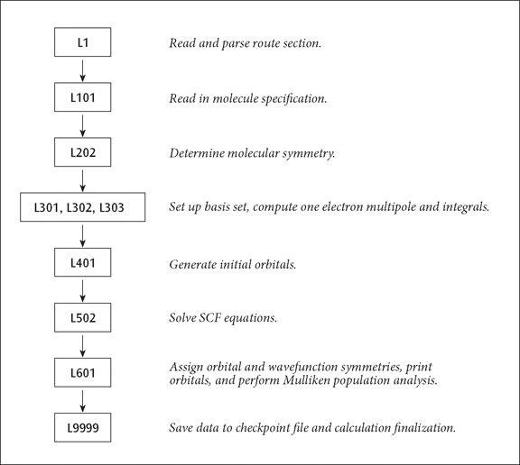
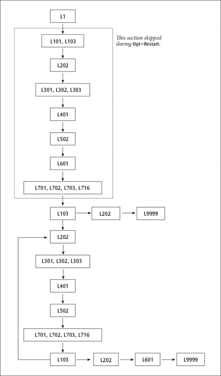

### A.4 Non-Standard Routes

If a combination of options or links is required which is drastically different than a standard route, then a complete sequence of overlays and links with associated options can be read in. The job-type input section begins with the line:

```
#NonStd
```

This is followed by one line for each desired overlay, in execution order, giving the overlay number, a slash, the desired options, another slash, the list of links to be executed, and finally a semicolon: *Ov/Opt=val,Opt=val,*···*/Link,Link,*···*;* For example:

```
7/5=3,7=4/2,3,16;
```

specifies a run through the links 702, 703, and 716 (in this order), with option 5 set equal to 3 and option 7 equal to 4 in each of the links. If all options have their default value, the line would be

```
7//2,3,16;
```

A further feature of the route specification is the jump number. This is given in parentheses at the end of the link list, just before the semicolon. It indicates which overlay line is executed after completion of the

current overlay. If it is omitted, the default value is +0, indicating that the program will proceed to the next line in the list (skipping no lines). If the jump number is set to -4, on the other hand, as in

```
7//2,3,16(-4);
```

then execution will continue with the overlay specified four route lines back (not counting the current line). This feature permits loops to be built into the route and is useful for optimization runs. An argument to the program chaining routine can override the jump. This is used during geometry optimizations to loop over a sequence of overlay lines until the optimization has been completed, at which point the line following the end of the loop is executed. Note that non-standard routes are not generally created from scratch but rather are built by printing out and modifying the sequence produced by the standard route most similar to that desired. This can be accomplished most easily with the testrt utility. **A Simple Route Example.** The standard route:

```
#RHF/STO-3G
```

causes the following non-standard route to be generated:

1`1/38=1/1;` 2`2/12=2,17=6,18=5,40=1/2;`

```
3/6=3,11=1,16=1,25=1,30=1,116=1/1,2,3; 3
```

4`4//1;` 5`5/5=2,38=5/2;` 6`6/7=2,8=2,9=2,10=2,28=1/1;` 7`99/5=1,9=1/99;`

The resulting sequence of programs is illustrated in Figure A.1. Figure A.1: A Simple Route Sequence



The basic sequence of program execution is identical to that found in any *ab initio* program, except that Link 1 (reading and interpreting the route section) precedes the actual calculation, and that Link 9999 (writing to the checkpoint file) follows it. Similarly, an MP4 single point has integral transformation (links 801 and 804) and the MP calculation (link 913) inserted before the population analysis (Link 601) and Link 9999. Link 9999 automatically terminates the job step when it completes. **A Route Involving Loops.** The standard route: `# RHF/STO-3G Opt` produces the following on-standard route: 1`1/18=20,19=15,38=1/1,3;` 2`2/9=110,12=2,17=6,18=5,40=1/2` 3`3/6=3,11=1,16=1,25=1,30=1,71=1,116=1/1,2,3;` 4`4//1;` 5`5/5=2,38=5/2;` 6`6/7=2,8=2,9=2,10=2,28=1/1;` 7`7//1,2,3,16;` `1/18=20,19=15/3(2);`8 9`2/9=110/2;` 10`99//99;` 11`2/9=110/2;` 12`3/6=3,11=1,16=1,25=1,30=1,71=1,116=1/1,2,3;` 13`4/5=5,16=3/1;` 14`5/5=2,38=5/2;` 15`7//1,2,3,16;` 16`1/18=20,19=15/3(-5);` 17`2/9=110/2;` 18`6/7=2,8=2,9=2,10=2,19=2,28=1/1;` 19`99/9=1/99;`

The resulting sequence of program execution is illustrated in Figure A.2. Several considerations complicate this route:

- The first point of the optimization must be handled separately from later steps, since several actions must be performed only once. These include reading the initial molecule specification and generating the initial orbitals.
- There must be a loop over geometries, with the optimization program (in this case the Berny optimizer, Link 103) deciding whether another geometry was required or the structure has been optimized.
- If a converged geometry is supplied, the program should calculate the gradients once, recognize that the structure is optimized, and quit.
- Population analysis and orbital printing are done by default only at the first and last points, not at the relatively uninteresting intermediate geometries. The first point has been dealt with by having two basic sequences of integrals, guess, SCF, and integral derivatives in the route. The first sequence includes Link 101 (to read the initial geometry), Link 103 (which does its own initialization), and has options set to tell Link 401 to generate an initial guess. The second sequence uses geometries produced in Link 103 in the course of the optimization, and has options set to tell Link 401 to retrieve the wavefunction from the previous geometry as the initial guess for the next. The forward jump on the eighth line has the effect that if Link 103 exits normally (without taking any spe-

Figure A.2: A Route Involving Loops

cial action), the following lines (invoking Links 202 and 9999) are skipped. Normally, in this second invocation of Link 103, the initial gradient will be examined and a new structure chosen. The next link to be executed will be Link 202, which processes the new geometry, followed by the rest of the second energy+gradient sequence, which constitutes the main optimization loop. If the second invocation of Link 103 finds that the geometry is converged, it exits with a flag which suppresses the jump, causing Links 202, 601 and 9999 to be invoked by the following lines and the job to complete.

Lines 11-16 form the main optimization loop. This evaluates the integrals, wavefunction, and gradient for



the second and subsequent points in the optimization. It concludes with Link 103. If the geometry is still not converged, Link 103 chooses a new geometry and exits normally, causing the backward jump on line 16 to be executed, and the next line processed to be line 11, beginning a new cycle. If Link 103 finds that the geometry has converged, it exits and suppresses the jump, causing the concluding lines (17-19) to be processed. The final instance of Link 601 prints the final multipole moments as well as the orbitals and population analysis if so requested. Finally, Link 9999 generates the archive entry and terminates the job step. MP and CI optimizations have the transformation and correlation overlays (8 and 9) and the post-SCF gradient overlays (11 and 10, in that order) inserted before overlay 7. The same two-phase route structure is used for numerical differentiation to produce frequencies or polarizabilities. The route for Opt=Restart is basically just the main loop from the original optimization, with the special lines for the first step omitted. The second invocation of Link 103 is kept and does the actual restarting.
