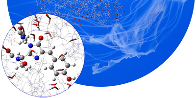

### G. Gaussian 16 FAQs

- **How can I get a breakdown of the SCF or DFT energy into all its component parts?** See `http://gaussian.com/faq1/`.
- **What does the output from Link 608 mean?** See `http://gaussian.com/faq1/`.
- **How can I restart a job that was interrupted?** See `http://gaussian.com/faq2/`.
- **Restarting Interrupted Geometry Optimizations: Opt=Restart** See `http://gaussian.com/faq2/`.
- **“Restarting” a Geometry Optimization from a Specific Point: Geom=(AllCheck,Step=_n_)** See `http://gaussian.com/faq2/`.
- **Restarting IRC Calculations: IRC=Restart** See `http://gaussian.com/faq2/`.
- **Restarting Analytic Frequency Calculations (and Other Long Jobs): # Restart** See `http://gaussian.com/faq2/`.
- **Restarting Numerical Frequency Calculations: Freq=(Numer,Restart)** See `http://gaussian.com/faq2/`.
- **Locating the Read-Write File for a Job** See `http://gaussian.com/faq2/`.
- **For More Information** ··· See `http://gaussian.com/faq2/`.
- **I optimized a structure, then calculated the frequencies for it. The frequency calculation showed the** **structure was not converged even though the optimization completed. Is my structure reliable?** See `http://gaussian.com/faq3/`.
- **Convergence Disagreements Between Optimizations and Frequency Calculations** See `http://gaussian.com/faq3/`.


- **What to Do in Cases Like These** See `http://gaussian.com/faq3/`.
- **How Much Difference Does It Make?** See `http://gaussian.com/faq3/`.
- **What If the The Second Frequency Job Still Fails to Converge?** See `http://gaussian.com/faq3/`.
- **How do I generate Natural Transition Orbitals?** See `http://gaussian.com/faq4/`.
- **Gaussian Jobs for Generating NTOs** See `http://gaussian.com/faq4/`.

## Bibliography

[1]W. J. Hehre, W. A. Lathan, R. Ditchfield, M. D. Newton, and J. A. Pople. Gaussian 70, (Quantum Chemistry Program Exchange, Program No. 237, 1970). (cited on page 3). [2]J. S. Binkley, R. A. Whiteside, P. C. Hariharan, R. Seeger, J. A. Pople, W. J. Hehre, and M. D. Newton. Gaussian 76, (Carnegie-Mellon University, Pittsburgh, PA, 1976). (cited on page 3). [3]J. S. Binkley, R. A. Whiteside, R. Krishnan, R. Seeger, D. J. Defrees, H. B. Schlegel, S. Topiol, L. R. Kahn, and J. A. Pople. Gaussian 80, (Carnegie-Mellon Quantum Chemistry Publishing Unit, Pittsburgh, PA, 1980). (cited on page 3). [4]J. S. Binkley, M. J. Frisch, D. J. Defrees, R. Krishnan, R. A. Whiteside, H. B. Schlegel, E. M. Fluder, and J. A. Pople. Gaussian 82, (Carnegie-Mellon Quantum Chemistry Publishing Unit, Pittsburgh, PA, 1982). (cited on page 3). [5]M. J. Frisch, J. S. Binkley, H. B. Schlegel, K. Raghavachari, C. F. Melius, R. L. Martin, J. J. P. Stewart, F. W. Bobrowicz, C. M. Rohlfing, L. R. Kahn, D. J. Defrees, R. Seeger, R. A. Whiteside, D. J. Fox, E. M. Fluder, and J. A. Pople. Gaussian 86, (Gaussian, Inc., Pittsburgh, PA, 1986). (cited on page 3). [6]M. J. Frisch, M. Head-Gordon, H. B. Schlegel, K. Raghavachari, J. S. Binkley, C. Gonzalez, D. J. Defrees, D. J. Fox, R. A. Whiteside, R. Seeger, C. F. Melius, J. Baker, L. R. Kahn, J. J. P. Stewart, E. M. Fluder, S. Topiol, and J. A. Pople. Gaussian 88, (Gaussian, Inc., Pittsburgh, PA, 1988). (cited on page 3). [7]M. J. Frisch, M. Head-Gordon, G. W. Trucks, J. B. Foresman, K. Raghavachari, H. B. Schlegel, M. Robb, J. S. Binkley, C. Gonzalez, D. J. Defrees, D. J. Fox, R. A. Whiteside, R. Seeger, C. F. Melius, J. Baker, L. R. Kahn, J. J. P. Stewart, E. M. Fluder, S. Topiol, and J. A. Pople. Gaussian 90, (Gaussian, Inc., Pittsburgh, PA, 1990). (cited on page 3). [8]M. J. Frisch, G. W. Trucks, M. Head-Gordon, P. M. W. Gill, M. W. Wong, J. B. Foresman, B. G. Johnson, H. B. Schlegel, M. A. Robb, E. S. Replogle, R. Gomperts, J. L. Andres, K. Raghavachari, J. S. Binkley, C. Gonzalez, R. L. Martin, D. J. Fox, D. J. Defrees, J. Baker, J. J. P. Stewart, and J. A. Pople. Gaussian 92, (Gaussian, Inc., Pittsburgh, PA, 1992). (cited on page 3).



[9]M. J. Frisch, G. W. Trucks, H. B. Schlegel, P. M. W. Gill, B. G. Johnson, M. W. Wong, J. B. Foresman, M. A. Robb, M. Head-Gordon, E. S. Replogle, R. Gomperts, J. L. Andres, K. Raghavachari, J. S. Binkley, C. Gonzalez, R. L. Martin, D. J. Fox, D. J. Defrees, J. Baker, J. J. P. Stewart, and J. A. Pople. Gaussian 92/DFT, (Gaussian, Inc., Pittsburgh, PA, 1993). (cited on page 3). [10]M. J. Frisch, G. W. Trucks, H. B. Schlegel, P. M. W. Gill, B. G. Johnson, M. A. Robb, J. R. Cheeseman, T. A. Keith, G. A. Petersson, J. A. Montgomery Jr., K. Raghavachari, M. A. Al-Laham, V. G. Zakrzewski, J. V. Ortiz, J. B. Foresman, J. Cioslowski, B. B. Stefanov, A. Nanayakkara, M. Challacombe, C. Y. Peng, P. Y. Ayala, W. Chen, M. W. Wong, J. L. Andres, E. S. Replogle, R. Gomperts, R. L. Martin, D. J. Fox, J. S. Binkley, D. J. Defrees, J. Baker, J. P. Stewart, M. Head-Gordon, C. Gonzalez, and J. A. Pople. Gaussian 94, (Gaussian, Inc., Pittsburgh, PA, 1995). (cited on page 3). [11]M. J. Frisch, G. W. Trucks, H. B. Schlegel, G. E. Scuseria, M. A. Robb, J. R. Cheeseman, V. G. Zakrzewski, J. A. Montgomery Jr., R. E. Stratmann, J. C. Burant, S. Dapprich, J. M. Millam, A. D. Daniels, K. N. Kudin, M. C. Strain, O. Farkas, J. Tomasi, V. Barone, M. Cossi, R. Cammi, B. Mennucci, C. Pomelli, C. Adamo, S. Clifford, J. Ochterski, G. A. Petersson, P. Y. Ayala, Q. Cui, K. Morokuma, P. Salvador, J. J. Dannenberg, D. K. Malick, A. D. Rabuck, K. Raghavachari, J. B. Foresman, J. Cioslowski, J. V. Ortiz, A. G. Baboul, B. B. Stefanov, G. Liu, A. Liashenko, P. Piskorz, I. Komaromi, R. Gomperts, R. L. Martin, D. J. Fox, T. Keith, M. A. Al-Laham, C. Y. Peng, A. Nanayakkara, M. Challacombe, P. M. W. Gill, B. Johnson, W. Chen, M. W. Wong, J. L. Andres, C. Gonzalez, M. Head-Gordon, E. S. Replogle, and J. A. Pople. Gaussian 98, (Gaussian, Inc., Pittsburgh, PA, 1998). (cited on page 3). [12]M. J. Frisch, G. W. Trucks, H. B. Schlegel, G. E. Scuseria, M. A. Rob, J. R. Cheeseman, J. A. Montgomery Jr., T. Vreven, K. N. Kudin, J. C. Burant, J. M. Millam, S. S. Iyengar, J. Tomasi, V. Barone, B. Mennucci, M. Cossi, G. Scalmani, N. Rega, G. A. Petersson, H. Nakatsuji, M. Hada, M. Ehara, K. Toyota, R. Fukuda, J. Hasegawa, M. Ishida, T. Nakajima, Y. Honda, O. Kitao, H. Nakai, M. Klene, X. Li, J. E. Knox, H. P. Hratchian, J. B. Cross, V. Bakken, C. Adamo, J. Jaramillo, R. Gomperts, R. E. Stratmann, O. Yazyev, A. J. Austin, R. Cammi, C. Pomelli, J. W. Ochterski, P. Y. Ayala, K. Morokuma, G. A. Voth, P. Salvador, J. J. Dannenberg, V. G. Zakrzewski, S. Dapprich, A. D. Daniels, M. C. Strain, O. Farkas, D. K. Malick, A. D. Rabuck, K. Raghavachari, J. B. Foresman, J. V. Ortiz, Q. Cui, A. G. Baboul, S. Clifford, J. Cioslowski, B. B. Stefanov, G. Liu, A. Liashenko, P. Piskorz, I. Komaromi, R. L. Martin, D. J. Fox, T. Keith, M. A. Al-Laham, C. Y. Peng, A. Nanayakkara, M. Challacombe, P. M. W. Gill, B. Johnson, W. Chen, M. W. Wong, C. Gonzalez, and J. A. Pople. Gaussian 03, (Gaussian, Inc., Wallingford CT, 2003). (cited on page 3). [13]M. J. Frisch, G. W. Trucks, H. B. Schlegel, G. E. Scuseria, M. A. Robb, J. R. Cheeseman, G. Scalmani, V. Barone, B. Mennucci, G. A. Petersson, H. Nakatsuji, M. Caricato, X. Li, H. P. Hratchian, A. F. Izmaylov, J. Bloino, G. Zheng, J. L. Sonnenberg, M. Hada, M. Ehara, K. Toyota, R. Fukuda, J. Hasegawa, M. Ishida, T. Nakajima, Y. Honda, O. Kitao, H. Nakai, T. Vreven, J. A. Montgomery Jr., J. E. Peralta, F. Ogliaro, M. Bearpark, J. J. Heyd, E. Brothers, K. N. Kudin, V. N. Staroverov, R. Kobayashi, J. Normand, K. Raghavachari, A. Rendell, J. C. Burant, S. S. Iyengar, J. Tomasi, M. Cossi, N. Rega, J. M. Millam, M. Klene, J. E. Knox, J. B. Cross, V. Bakken, C. Adamo, J. Jaramillo, R. Gomperts, R. E. Stratmann, O. Yazyev, A. J. Austin, R. Cammi, C. Pomelli, J. W. Ochterski, R. L. Martin, K. Morokuma, V. G. Zakrzewski, G. A. Voth, P. Salvador, J. J. Dannenberg, S. Dapprich, A. D. Daniels, Ö. Farkas, J. B. Foresman, J. V. Ortiz, J. Cioslowski, and D. J. Fox. Gaussian 09, (Gaussian, Inc., Wallingford CT, 2009). (cited on page 3). [14]J. E. Carpenter. “Extension of Lewis structure concepts to open-shell and excited-state molecular species”. PhD thesis. University of Wisconsin, Madison, WI, 1987 (cited on pages 4, 274). [15]J. E. Carpenter and F. Weinhold. “Analysis of the geometry of the hydroxymethyl radical by the different hybrids for different spins natural bond orbital procedure”. In: *J. Mol. Struct. (Theochem)* 169 (1988), pages 41–62 (cited on pages 4, 274).

[16]J. P. Foster and F. Weinhold. “Natural hybrid orbitals”. In: *J. Am. Chem. Soc.* 102 (1980), pages 7211–18 (cited on pages 4, 274). [17]A. E. Reed and F. Weinhold. “Natural bond orbital analysis of near-Hartree-Fock water dimer”. In: *J. Chem. Phys.* 78 (1983), pages 4066–73 (cited on pages 4, 274). [18]A. E. Reed, R. B. Weinstock, and F. Weinhold. “Natural-population analysis”. In: *J. Chem. Phys.* 83 (1985), pages 735–46 (cited on pages 4, 274). [19]A. E. Reed and F. Weinhold. “Natural Localized Molecular Orbitals”. In: *J. Chem. Phys.* 83 (1985), pages 1736– 40 (cited on pages 4, 274). [20]A. E. Reed, L. A. Curtiss, and F. Weinhold. “Intermolecular interactions from a natural bond orbital, donoracceptor viewpoint”. In: *Chem. Rev.* 88 (1988), pages 899–926 (cited on pages 4, 274). [21]F. Weinhold and J. E. Carpenter. In: *The Structure of Small Molecules and Ions*. Edited by R. Naaman and Z. Vager. Plenum, 1988, pages 227–36 (cited on pages 4, 274). [22]P.-O. Löwdin. “Scaling Problem, Virial Theorem and Connected Relations in Quantum Mechanics”. In: *J. Mol.* *Spec.* 3 (1959), pages 44–66 (cited on page 8). [23]D. E. Magnoli and J. R. Murdoch. “Obtaining self-consistent wave functions which satisfy the virial theorem”. In: *Int. J. Quant. Chem.* 22 (1982), pages 1249–62 (cited on page 8). [24]M. Lehd and F. Jensen. “A General Procedure for Obtaining Wave Functions Obeying the Virial Theorem”. In: *J.* *Comp. Chem.* 12 (1991), pages 1089–96 (cited on page 8). [25]W. Shakespeare. *Macbeth*. Volume III.iv.40-107. London, c.1606-1611 (cited on page 16). [26]W. J. Hehre, R. F. Stewart, and J. A. Pople. “Self-Consistent Molecular Orbital Methods. 1. Use of Gaussian expansions of Slater-type atomic orbitals”. In: *J. Chem. Phys.* 51 (1969), pages 2657–64 (cited on page 18). [27]J. B. Collins, P. v. R. Schleyer, J. S. Binkley, and J. A. Pople. “Self-Consistent Molecular Orbital Methods. 17. Geometries and binding energies of second-row molecules. A comparison of three basis sets”. In: *J. Chem. Phys.* 64 (1976), pages 5142–51 (cited on page 18). [28]J. S. Binkley, J. A. Pople, and W. J. Hehre. “Self-Consistent Molecular Orbital Methods. 21. Small Split-Valence Basis Sets for First-Row Elements”. In: *J. Am. Chem. Soc.* 102 (1980), pages 939–47 (cited on page 18). [29]M. S. Gordon, J. S. Binkley, J. A. Pople, W. J. Pietro, and W. J. Hehre. “Self-Consistent Molecular Orbital Methods. 22. Small Split-Valence Basis Sets for Second-Row Elements”. In: *J. Am. Chem. Soc.* 104 (1982), pages 2797–803 (cited on page 18). [30]W. J. Pietro, M. M. Francl, W. J. Hehre, D. J. Defrees, J. A. Pople, and J. S. Binkley. “Self-Consistent Molecular Orbital Methods. 24. Supplemented small split-valence basis-sets for 2nd-row elements”. In: *J. Am. Chem. Soc.* 104 (1982), pages 5039–48 (cited on page 18). [31]K. D. Dobbs and W. J. Hehre. “Molecular-orbital theory of the properties of inorganic and organometallic compounds. 4. Extended basis-sets for 3rd row and 4th row, main-group elements”. In: *J. Comp. Chem.* 7 (1986), pages 359–78 (cited on page 18). [32]K. D. Dobbs and W. J. Hehre. “Molecular-orbital theory of the properties of inorganic and organometallic compounds. 5. Extended basis-sets for 1st-row transition-metals”. In: *J. Comp. Chem.* 8 (1987), pages 861–79 (cited on page 18). [33]K. D. Dobbs and W. J. Hehre. “Molecular-orbital theory of the properties of inorganic and organometallic compounds. 6. Extended basis-sets for 2nd-row transition-metals”. In: *J. Comp. Chem.* 8 (1987), pages 880–93 (cited on page 18).

[34]R. Ditchfield, W. J. Hehre, and J. A. Pople. “Self-Consistent Molecular Orbital Methods. 9. Extended Gaussiantype basis for molecular-orbital studies of organic molecules”. In: *J. Chem. Phys.* 54 (1971), page 724 (cited on page 18). [35]W. J. Hehre, R. Ditchfield, and J. A. Pople. “Self-Consistent Molecular Orbital Methods. 12. Further extensions of Gaussian-type basis sets for use in molecular-orbital studies of organic-molecules”. In: *J. Chem. Phys.* 56 (1972), page 2257 (cited on page 18). [36]P. C. Hariharan and J. A. Pople. “Accuracy of AH equilibrium geometries by single determinant molecular-orbital theory”. In: *Mol. Phys.* 27 (1974), pages 209–14 (cited on page 18). [37]M. S. Gordon. “The isomers of silacyclopropane”. In: *Chem. Phys. Lett.* 76 (1980), pages 163–68 (cited on page 18). [38]P. C. Hariharan and J. A. Pople. “Influence of polarization functions on molecular-orbital hydrogenation energies”. In: *Theor. Chem. Acc.* 28 (1973), pages 213–22 (cited on page 18). [39]M. M. Francl, W. J. Pietro, W. J. Hehre, J. S. Binkley, D. J. DeFrees, J. A. Pople, and M. S. Gordon. “Self- Consistent Molecular Orbital Methods. 23. A polarization-type basis set for 2nd-row elements”. In: *J. Chem.* *Phys.* 77 (1982), pages 3654–65 (cited on page 18). [40]R. C. Binning Jr. and L. A. Curtiss. “Compact contracted basis-sets for 3rd-row atoms – Ga-Kr”. In: *J. Comp.* *Chem.* 11 (1990), pages 1206–16 (cited on page 18). [41]J.-P. Blaudeau, M. P. McGrath, L. A. Curtiss, and L. Radom. “Extension of Gaussian-2 (G2) theory to molecules containing third-row atoms K and Ca”. In: *J. Chem. Phys.* 107 (1997), pages 5016–21 (cited on page 18). [42]V. A. Rassolov, J. A. Pople, M. A. Ratner, and T. L. Windus. “6-31G* basis set for atoms K through Zn”. In: *J.* *Chem. Phys.* 109 (1998), pages 1223–29 (cited on page 18). [43]V. A. Rassolov, M. A. Ratner, J. A. Pople, P. C. Redfern, and L. A. Curtiss. “6-31G* Basis Set for Third-Row Atoms”. In: *J. Comp. Chem.* 22 (2001), pages 976–84 (cited on page 18). [44]G. A. Petersson, A. Bennett, T. G. Tensfeldt, M. A. Al-Laham, W. A. Shirley, and J. Mantzaris. “A complete basis set model chemistry. I. The total energies of closed-shell atoms and hydrides of the first-row atoms”. In: *J. Chem.* *Phys.* 89 (1988), pages 2193–218 (cited on pages 18, 76, 78). [45]G. A. Petersson and M. A. Al-Laham. “A complete basis set model chemistry. II. Open-shell systems and the total energies of the first-row atoms”. In: *J. Chem. Phys.* 94 (1991), pages 6081–90 (cited on pages 18, 76, 78). [46]A. D. McLean and G. S. Chandler. “Contracted Gaussian-basis sets for molecular calculations. 1. 2nd row atoms, Z=11-18”. In: *J. Chem. Phys.* 72 (1980), pages 5639–48 (cited on page 18). [47]K. Raghavachari, J. S. Binkley, R. Seeger, and J. A. Pople. “Self-Consistent Molecular Orbital Methods. 20. Basis set for correlated wave-functions”. In: *J. Chem. Phys.* 72 (1980), pages 650–54 (cited on page 18). [48]A. J. H. Wachters. “Gaussian basis set for molecular wavefunctions containing third-row atoms”. In: *J. Chem.* *Phys.* 52 (1970), page 1033 (cited on page 18). [49]P. J. Hay. “Gaussian basis sets for molecular calculations – representation of 3D orbitals in transition-metal atoms”. In: *J. Chem. Phys.* 66 (1977), pages 4377–84 (cited on page 18). [50]K. Raghavachari and G. W. Trucks. “Highly correlated systems: Excitation energies of first row transition metals Sc-Cu”. In: *J. Chem. Phys.* 91 (1989), pages 1062–65 (cited on page 18). [51]M. P. McGrath and L. Radom. “Extension of Gaussian-1 (G1) theory to bromine-containing molecules”. In: *J.* *Chem. Phys.* 94 (1991), pages 511–16 (cited on page 18). [52]L. A. Curtiss, M. P. McGrath, J.-P. Blaudeau, N. E. Davis, R. C. Binning Jr., and L. Radom. “Extension of Gaussian-2 theory to molecules containing third-row atoms Ga-Kr”. In: *J. Chem. Phys.* 103 (1995), pages 6104– 13 (cited on page 18).

[53]T. H. Dunning Jr. and P. J. Hay. In: *Modern Theoretical Chemistry, Vol. 3*. Edited by H. F. Schaefer III. New York: Plenum, 1977, pages 1–28 (cited on page 18). [54]A. K. Rappé, T. Smedly, and W. A. Goddard III. “The Shape and Hamiltonian Consistent (SHC) Effective Potentials”. In: *J. Phys. Chem.* 85 (1981), pages 1662–66 (cited on page 18). [55]W. J. Stevens, H. Basch, and M. Krauss. “Compact effective potentials and efficient shared-exponent basis-sets for the 1st-row and 2nd-row atoms”. In: *J. Chem. Phys.* 81 (1984), pages 6026–33 (cited on page 18). [56]W. J. Stevens, M. Krauss, H. Basch, and P. G. Jasien. “Relativistic compact effective potentials and efficient, shared-exponent basis-sets for the 3rd-row, 4th-row, and 5th-row atoms”. In: *Can. J. Chem.* 70 (1992), pages 612– 30 (cited on page 18). [57]T. R. Cundari and W. J. Stevens. “Effective core potential methods for the lanthanides”. In: *J. Chem. Phys.* 98 (1993), pages 5555–65 (cited on page 18). [58]P. J. Hay and W. R. Wadt. “Ab initio effective core potentials for molecular calculations - potentials for the transition-metal atoms Sc to Hg”. In: *J. Chem. Phys.* 82 (1985), pages 270–83 (cited on page 18). [59]W. R. Wadt and P. J. Hay. “Ab initio effective core potentials for molecular calculations - potentials for main group elements Na to Bi”. In: *J. Chem. Phys.* 82 (1985), pages 284–98 (cited on page 18). [60]P. J. Hay and W. R. Wadt. “Ab initio effective core potentials for molecular calculations - potentials for K to Au including the outermost core orbitals”. In: *J. Chem. Phys.* 82 (1985), pages 299–310 (cited on page 18). [61]P. Fuentealba, H. Preuss, H. Stoll, and L. v. Szentpály. “A Proper Account of Core-polarization with Pseudopotentials - Single Valence-Electron Alkali Compounds”. In: *Chem. Phys. Lett.* 89 (1982), pages 418–22 (cited on page 18). L. v. Szentpály, P. Fuentealba, H. Preuss, and H. Stoll. “Pseudopotential calculations on Rb+2, Cs+2, RbH+, CsH+[62] and the mixed alkali dimer ions”. In: *Chem. Phys. Lett.* 93 (1982), pages 555–59 (cited on page 18). [63]P. Fuentealba, H. Stoll, L. v. Szentpály, P. Schwerdtfeger, and H. Preuss. “On the reliability of semi-empirical pseudopotentials - simulation of Hartree-Fock and Dirac-Fock results”. In: *J. Phys. B* 16 (1983), pages L323–L28 (cited on page 18). [64]H. Stoll, P. Fuentealba, P. Schwerdtfeger, J. Flad, L. v. Szentpály, and H. Preuss. “Cu and Ag as one-valenceelectron atoms - CI results and quadrupole corrections of Cu2, Ag2, CuH, and AgH”. In: *J. Chem. Phys.* 81 (1984), pages 2732–36 (cited on page 18). [65]P. Fuentealba, L. v. Szentpály, H. Preuss, and H. Stoll. “Pseudopotential calculations for alkaline-earth atoms”. In: *J. Phys. B* 18 (1985), pages 1287–96 (cited on page 18). [66]U. Wedig, M. Dolg, H. Stoll, and H. Preuss. In: *Quantum Chemistry: The Challenge of Transition Metals and* *Coordination Chemistry*. Edited by A. Veillard. Reidel and Dordrecht, 1986, page 79 (cited on page 18). [67]M. Dolg, U. Wedig, H. Stoll, and H. Preuss. “Energy-adjusted ab initio pseudopotentials for the first row transition elements”. In: *J. Chem. Phys.* 86 (1987), pages 866–72 (cited on page 18). [68]G. Igel-Mann, H. Stoll, and H. Preuss. “Pseudopotentials for main group elements (IIIA through VIIA)”. In: *Mol.* *Phys.* 65 (1988), pages 1321–28 (cited on page 18). [69]M. Dolg, H. Stoll, and H. Preuss. “Energy-adjusted ab initio pseudopotentials for the rare earth elements”. In: *J.* *Chem. Phys.* 90 (1989), pages 1730–34 (cited on page 18). [70]P. Schwerdtfeger, M. Dolg, W. H. E. Schwarz, G. A. Bowmaker, and P. D. W. Boyd. “Relativistic effects in gold chemistry. 1. Diatomic gold compounds”. In: *J. Chem. Phys.* 91 (1989), pages 1762–74 (cited on page 18). [71]M. Dolg, H. Stoll, A. Savin, and H. Preuss. “Energy-adjusted pseudopotentials for the rare-earth elements”. In: *Theor. Chem. Acc.* 75 (1989), pages 173–94 (cited on page 18).

[72]D. Andrae, U. Haeussermann, M. Dolg, H. Stoll, and H. Preuss. “Energy-adjusted ab initio pseudopotentials for the 2nd and 3rd row transition-elements”. In: *Theor. Chem. Acc.* 77 (1990), pages 123–41 (cited on page 18). [73]M. Dolg, P. Fulde, W. Kuechle, C.-S. Neumann, and H. Stoll. “Ground state calculations of di-pi-cyclooctatetraene cerium”. In: *J. Chem. Phys.* 94 (1991), pages 3011–17 (cited on page 18). [74]M. Kaupp, P. v. R. Schleyer, H. Stoll, and H. Preuss. “Pseudopotential approaches to Ca, Sr, and Ba hydrides. Why are some alkaline-earth MX2 compounds bent?” In: *J. Chem. Phys.* 94 (1991), pages 1360–66 (cited on page 18). [75]W. Kuechle, M. Dolg, H. Stoll, and H. Preuss. “Ab initio pseudopotentials for Hg through Rn. 1. Parameter sets and atomic calculations”. In: *Mol. Phys.* 74 (1991), pages 1245–63 (cited on page 18). [76]M. Dolg, H. Stoll, H.-J. Flad, and H. Preuss. “Ab initio pseudopotential study of Yb and YbO”. In: *J. Chem. Phys.* 97 (1992), pages 1162–73 (cited on page 18). [77]A. Bergner, M. Dolg, W. Kuechle, H. Stoll, and H. Preuss. “Ab-initio energy-adjusted pseudopotentials for elements of groups 13-17”. In: *Mol. Phys.* 80 (1993), pages 1431–41 (cited on page 18). [78]M. Dolg, H. Stoll, and H. Preuss. “A combination of quasi-relativistic pseudopotential and ligand-field calculations for lanthanoid compounds”. In: *Theor. Chem. Acc.* 85 (1993), pages 441–50 (cited on page 18). [79]U. Haeussermann, M. Dolg, H. Stoll, and H. Preuss. “Accuracy of energy-adjusted quasi-relativistic ab initio pseudopotentials - all-electron and pseudopotential benchmark calculations for Hg, HgH and their cations”. In: *Mol. Phys.* 78 (1993), pages 1211–24 (cited on page 18). [80]M. Dolg, H. Stoll, H. Preuss, and R. M. Pitzer. “Relativistic and correlation-effects for element 105 (Hahnium, Ha) - a comparative-study of M and MO (M = NB, TA, HA) using energy-adjusted ab initio pseudopotentials”. In: *J. Phys. Chem.* 97 (1993), pages 5852–59 (cited on page 18). [81]W. Kuechle, M. Dolg, H. Stoll, and H. Preuss. “Energy-adjusted pseudopotentials for the actinides. Parameter sets and test calculations for thorium and thorium molecules”. In: *J. Chem. Phys.* 100 (1994), pages 7535–42 (cited on page 18). [82]A. Nicklass, M. Dolg, H. Stoll, and H. Preuss. “Ab initio energy-adjusted pseudopotentials for the noble gases Ne through Xe: Calculation of atomic dipole and quadrupole polarizabilities”. In: *J. Chem. Phys.* 102 (1995), pages 8942–52 (cited on page 18). [83]T. Leininger, A. Nicklass, H. Stoll, M. Dolg, and P. Schwerdtfeger. “The accuracy of the pseudopotential approximation. II. A comparison of various core sizes for indium pseudopotentials in calculations for spectroscopic constants of InH, InF, and InCI”. In: *J. Chem. Phys.* 105 (1996), pages 1052–59 (cited on page 18). [84]X. Y. Cao and M. Dolg. “Valence basis sets for relativistic energy-consistent small-core lanthanide pseudopotentials”. In: *J. Chem. Phys.* 115 (2001), pages 7348–55 (cited on page 18). [85]X. Y. Cao and M. Dolg. “Segmented contraction scheme for small-core lanthanide pseudopotential basis sets”. In: *J. Mol. Struct. (Theochem)* 581 (2002), pages 139–47 (cited on page 18). [86]T. H. Dunning Jr. “Gaussian basis sets for use in correlated molecular calculations. I. The atoms boron through neon and hydrogen”. In: *J. Chem. Phys.* 90 (1989), pages 1007–23 (cited on page 18). [87]R. A. Kendall, T. H. Dunning Jr., and R. J. Harrison. “Electron affinities of the first-row atoms revisited. Systematic basis sets and wave functions”. In: *J. Chem. Phys.* 96 (1992), pages 6796–806 (cited on pages 18, 20). [88]D. E. Woon and T. H. Dunning Jr. “Gaussian-basis sets for use in correlated molecular calculations. 3. The atoms aluminum through argon”. In: *J. Chem. Phys.* 98 (1993), pages 1358–71 (cited on pages 18, 20). [89]K. A. Peterson, D. E. Woon, and T. H. Dunning Jr. “Benchmark calculations with correlated molecular wave functions. IV. The classical barrier height of the H + H2 →H2 + H reaction”. In: *J. Chem. Phys.* 100 (1994), pages 7410–15 (cited on page 18).

[90]A. K. Wilson, T. van Mourik, and T. H. Dunning Jr. “Gaussian Basis Sets for use in Correlated Molecular Calculations. VI. Sextuple zeta correlation consistent basis sets for boron through neon”. In: *J. Mol. Struct. (Theochem)* 388 (1996), pages 339–49 (cited on page 18). [91]E. R. Davidson. “Comment on “Comment on Dunning’s correlation-consistent basis sets””. In: *Chem. Phys. Lett.* 260 (1996), pages 514–18 (cited on page 18). [92]A. Schaefer, H. Horn, and R. Ahlrichs. “Fully optimized contracted Gaussian-basis sets for atoms Li to Kr”. In: *J. Chem. Phys.* 97 (1992), pages 2571–77 (cited on page 19). [93]A. Schaefer, C. Huber, and R. Ahlrichs. “Fully optimized contracted Gaussian-basis sets of triple zeta valence quality for atoms Li to Kr”. In: *J. Chem. Phys.* 100 (1994), pages 5829–35 (cited on page 19). [94]F. Weigend and R. Ahlrichs. “Balanced basis sets of split valence, triple zeta valence and quadruple zeta valence quality for H to Rn: Design and assessment of accuracy”. In: *Phys. Chem. Chem. Phys.* 7 (2005), pages 3297–305 (cited on pages 19, 22). [95]F. Weigend. “Accurate Coulomb-fitting basis sets for H to Rn”. In: *Phys. Chem. Chem. Phys.* 8 (2006), pages 1057– 65 (cited on pages 19, 22). [96]R. E. Easton, D. J. Giesen, A. Welch, C. J. Cramer, and D. G. Truhlar. “The MIDI! basis set for quantum mechanical calculations of molecular geometries and partial charges”. In: *Theor. Chem. Acc.* 93 (1996), pages 281–301 (cited on page 19). [97]V. Barone. In: *Recent Advances in Density Functional Methods, Part I*. Edited by D. P. Chong. Singapore: World Scientific Publ. Co., 1996 (cited on pages 19, 277, 278). [98]D. M. Silver, S. Wilson, and W. C. Nieuwpoort. “Universal basis sets and transferability of integrals”. In: *Int. J.* *Quantum Chem.* 14 (1978), pages 635–39 (cited on page 19). [99]D. M. Silver and W. C. Nieuwpoort. “Universal atomic basis sets”. In: *Chem. Phys. Lett.* 57 (1978), pages 421–22 (cited on page 19). [100]J. R. Mohallem, R. M. Dreizler, and M. Trsic. “A Griffin-Hill-Wheeler version of the Hartree-Fock equations”. In: *Int. J. Quantum Chem., Quant. Chem. Symp.* 30 (S20) (1986), pages 45–55 (cited on page 19). [101]J. R. Mohallem and M. Trsic. “A universal Gaussian basis set for atoms Li through Ne based on a generator coordinate version of the Hartree-Fock equations”. In: *J. Chem. Phys.* 86 (1987), pages 5043–44 (cited on page 19). [102]H. F. M. da Costa, M. Trsic, and J. R. Mohallem. “Universal Gaussian and Slater-type basis-sets for atoms He to Ar based on an integral version of the Hartree-Fock equations”. In: *Mol. Phys.* 62 (1987), pages 91–95 (cited on page 19). [103]A. B. F. da Silva, H. F. M. da Costa, and M. Trsic. “Universal Gaussian and Slater-type bases for atoms H to Xe based on the generator-coordinate Hartree-Fock method .1. Ground and certain low-lying excited-states of the neutral atoms”. In: *Mol. Phys.* 68 (1989), pages 433–45 (cited on page 19). [104]F. E. Jorge, E. V. R. de Castro, and A. B. F. da Silva. “A universal Gaussian basis set for atoms Cerium through Lawrencium generated with the generator coordinate Hartree-Fock method”. In: *J. Comp. Chem.* 18 (1997), pages 1565–69 (cited on page 19). [105]F. E. Jorge, E. V. R. de Castro, and A. B. F. da Silva. “Accurate universal Gaussian basis set for hydrogen through lanthanum generated with the generator coordinate Hartree-Fock method”. In: *Chem. Phys.* 216 (1997), pages 317–21 (cited on page 19). [106]E. V. R. de Castro and F. E. Jorge. “Accurate universal gaussian basis set for all atoms of the periodic table”. In: *J. Chem. Phys.* 108 (1998), pages 5225–29 (cited on page 19). [107]J. M. L. Martin and G. de Oliveira. “Towards standard methods for benchmark quality ab initio thermochemistry - W1 and W2 theory”. In: *J. Chem. Phys.* 111 (1999), pages 1843–56 (cited on pages 19, 330).

[108]N. Godbout, D. R. Salahub, J. Andzelm, and E. Wimmer. “Optimization of Gaussian-type basis sets for local spin density functional calculations. Part I. Boron through neon, optimization technique and validation”. In: *Can. J.* *Chem.* 70 (1992), pages 560–71 (cited on pages 19, 22). [109]C. Sosa, J. Andzelm, B. C. Elkin, E. Wimmer, K. D. Dobbs, and D. A. Dixon. “A Local Density Functional Study of the Structure and Vibrational Frequencies of Molecular Transition-Metal Compounds”. In: *J. Phys. Chem.* 96 (1992), pages 6630–36 (cited on pages 19, 22). [110]J. A. Montgomery Jr., M. J. Frisch, J. W. Ochterski, and G. A. Petersson. “A complete basis set model chemistry. VI. Use of density functional geometries and frequencies”. In: *J. Chem. Phys.* 110 (1999), pages 2822–27 (cited on pages 19, 76, 271, 380). [111]T. Clark, J. Chandrasekhar, G. W. Spitznagel, and P. v. R. Schleyer. “Efficient diffuse function-augmented basissets for anion calculations. 3. The 3-21+G basis set for 1st-row elements, Li-F”. In: *J. Comp. Chem.* 4 (1983), pages 294–301 (cited on page 20). [112]M. J. Frisch, J. A. Pople, and J. S. Binkley. “Self-Consistent Molecular Orbital Methods. 25. Supplementary Functions for Gaussian Basis Sets”. In: *J. Chem. Phys.* 80 (1984), pages 3265–69 (cited on page 20). [113]E. Papajak, J. Zheng, H. R. Leverentz, and D. G. Truhlar. “Perspectives on Basis Sets Beautiful: Seasonal Plantings of Diffuse Basis Functions”. In: *J. Chem. Theory and Comput.* 7 (2011), page 3027 (cited on page 20). [114]H. B. Schlegel and M. J. Frisch. “Transformation between Cartesian and Pure Spherical Harmonic Gaussians”. In: *Int. J. Quantum Chem.* 54 (1995), pages 83–87 (cited on pages 22, 159). [115]B. I. Dunlap. “Fitting the Coulomb Potential Variationally in X-Alpha Molecular Calculations”. In: *J. Chem.* *Phys.* 78 (1983), pages 3140–42 (cited on page 22). [116]B. I. Dunlap. “Robust and variational fitting: Removing the four-center integrals from center stage in quantum chemistry”. In: *J. Mol. Struct. (Theochem)* 529 (2000), pages 37–40 (cited on page 22). [117]K. Eichkorn, O. Treutler, H. Ohm, M. Haser, and R. Ahlrichs. “Auxiliary basis-sets to approximate Coulomb potentials”. In: *Chem. Phys. Lett.* 240 (1995), pages 283–89 (cited on page 22). [118]K. Eichkorn, F. Weigend, O. Treutler, and R. Ahlrichs. “Auxiliary basis sets for main row atoms and transition metals and their use to approximate Coulomb potentials”. In: *Theor. Chem. Acc.* 97 (1997), pages 119–24 (cited on page 22). [119]J. A. Pople and M. S. Gordon. “Molecular orbital theory of electronic structure of organic compounds. 1. Substituent effects and dipole methods”. In: *J. Am. Chem. Soc.* 89 (1967), page 4253 (cited on page 27). [120]D. L. Bunker. “Classical Trajectory Methods”. In: *Meth. Comp. Phys.* 10 (1971), page 287 (cited on pages 55, 61). [121]L. M. Raff and D. L. Thompson. In: *Theory of Chemical Reaction Dynamics*. Edited by M. Baer. Boca Raton, FL: CRC, 1985 (cited on pages 55, 61). [122]W. L. Hase, editor. *Advances in Classical Trajectory Methods*. Volume 1-3. Stamford, CT: JAI, 1991 (cited on pages 55, 61). [123]D. L. Thompson. In: *Encyclopedia of Computational Chemistry*. Edited by P. v. R. Schleyer, N. L. Allinger, P. A. Kollman, T. Clark, H. F. Schaefer III, J. Gasteiger, and P. R. Schreiner. Chichester: Wiley, 1998, pages 3056–73 (cited on pages 55, 61). [124]S. S. Iyengar, H. B. Schlegel, J. M. Millam, G. A. Voth, G. E. Scuseria, and M. J. Frisch. “Ab initio molecular dynamics: Propagating the density matrix with Gaussian orbitals. II. Generalizations based on mass-weighting, idempotency, energy conservation and choice of initial conditions”. In: *J. Chem. Phys.* 115 (2001), pages 10291– 302 (cited on page 55).

[125]H. B. Schlegel, J. M. Millam, S. S. Iyengar, G. A. Voth, G. E. Scuseria, A. D. Daniels, and M. J. Frisch. “Ab initio molecular dynamics: Propagating the density matrix with Gaussian orbitals”. In: *J. Chem. Phys.* 114 (2001), pages 9758–63 (cited on page 55). [126]H. B. Schlegel, S. S. Iyengar, X. Li, J. M. Millam, G. A. Voth, G. E. Scuseria, and M. J. Frisch. “Ab initio molecular dynamics: Propagating the density matrix with Gaussian orbitals. III. Comparison with Born-Oppenheimer dynamics”. In: *J. Chem. Phys.* 117 (2002), pages 8694–704 (cited on page 55). [127]R. Car and M. Parrinello. “Unified Approach for Molecular-Dynamics and Density-Functional Theory”. In: *Phys.* *Rev. Lett.* 55 (1985), pages 2471–74 (cited on page 55). [128]G. Martyna, C. Cheng, and M. L. Klein. “Electronic States and Dynamic Behavior of Lixen and Csxen Clusters”. In: *J. Chem. Phys.* 95 (1991), pages 1318–36 (cited on page 55). [129]G. Lippert, J. Hutter, and M. Parrinello. “A hybrid Gaussian and plane wave density functional scheme”. In: *Mol.* *Phys.* 92 (1997), pages 477–87 (cited on page 55). [130]G. Lippert, J. Hutter, and M. Parrinello. “The Gaussian and augmented-plane-wave density functional method for ab initio molecular dynamics simulations”. In: *Theor. Chem. Acc.* 103 (1999), pages 124–40 (cited on page 55). [131]C. E. Dykstra. “Examination of Brueckner condition for selection of molecular-orbitals in correlated wavefunctions”. In: *Chem. Phys. Lett.* 45 (1977), pages 466–69 (cited on page 59). [132]N. C. Handy, J. A. Pople, M. Head-Gordon, K. Raghavachari, and G. W. Trucks. “Size-consistent Brueckner theory limited to double substitutions”. In: *Chem. Phys. Lett.* 164 (1989), pages 185–92 (cited on page 59). [133]R. Kobayashi, N. C. Handy, R. D. Amos, G. W. Trucks, M. J. Frisch, and J. A. Pople. “Gradient theory applied to the Brueckner doubles method”. In: *J. Chem. Phys.* 95 (1991), pages 6723–33 (cited on page 59). [134]K. Raghavachari, J. A. Pople, E. S. Replogle, and M. Head-Gordon. “Fifth Order Mller-Plesset Perturbation Theory: Comparison of Existing Correlation Methods and Implementation of New Methods Correct to Fifth Order”. In: *J. Phys. Chem.* 94 (1990), pages 5579–86 (cited on pages 59, 226, 286). [135]T. Helgaker, E. Uggerud, and H. J. A. Jensen. “Integration of the Classical Equations of Motion on ab initio Molecular-Potential Energy Surfaces Using Gradients and Hessians - Application to Translational Energy-Release Upon Fragmentation”. In: *Chem. Phys. Lett.* 173 (1990), pages 145–50 (cited on page 61). E. Uggerud and T. Helgaker. “Dynamics of the Reaction CH2OH+ →CHO+ + H2. Translational Energy-Release[136] from ab initio Trajectory Calculations”. In: *J. Am. Chem. Soc.* 114 (1992), pages 4265–68 (cited on page 61). [137]K. Bolton, W. L. Hase, and G. H. Peslherbe. In: *Modern Methods for Multidimensional Dynamics Computation* *in Chemistry*. Edited by D. L. Thompson. Singapore: World Scientific, 1998, page 143 (cited on page 61). [138]W. Chen, W. L. Hase, and H. B. Schlegel. “Ab initio classical trajectory study of H2CO →H2 + CO dissociation”. In: *Chem. Phys. Lett.* 228 (1994), pages 436–42 (cited on page 61). [139]J. M. Millam, V. Bakken, W. Chen, W. L. Hase, and H. B. Schlegel. “Ab initio classical trajectories on the Born- Oppenheimer Surface: Hessian-Based Integrators using Fifth Order Polynomial and Rational Function Fits”. In: *J. Chem. Phys.* 111 (1999), pages 3800–05 (cited on page 61). [140]X. Li, J. M. Millam, and H. B. Schlegel. “Ab initio molecular dynamics studies of the photodissociation of formaldehyde, H2CO →H2 + CO: Direct classical trajectory calculations by MP2 and density functional theory”. In: *J. Chem. Phys.* 113 (2000), pages 10062–67 (cited on page 61). [141]W. L. Hase, R. J. Duchovic, X. Hu, A. Komornicki, K. F. Lim, D.-H. Lu, G. H. Peslherbe, K. N. Swamy, S. R. V. Linde, A. Varandas, H. Wang, and R. J. Wolfe. “VENUS96: A General Chemical Dynamics Computer Program”. In: *QCPE* 16 (1996), page 671 (cited on page 61). [142]D. Hegarty and M. A. Robb. “Application of unitary group-methods to configuration-interaction calculations”. In: *Mol. Phys.* 38 (1979), pages 1795–812 (cited on page 68).

[143]R. H. A. Eade and M. A. Robb. “Direct minimization in MC SCF theory - the Quasi-Newton method”. In: *Chem.* *Phys. Lett.* 83 (1981), pages 362–68 (cited on page 68). [144]H. B. Schlegel and M. A. Robb. “MC SCF gradient optimization of the H2CO →H2 + CO transition structure”. In: *Chem. Phys. Lett.* 93 (1982), pages 43–46 (cited on page 68). [145]F. Bernardi, A. Bottini, J. J. W. McDougall, M. A. Robb, and H. B. Schlegel. “MCSCF gradient calculation of transition structures in organic reactions”. In: *Far. Symp. Chem. Soc.* 19 (1984), pages 137–47 (cited on pages 68, 69). [146]M. J. Frisch, I. N. Ragazos, M. A. Robb, and H. B. Schlegel. “An Evaluation of 3 Direct MC-SCF Procedures”. In: *Chem. Phys. Lett.* 189 (1992), pages 524–28 (cited on page 68). [147]N. Yamamoto, T. Vreven, M. A. Robb, M. J. Frisch, and H. B. Schlegel. “A Direct Derivative MC-SCF Procedure”. In: *Chem. Phys. Lett.* 250 (1996), pages 373–78 (cited on page 68). [148]P. E. M. Siegbahn. “A new direct CI method for large CI expansions in a small orbital space”. In: *Chem. Phys.* *Lett.* 109 (1984), pages 417–23 (cited on page 68). [149]M. A. Robb and U. Niazi. “The Unitary Group Approach to Electronic Structure Computations”. In: *Reports in* *Molecular Theory*. Edited by H. Weinstein and G. Náray-Szabó. Volume 1. Boca Raton, FL: CRC Press, 1990, pages 23–55 (cited on page 68). [150]M. Klene, M. A. Robb, M. J. Frisch, and P. Celani. “Parallel implementation of the CI-vector evaluation in full CI/CAS-SCF”. In: *J. Chem. Phys.* 113 (2000), pages 5653–65 (cited on page 68). [151]S. Li. “Development of algorithms for the direct multi-configuration self-consistent field (MCSCF) method”. Supervisors: M. A. Robb and M. Bearpark. URL: `spiral.imperial.ac.uk:8443/handle/10044/1/`

```
6945 . PhD thesis. London, UK: Imperial College, 2011 (cited on page 69).
```

[152]J. B. Foresman and Æ. Frisch. *Exploring Chemistry with Electronic Structure Methods*. 3rd ed. ISBN: 978-1- 935522-03-4. Wallingford, CT: Gaussian, Inc., 2015 (cited on pages 69, 89, 128, 238, 295). [153]F. Bernardi, A. Bottoni, M. J. Field, M. F. Guest, I. H. Hillier, M. A. Robb, and A. Venturini. “MC-SCF Study of the Diels-Alder Reaction Between Ethylene and Butadiene”. In: *J. Am. Chem. Soc.* 110 (1988), pages 3050–55 (cited on page 69). [154]F. Bernardi, A. Bottoni, M. Olivucci, M. A. Robb, H. B. Schlegel, and G. Tonachini. “Do Supra-Antara Paths Really Exist for 2+2 Cycloaddition Reactions? Analytical Computation of the MC-SCF Hessians for Transition States of C2H4 with C2H4, Singlet O2, and Ketene”. In: *J. Am. Chem. Soc.* 110 (1988), pages 5993–95 (cited on page 69). [155]F. Bernardi, A. Bottoni, M. A. Robb, and A. Venturini. “MC-SCF study of the cycloaddition reaction between ketene and ethylene”. In: *J. Am. Chem. Soc.* 112 (1990), pages 2106–14 (cited on page 69). [156]G. Tonachini, H. B. Schlegel, F. Bernardi, and M. A. Robb. “MC-SCF Study of the Addition Reaction of the 1 *Dg* Oxygen Molecule to Ethene”. In: *J. Am. Chem. Soc.* 112 (1990), pages 483–91 (cited on page 69). [157]F. Bernardi, M. Olivucci, I. Palmer, and M. A. Robb. “An MC-SCF study of the thermal and photochemical cycloaddition of Dewar benzene”. In: *J. Organic Chem.* 57 (1992), pages 5081–87 (cited on page 69). [158]I. J. Palmer, F. Bernardi, M. Olivucci, I. N. Ragazos, and M. A. Robb. “An MC-SCF study of the (photochemical) Paterno-Buchi reaction”. In: *J. Am. Chem. Soc.* 116 (1994), pages 2121–32 (cited on page 69). [159]T. Vreven, F. Bernardi, M. Garavelli, M. Olivucci, M. A. Robb, and H. B. Schlegel. “Ab initio photoisomerization dynamics of a simple retinal chromophore model”. In: *J. Am. Chem. Soc.* 119 (1997), pages 12687–88 (cited on page 69). [160]J. J. McDouall, K. Peasley, and M. A. Robb. “A Simple MC-SCF Perturbation Theory: Orthogonal Valence Bond Møller-Plesset 2 (OVB-MP2)”. In: *Chem. Phys. Lett.* 148 (1988), pages 183–89 (cited on page 69).

[161]I. N. Ragazos, M. A. Robb, F. Bernardi, and M. Olivucci. “Optimization and Characterization of the Lowest Energy Point on a Conical Intersection using an MC-SCF Lagrangian”. In: *Chem. Phys. Lett.* 197 (1992), pages 217– 23 (cited on page 69). [162]M. J. Bearpark, M. A. Robb, and H. B. Schlegel. “A Direct Method for the Location of the Lowest Energy Point on a Potential Surface Crossing”. In: *Chem. Phys. Lett.* 223 (1994), pages 269–74 (cited on page 69). [163]F. Bernardi, M. A. Robb, and M. Olivucci. “Potential energy surface crossings in organic photochemistry”. In: *Chem. Soc. Reviews* 25 (1996), page 321 (cited on page 69). [164]T. E. H. Walker. “Molecular spin-orbit coupling constants. Role of core polarization”. In: *J. Chem. Phys.* 52 (1970), page 1311 (cited on page 69). [165]P. W. Abegg and T.-K. Ha. “Ab initio calculation of spin-orbit-coupling constant from Gaussian lobe SCF molecular wavefunctions”. In: *Mol. Phys.* 27 (1974), pages 763–67 (cited on page 69). [166]P. W. Abegg. “Ab initio calculation of spin-orbit-coupling constants for Gaussian lobe and Gaussian-type wavefunctions”. In: *Mol. Phys.* 30 (1975), pages 579–96 (cited on page 69). [167]R. Cimiraglia, M. Persico, and J. Tomasi. “Roto-electronic and spin-orbit couplings in the predissociation of HNO - a theoretical calculation”. In: *Chem. Phys. Lett.* 76 (1980), pages 169–71 (cited on page 69). [168]S. Koseki, M. W. Schmidt, and M. S. Gordon. “MCSCF/6-31G(d,p) calculations of one-electron spin-orbitcoupling constants in diatomic-molecules”. In: *J. Phys. Chem.* 96 (1992), pages 10768–72 (cited on page 69). [169]S. Koseki, M. S. Gordon, M. W. Schmidt, and N. Matsunaga. “Main-group effective nuclear charges for spin-orbit calculations”. In: *J. Phys. Chem.* 99 (1995), pages 12764–72 (cited on page 69). [170]S. Koseki, M. W. Schmidt, and M. S. Gordon. “Effective nuclear charges for the first- through third-row transition metal elements in spin-orbit calculations”. In: *J. Phys. Chem. A* 102 (1998), pages 10430–35 (cited on page 69). [171]J. Olsen, B. O. Roos, P. Jørgensen, and H. J. A. Jensen. “Determinant Based Configuration-Interaction Algorithms for Complete and Restricted Configuration-Interaction Spaces”. In: *J. Chem. Phys.* 89 (1988), pages 2185–92 (cited on page 69). [172]M. Klene, M. A. Robb, L. Blancafort, and M. J. Frisch. “A New Efficient Approach to the Direct RASSCF Method”. In: *J. Chem. Phys.* 119 (2003), pages 713–28 (cited on page 69). [173]T. P. Hamilton and P. Pulay. “UHF natural orbitals for defining and starting MC-SCF calculations”. In: *J. Chem.* *Phys.* 88 (1988), pages 4926–33 (cited on page 71). [174]J. M. Bofill and P. Pulay. “The unrestricted natural orbital-complete active space (UNO-CAS) method: An inexpensive alternative to the complete active space-self-consistent-field (CAS-SCF) method”. In: *J. Chem. Phys.* 90 (1989), pages 3637–46 (cited on page 71). [175]S. Clifford, M. J. Bearpark, and M. A. Robb. “A hybrid MC-SCF method: Generalized valence bond (GVB) with complete active space SCF (CASSCF)”. In: *Chem. Phys. Lett.* 255 (1996), pages 320–26 (cited on page 72). [176]J. B. Foresman and Æ. Frisch. *Exploring Chemistry with Electronic Structure Methods*. 2nd ed. Pittsburgh, PA: Gaussian, Inc., 1996 (cited on pages 75, 93). [177]M. R. Nyden and G. A. Petersson. “Complete basis set correlation energies. I. The asymptotic convergence of pair natural orbital expansions”. In: *J. Chem. Phys.* 75 (1981), pages 1843–62 (cited on pages 76, 78). [178]G. A. Petersson, T. G. Tensfeldt, and J. A. Montgomery Jr. “A complete basis set model chemistry. III. The complete basis set-quadratic configuration interaction family of methods”. In: *J. Chem. Phys.* 94 (1991), pages 6091– 101 (cited on pages 76, 78, 380). [179]J. A. Montgomery Jr., J. W. Ochterski, and G. A. Petersson. “A complete basis set model chemistry. IV. An improved atomic pair natural orbital method”. In: *J. Chem. Phys.* 101 (1994), pages 5900–09 (cited on page 76).

[180]J. W. Ochterski, G. A. Petersson, and J. A. Montgomery Jr. “A complete basis set model chemistry. V. Extensions to six or more heavy atoms”. In: *J. Chem. Phys.* 104 (1996), pages 2598–619 (cited on pages 76, 380). [181]J. A. Montgomery Jr., M. J. Frisch, J. W. Ochterski, and G. A. Petersson. “A complete basis set model chemistry. VII. Use of the minimum population localization method”. In: *J. Chem. Phys.* 112 (2000), pages 6532–42 (cited on pages 76, 77, 79, 271). [182]G. P. F. Wood, L. Radom, G. A. Petersson, E. C. Barnes, M. J. Frisch, and J. A. Montgomery Jr. “A restrictedopen-shell complete-basis-set model chemistry”. In: *J. Chem. Phys.* 125 (2006), 094106:1–16 (cited on page 76). [183]J. Pipek and P. G. Mezey. “A fast intrinsic localization procedure applicable for ab initio and semiempirical linear combination of atomic orbital wave functions”. In: *J. Chem. Phys.* 90 (1989), pages 4916–26 (cited on page 79). [184]S. F. Boys. “Construction of Molecular Orbitals to be Approximately Invariant for Changes from One Molecule to Another”. In: *Rev. Mod. Phys.* 32 (1960), pages 296–99 (cited on pages 79, 179). [185]J. M. Foster and S. F. Boys. “Canonical configurational interaction procedure”. In: *Rev. Mod. Phys.* 32 (1960), pages 300–02 (cited on page 79). [186]S. F. Boys. In: *Quantum Theory of Atoms, Molecules and the Solid State*. Edited by P.-O. Löwdin. New York: Academic Press, 1966, page 253 (cited on page 79). [187]R. J. Bartlett and G. D. Purvis III. “Many-body perturbation-theory, coupled-pair many-electron theory, and importance of quadruple excitations for correlation problem”. In: *Int. J. Quantum Chem.* 14 (1978), pages 561–81 (cited on page 79). [188]J. A. Pople, R. Krishnan, H. B. Schlegel, and J. S. Binkley. “Electron Correlation Theories and Their Application to the Study of Simple Reaction Potential Surfaces”. In: *Int. J. Quantum Chem.* 14 (1978), pages 545–60 (cited on page 79). [189]J. Cíek. In: *Advances in Chemical Physics*. Edited by P. C. Hariharan. Volume 14. New York: Wiley Interscience, 1969, page 35 (cited on page 79). [190]G. D. Purvis III and R. J. Bartlett. “A full coupled-cluster singles and doubles model - the inclusion of disconnected triples”. In: *J. Chem. Phys.* 76 (1982), pages 1910–18 (cited on pages 79, 80). [191]G. E. Scuseria, C. L. Janssen, and H. F. Schaefer III. “An efficient reformulation of the closed-shell coupled cluster single and double excitation (CCSD) equations”. In: *J. Chem. Phys.* 89 (1988), pages 7382–87 (cited on page 79). [192]G. E. Scuseria and H. F. Schaefer III. “Is coupled cluster singles and doubles (CCSD) more computationally intensive than quadratic configuration-interaction (QCISD)?” In: *J. Chem. Phys.* 90 (1989), pages 3700–03 (cited on page 79). [193]J. D. Watts, J. Gauss, and R. J. Bartlett. “Coupled-cluster methods with noniterative triple excitations for restricted open-shell Hartree-Fock and other general single determinant reference functions. Energies and analytical gradients”. In: *J. Chem. Phys.* 98 (1993), page 8718 (cited on page 79). [194]J. A. Pople, M. Head-Gordon, and K. Raghavachari. “Quadratic configuration interaction - a general technique for determining electron correlation energies”. In: *J. Chem. Phys.* 87 (1987), pages 5968–75 (cited on pages 80, 285, 286). [195]T. J. Lee and P. R. Taylor. “A diagnostic for determining the quality of single-reference electron correlation methods”. In: *Int. J. Quantum Chem., Quant. Chem. Symp.* S23 (1989), pages 199–207 (cited on pages 80, 286). [196]G. G. Hall and C. M. Smith. “Fitting electron-densities of molecules”. In: *Int. J. Quantum Chem.* 25 (1984), pages 881–90 (cited on page 81). [197]C. M. Smith and G. G. Hall. “Approximation of electron-densities”. In: *Theor. Chem. Acc.* 69 (1986), pages 63–69 (cited on page 81).

[198]J. A. Pople, R. Seeger, and R. Krishnan. “Variational Configuration Interaction Methods and Comparison with Perturbation Theory”. In: *Int. J. Quantum Chem., Suppl.* Y-11 (1977), pages 149–63 (cited on pages 82, 226). [199]K. Raghavachari, H. B. Schlegel, and J. A. Pople. “Derivative studies in configuration-interaction theory”. In: *J.* *Chem. Phys.* 72 (1980), pages 4654–55 (cited on page 82). [200]K. Raghavachari and J. A. Pople. “Calculation of one-electron properties using limited configuration-interaction techniques”. In: *Int. J. Quantum Chem.* 20 (1981), pages 1067–71 (cited on pages 82, 119). [201]J. B. Foresman, M. Head-Gordon, J. A. Pople, and M. J. Frisch. “Toward a Systematic Molecular Orbital Theory for Excited States”. In: *J. Phys. Chem.* 96 (1992), pages 135–49 (cited on page 83). [202]M. Head-Gordon, R. J. Rico, M. Oumi, and T. J. Lee. “A Doubles Correction to Electronic Excited-States from Configuration-Interaction in the Space of Single Substitutions”. In: *Chem. Phys. Lett.* 219 (1994), pages 21–29 (cited on page 84). [203]M. Head-Gordon, D. Maurice, and M. Oumi. “A Perturbative Correction to Restricted Open-Shell Configuration- Interaction with Single Substitutions for Excited-States of Radicals”. In: *Chem. Phys. Lett.* 246 (1995), pages 114– 21 (cited on page 84). [204]J. A. Pople and G. Segal. “Approximate self-consistent molecular orbital theory. 3. CNDO results for AB2 and AB3 systems”. In: *J. Chem. Phys.* 44 (1966), pages 3289–96 (cited on page 87). [205]P. J. Mohr, B. N. Taylor, and D. B. Newell. “CODATA Recommended Values of the Fundamental Physical Constants: 2010”. In: *Rev. Mod. Phys.* 84 (2012), pages 1527–1605 (cited on pages 88, 89). [206]P. J. Mohr, B. N. Taylor, and D. B. Newell. “CODATA Recommended Values of the Fundamental Physical Constants: 2010”. In: *Chem. Ref. Data* 41 (2012), page 043109 (cited on pages 88, 89). [207]P. J. Mohr, B. N. Taylor, and D. B. Newell. “CODATA Recommended Values of the Fundamental Physical Constants: 2006”. In: *Rev. Mod. Phys.* 80 (2008), pages 633–730 (cited on page 88). [208]P. J. Mohr and B. N. Taylor. “CODATA Recommended Values of the Fundamental Physical Constants: 1998”. In: *Rev. Mod. Phys.* 72 (2000), pages 351–495 (cited on page 88). [209]E. R. Cohen and B. N. Taylor. “The 1986 Adjustment of the Fundamental Physical Constants”. In: *CODATA* *Bulletin*. Elmsford, NY: Pergamon, 1986 (cited on page 88). [210]D. R. Lide, editor. *CRC Handbook of Chemistry and Physics*. 60th ed. Boca Raton, FL: CRC Press, 1980 (cited on page 88). [211]M. L. McGlashan. “Manual of Symbols and Terminology for Physicochemical Quantities and Units”. In: *Pure* *and Applied Chemistry* 51 (1979), page 1 (cited on page 88). [212]S. F. Boys and F. Bernardi. “Calculation of Small Molecular Interactions by Differences of Separate Total Energies - Some Procedures with Reduced Errors”. In: *Mol. Phys.* 19 (1970), page 553 (cited on page 89). [213]S. Simon, M. Duran, and J. J. Dannenberg. “How does basis set superposition error change the potential surfaces for hydrogen bonded dimers?” In: *J. Chem. Phys.* 105 (1996), pages 11024–31 (cited on page 89). [214]R. McWeeny. “Some recent advances in density matrix theory”. In: *Rev. Mod. Phys.* 32 (1960), pages 335–69 (cited on page 90). [215]R. McWeeny. “Perturbation Theory for Fock-Dirac Density Matrix”. In: *Phys. Rev.* 126 (1962), page 1028 (cited on pages 90, 228). [216]R. M. Stevens, R. M. Pitzer, and W. N. Lipscomb. “Perturbed Hartree-Fock calculations. 1. Magnetic susceptibility and shielding in LiH molecule”. In: *J. Chem. Phys.* 38 (1963), page 550 (cited on pages 90, 92). [217]J. Gerratt and I. M. Mills. “Force constants and dipole-moment derivatives of molecules from perturbed Hartree- Fock calculations. I.” In: *J. Chem. Phys.* 49 (1968), page 1719 (cited on page 90).

[218]J. L. Dodds, R. McWeeny, W. T. Raynes, and J. P. Riley. “SCF theory for multiple perturbations”. In: *Mol. Phys.* 33 (1977), pages 611–17 (cited on page 90). [219]J. L. Dodds, R. McWeeny, and A. J. Sadlej. “Self-consistent perturbation theory: Generalization for perturbationdependent non-orthogonal basis set”. In: *Mol. Phys.* 34 (1977), pages 1779–91 (cited on page 90). [220]K. Wolinski and A. Sadlej. “Self-consistent perturbation theory: Open-shell states in perturbation-dependent nonorthogonal basis sets”. In: *Mol. Phys.* 41 (1980), pages 1419–30 (cited on page 90). [221]Y. Osamura, Y. Yamaguchi, and H. F. Schaefer III. “Analytic configuration-interaction (CI) gradient techniques for potential-energy hypersurfaces - a method for openshell molecular wave-functions”. In: *J. Chem. Phys.* 75 (1981), pages 2919–22 (cited on pages 90, 92). [222]Y. Osamura, Y. Yamaguchi, and H. F. Schaefer III. “Generalization of analytic configuration-interaction (CI) gradient techniques for potential-energy hypersurfaces, including a solution to the coupled perturbed Hartree- Fock equations for multiconfiguration SCF molecular wave-functions”. In: *J. Chem. Phys.* 77 (1982), pages 383– 90 (cited on pages 90, 92). [223]P. Pulay. “2nd and 3rd derivatives of variational energy expressions - application to multi-configurational selfconsistent field wave-functions”. In: *J. Chem. Phys.* 78 (1983), pages 5043–51 (cited on pages 90, 92). [224]C. E. Dykstra and P. G. Jasien. “Derivative Hartree-Fock theory to all orders”. In: *Chem. Phys. Lett.* 109 (1984), pages 388–93 (cited on page 90). [225]G. H. F. Diercksen, B. O. Roos, and A. J. Sadlej. “Legitimate calculation of 1st-order molecular-properties in the case of limited CI functions - dipole-moments”. In: *Chem. Phys.* 59 (1981), pages 29–39 (cited on pages 92, 362). [226]G. H. F. Diercksen and A. J. Sadlej. “Perturbation-theory of the electron correlation-effects for atomic and molecular-properties - 2nd-order and 3rd-order correlation corrections to molecular dipole-moments and polarizabilities”. In: *J. Chem. Phys.* 75 (1981), pages 1253–66 (cited on pages 92, 362). [227]N. C. Handy and H. F. Schaefer III. “On the evaluation of analytic energy derivatives for correlated wavefunctions”. In: *J. Chem. Phys.* 81 (1984), pages 5031–33 (cited on pages 92, 227, 362). [228]K. B. Wiberg, C. M. Hadad, T. J. LePage, C. M. Breneman, and M. J. Frisch. “An Analysis of the Effect of Electron Correlation on Charge Density Distributions”. In: *J. Phys. Chem.* 96 (1992), pages 671–79 (cited on pages 92, 93, 119). [229]P. Hohenberg and W. Kohn. “Inhomogeneous Electron Gas”. In: *Phys. Rev.* 136 (1964), B864–B71 (cited on pages 95, 99). [230]W. Kohn and L. J. Sham. “Self-Consistent Equations Including Exchange and Correlation Effects”. In: *Phys. Rev.* 140 (1965), A1133–A38 (cited on pages 95, 96, 99). [231]R. G. Parr and W. Yang. *Density-functional theory of atoms and molecules*. Oxford: Oxford Univ. Press, 1989 (cited on page 95). [232]D. R. Salahub and M. C. Zerner, editors. *The Challenge of d and f Electrons*. Washington, D.C.: ACS, 1989 (cited on page 95). [233]J. K. Labanowski and J. W. Andzelm, editors. *Density Functional Methods in Chemistry*. New York: Springer- Verlag, 1991 (cited on page 95). [234]J. Andzelm and E. Wimmer. “Density functional Gaussian-type-orbital approach to molecular geometries, vibrations, and reaction energies”. In: *J. Chem. Phys.* 96 (1992), pages 1280–303 (cited on page 95). [235]A. D. Becke. “Density-functional thermochemistry. I. The effect of the exchange-only gradient correction”. In: *J.* *Chem. Phys.* 96 (1992), pages 2155–60 (cited on page 95).

[236]P. M. W. Gill, B. G. Johnson, J. A. Pople, and M. J. Frisch. “The performance of the Becke-Lee-Yang-Parr (B- LYP) density functional theory with various basis sets”. In: *Chem. Phys. Lett.* 197 (1992), pages 499–505 (cited on page 95). [237]J. P. Perdew, J. A. Chevary, S. H. Vosko, K. A. Jackson, M. R. Pederson, D. J. Singh, and C. Fiolhais. “Atoms, molecules, solids, and surfaces: Applications of the generalized gradient approximation for exchange and correlation”. In: *Phys. Rev. B* 46 (1992), pages 6671–87 (cited on pages 95, 99, 100). [238]G. E. Scuseria. “Comparison of coupled-cluster results with a hybrid of Hartree-Fock and density functional theory”. In: *J. Chem. Phys.* 97 (1992), pages 7528–30 (cited on page 95). [239]A. D. Becke. “Density-functional thermochemistry. II. The effect of the Perdew-Wang generalized-gradient correlation correction”. In: *J. Chem. Phys.* 97 (1992), pages 9173–77 (cited on page 95). [240]J. P. Perdew and Y. Wang. “Accurate and Simple Analytic Representation of the Electron Gas Correlation Energy”. In: *Phys. Rev. B* 45 (1992), pages 13244–49 (cited on page 95). [241]J. P. Perdew, J. A. Chevary, S. H. Vosko, K. A. Jackson, M. R. Pederson, D. J. Singh, and C. Fiolhais. “Erratum: Atoms, molecules, solids, and surfaces - Applications of the generalized gradient approximation for exchange and correlation”. In: *Phys. Rev. B* 48 (1993), page 4978 (cited on pages 95, 99, 100). [242]C. Sosa and C. Lee. “Density-functional description of transition structures using nonlocal corrections: Silylene insertion reactions into the hydrogen molecule”. In: *J. Chem. Phys.* 98 (1993), pages 8004–11 (cited on page 95). [243]P. J. Stephens, F. J. Devlin, M. J. Frisch, and C. F. Chabalowski. “Ab initio Calculation of Vibrational Absorption and Circular Dichroism Spectra Using Density Functional Force Fields”. In: *J. Phys. Chem.* 98 (1994), pages 11623–27 (cited on page 95). [244]P. J. Stephens, F. J. Devlin, C. S. Ashvar, C. F. Chabalowski, and M. J. Frisch. “Theoretical Calculation of Vibrational Circular Dichroism Spectra”. In: *Faraday Discuss.* 99 (1994), pages 103–19 (cited on page 95). [245]A. Ricca and C. W. Bauschlicher Jr. “Successive H2O binding energies for Fe(H2O)N+”. In: *J. Phys. Chem.* 99 (1995), pages 9003–07 (cited on page 95). [246]J. A. Pople, P. M. W. Gill, and B. G. Johnson. “Kohn-Sham density-functional theory within a finite basis set”. In: *Chem. Phys. Lett.* 199 (1992), pages 557–60 (cited on page 95). [247]B. G. Johnson and M. J. Frisch. “Analytic second derivatives of the gradient-corrected density functional energy: Effect of quadrature weight derivatives”. In: *Chem. Phys. Lett.* 216 (1993), pages 133–40 (cited on page 95). [248]B. G. Johnson and M. J. Frisch. “An implementation of analytic second derivatives of the gradient-corrected density functional energy”. In: *J. Chem. Phys.* 100 (1994), pages 7429–42 (cited on page 95). [249]R. E. Stratmann, J. C. Burant, G. E. Scuseria, and M. J. Frisch. “Improving harmonic vibrational frequencies calculations in density functional theory”. In: *J. Chem. Phys.* 106 (1997), pages 10175–83 (cited on page 95). [250]A. D. Becke. “Density-functional thermochemistry. III. The role of exact exchange”. In: *J. Chem. Phys.* 98 (1993), pages 5648–52 (cited on page 96). [251]A. J. Cohen and N. C. Handy. “Dynamic correlation”. In: *Mol. Phys.* 99 (2001), pages 607–15 (cited on page 97). [252]A. Austin, G. Petersson, M. J. Frisch, F. J. Dobek, G. Scalmani, and K. Throssell. “A density functional with spherical atom dispersion terms”. In: *J. Chem. Theory and Comput.* 8 (2012), page 4989 (cited on pages 97, 100). [253]T. M. Henderson, A. F. Izmaylov, G. Scalmani, and G. E. Scuseria. “Can short-range hybrids describe long-rangedependent properties?” In: *J. Chem. Phys.* 131 (2009), page 044108 (cited on pages 97, 99). [254]O. A. Vydrov and G. E. Scuseria. “Assessment of a long range corrected hybrid functional”. In: *J. Chem. Phys.* 125 (2006), page 234109 (cited on page 97).

[255]O. A. Vydrov, J. Heyd, A. Krukau, and G. E. Scuseria. “Importance of short-range versus long-range Hartree- Fock exchange for the performance of hybrid density functionals”. In: *J. Chem. Phys.* 125 (2006), page 074106 (cited on page 97). [256]O. A. Vydrov, G. E. Scuseria, and J. P. Perdew. “Tests of functionals for systems with fractional electron number”. In: *J. Chem. Phys.* 126 (2007), page 154109 (cited on page 97). [257]T. Yanai, D. Tew, and N. Handy. “A new hybrid exchange-correlation functional using the Coulomb-attenuating method (CAM-B3LYP)”. In: *Chem. Phys. Lett.* 393 (2004), pages 51–57 (cited on page 97). [258]J.-D. Chai and M. Head-Gordon. “Long-range corrected hybrid density functionals with damped atom-atom dispersion corrections”. In: *Phys. Chem. Chem. Phys.* 10 (2008), pages 6615–20 (cited on page 97). [259]J.-D. Chai and M. Head-Gordon. “Systematic optimization of long-range corrected hybrid density functionals”. In: *J. Chem. Phys.* 128 (2008), page 084106 (cited on page 97). [260]H. Iikura, T. Tsuneda, T. Yanai, and K. Hirao. “Long-range correction scheme for generalized-gradient-approximation exchange functionals”. In: *J. Chem. Phys.* 115 (2001), pages 3540–44 (cited on page 97). [261]H. S. Yu, X. He, S. L. Li, and D. G. Truhlar. “MN15: A Kohn-Sham Global-Hybrid Exchange-Correlation Density Functional with Broad Accuracy for Multi-Reference and Single-Reference Systems and Noncovalent Interactions”. In: *Chemical Science* 7 (2016), pages 5032–5051 (cited on page 97). [262]R. Peverati and D. G. Truhlar. “Improving the Accuracy of Hybrid Meta-GGA Density Functionals by Range Separation”. In: *J. Phys. Chem. Lett.* 2 (2011), pages 2810–2817 (cited on page 97). [263]R. Peverati and D. G. Truhlar. “A global hybrid generalized gradient approximation to the exchange-correlation functional that satisfies the second-order density-gradient constraint and has broad applicability in chemistry”. In: *J. Chem. Phys.* 135 (2011), page 191102 (cited on page 97). [264]R. Peverati and D. G. Truhlar. “Screened-exchange density functionals with broad accuracy for chemistry and solidstate physics”. In: *Phys. Chem. Chem. Phys.* 14 (2012), page 16187 (cited on page 97). [265]Y. Zhao and D. G. Truhlar. “Design of Density Functionals That Are Broadly Accurate for Thermochemistry, Thermochemical Kinetics, and Nonbonded Interactions”. In: *J. Phys. Chem. A* 109 (2005), page 5656 (cited on page 97). [266]Y. Zhao and D. G. Truhlar. “Exploring the Limit of Accuracy of the Global Hybrid Meta Density Functional for Main-Group Thermochemistry, Kinetics, and Noncovalent Interactions”. In: *J. Chem. Theory Compute.* 4 (2008), page 1849 (cited on page 97). [267]Y. Zhao and D. G. Truhlar. “The M06 suite of density functionals for main group thermochemistry, thermochemical kinetics, noncovalent interactions, excited states, and transition elements: two new functionals and systematic testing of four M06-class functionals and 12 other functionals”. In: *Theor. Chem. Acc.* 120 (2008), pages 215–41 (cited on page 97). [268]Y. Zhao and D. G. Truhlar. “Comparative DFT study of van der Waals complexes: Rare-gas dimers, alkaline-earth dimers, zinc dimer, and zinc-rare-gas dimers”. In: *J. Phys. Chem.* 110 (2006), pages 5121–29 (cited on page 97). [269]Y. Zhao and D. G. Truhlar. “Density Functional for Spectroscopy: No Long-Range Self-Interaction Error, Good Performance for Rydberg and Charge-Transfer States, and Better Performance on Average than B3LYP for Ground States”. In: *J. Phys. Chem. A* 110 (2006), pages 13126–30 (cited on page 97). [270]Y. Zhao, N. E. Schultz, and D. G. Truhlar. “Exchange-correlation functional with broad accuracy for metallic and nonmetallic compounds, kinetics, and noncovalent interactions”. In: *J. Chem. Phys.* 123 (2005), page 161103 (cited on page 97).

[271]Y. Zhao, N. E. Schultz, and D. G. Truhlar. “Design of density functionals by combining the method of constraint satisfaction with parametrization for thermochemistry, thermochemical kinetics, and noncovalent interactions”. In: *J. Chem. Theory and Comput.* 2 (2006), pages 364–82 (cited on page 97). [272]J. P. Perdew, K. Burke, and M. Ernzerhof. “Generalized gradient approximation made simple”. In: *Phys. Rev.* *Lett.* 77 (1996), pages 3865–68 (cited on pages 97, 99, 100). [273]J. P. Perdew, K. Burke, and M. Ernzerhof. “Errata: Generalized gradient approximation made simple”. In: *Phys.* *Rev. Lett.* 78 (1997), page 1396 (cited on pages 97, 99, 100). [274]C. Adamo and V. Barone. “Toward reliable density functional methods without adjustable parameters: The PBE0 model”. In: *J. Chem. Phys.* 110 (1999), pages 6158–69 (cited on page 97). [275]M. Ernzerhof and G. E. Scuseria. “Assessment of the Perdew-Burke-Ernzerhof exchange-correlation functional”. In: *J. Chem. Phys.* 110 (1999). DOI: 10.1063/1.478401, pages 5029–36 (cited on page 97). [276]J. Heyd and G. Scuseria. “Efficient hybrid density functional calculations in solids: The HS-Ernzerhof screened Coulomb hybrid functional”. In: *J. Chem. Phys.* 121 (2004), pages 1187–92 (cited on page 97). [277]J. Heyd and G. E. Scuseria. “Assessment and validation of a screened Coulomb hybrid density functional”. In: *J.* *Chem. Phys.* 120 (2004), page 7274 (cited on page 97). [278]J. Heyd, J. E. Peralta, G. E. Scuseria, and R. L. Martin. “Energy band gaps and lattice parameters evaluated with the Heyd-Scuseria-Ernzerhof screened hybrid functional”. In: *J. Chem. Phys.* 123 (2005), 174101:1–8 (cited on page 97). [279]J. Heyd, G. E. Scuseria, and M. Ernzerhof. “Erratum: “Hybrid functionals based on a screened Coulomb potential””. In: *J. Chem. Phys.* 124 (2006), page 219906 (cited on page 97). [280]A. F. Izmaylov, G. Scuseria, and M. J. Frisch. “Efficient evaluation of short-range Hartree-Fock exchange in large molecules and periodic systems”. In: *J. Chem. Phys.* 125 (2006), 104103:1–8 (cited on pages 97, 99, 119). [281]A. V. Krukau, O. A. Vydrov, A. F. Izmaylov, and G. E. Scuseria. “Influence of the exchange screening parameter on the performance of screened hybrid functionals”. In: *J. Chem. Phys.* 125 (2006), page 224106 (cited on page 97). [282]M. Ernzerhof and J. P. Perdew. “Generalized gradient approximation to the angle- and system-averaged exchange hole”. In: *J. Chem. Phys.* 109 (1998). DOI: 10.1063/1.476928, pages 3313–20 (cited on pages 98, 99). [283]A. D. Becke. “Density-functional thermochemistry. IV. A new dynamical correlation functional and implications for exact-exchange mixing”. In: *J. Chem. Phys.* 104 (1996), pages 1040–46 (cited on pages 98, 100). [284]C. Adamo and V. Barone. “Toward reliable adiabatic connection models free from adjustable parameters”. In: *Chem. Phys. Lett.* 274 (1997), pages 242–50 (cited on page 98). [285]C. Adamo and V. Barone. “Exchange functionals with improved long-range behavior and adiabatic connection methods without adjustable parameters: The mPW and mPW1PW models”. In: *J. Chem. Phys.* 108 (1998), pages 664–75 (cited on pages 98, 99). [286]A. D. Becke. “Density-functional thermochemistry. V. Systematic optimization of exchange-correlation functionals”. In: *J. Chem. Phys.* 107 (1997), pages 8554–60 (cited on page 98). [287]H. L. Schmider and A. D. Becke. “Optimized density functionals from the extended G2 test set”. In: *J. Chem.* *Phys.* 108 (1998), pages 9624–31 (cited on page 98). [288]F. A. Hamprecht, A. Cohen, D. J. Tozer, and N. C. Handy. “Development and assessment of new exchangecorrelation functionals”. In: *J. Chem. Phys.* 109 (1998), pages 6264–71 (cited on pages 98, 100). [289]P. J. Wilson, T. J. Bradley, and D. J. Tozer. “Hybrid exchange-correlation functional determined from thermochemical data and ab initio potentials”. In: *J. Chem. Phys.* 115 (2001), pages 9233–42 (cited on page 98).

[290]J. M. Tao, J. P. Perdew, V. N. Staroverov, and G. E. Scuseria. “Climbing the density functional ladder: Nonempirical meta-generalized gradient approximation designed for molecules and solids”. In: *Phys. Rev. Lett.* 91 (2003), page 146401 (cited on pages 98–100). [291]V. N. Staroverov, G. E. Scuseria, J. Tao, and J. P. Perdew. “Comparative assessment of a new nonempirical density functional: Molecules and hydrogen-bonded complexes”. In: *J. Chem. Phys.* 119 (2003), page 12129 (cited on page 98). [292]A. D. Boese and N. C. Handy. “New exchange-correlation density functionals: The role of the kinetic-energy density”. In: *J. Chem. Phys.* 116 (2002), pages 9559–69 (cited on pages 98, 100). [293]A. D. Boese and J. M. L. Martin. “Development of Density Functionals for Thermochemical Kinetics”. In: *J.* *Chem. Phys.* 121 (2004), pages 3405–16 (cited on page 98). [294]T. M. Henderson, A. F. Izmaylov, G. E. Scuseria, and A. Savin. “Assessment of a middle range hybrid functional”. In: *J. Chem. Theory and Comput.* 4 (2008), page 1254 (cited on page 98). [295]X. Xu and W. A. Goddard III. “The X3LYP extended density functional for accurate descriptions of nonbond interactions, spin states, and thermochemical properties”. In: *Proc. Natl. Acad. Sci. USA* 101 (2004), pages 2673– 77 (cited on page 98). [296]A. D. Becke. “A new mixing of Hartree-Fock and local density-functional theories”. In: *J. Chem. Phys.* 98 (1993), pages 1372–77 (cited on page 98). [297]J. C. Slater. *The Self-Consistent Field for Molecular and Solids, Quantum Theory of Molecular and Solids*. Volume 4. New York: McGraw-Hill, 1974 (cited on page 99). [298]A. D. Becke. “Density-functional exchange-energy approximation with correct asymptotic-behavior”. In: *Phys.* *Rev. A* 38 (1988), pages 3098–100 (cited on page 99). [299]J. P. Perdew. In: *Electronic Structure of Solids ’91*. Edited by P. Ziesche and H. Eschrig. Berlin: Akademie Verlag, 1991, page 11 (cited on pages 99, 100). [300]J. P. Perdew, K. Burke, and Y. Wang. “Generalized gradient approximation for the exchange-correlation hole of a many-electron system”. In: *Phys. Rev. B* 54 (1996), pages 16533–39 (cited on pages 99, 100). [301]K. Burke, J. P. Perdew, and Y. Wang. In: *Electronic Density Functional Theory: Recent Progress and New Direc-* *tions*. Edited by J. F. Dobson, G. Vignale, and M. P. Das. Plenum, 1998 (cited on pages 99, 100). [302]P. M. W. Gill. “A new gradient-corrected exchange functional”. In: *Mol. Phys.* 89 (1996), pages 433–45 (cited on page 99). [303]C. Adamo and V. Barone. “Implementation and validation of the Lacks-Gordon exchange functional in conventional density functional and adiabatic connection methods”. In: *J. Comp. Chem.* 19 (1998), pages 418–29 (cited on page 99). [304]N. C. Handy and A. J. Cohen. “Left-right correlation energy”. In: *Mol. Phys.* 99 (2001), pages 403–12 (cited on page 99). [305]W.-M. Hoe, A. Cohen, and N. C. Handy. “Assessment of a new local exchange functional OPTX”. In: *Chem.* *Phys. Lett.* 341 (2001), pages 319–28 (cited on page 99). [306]John P. Perdew, Adrienn Ruzsinszky, Gábor I. Csonka, Lucian A. Constantin, and Jianwei Sun. “Workhorse Semilocal Density Functional for Condensed Matter Physics and Quantum Chemistry”. In: *Phys. Rev. Lett.* 103 (2009), page 026403 (cited on pages 99, 100). [307]John P. Perdew, Adrienn Ruzsinszky, Gábor I. Csonka, Lucian A. Constantin, and Jianwei Sun. “Erratum: “Workhorse Semilocal Density Functional for Condensed Matter Physics and Quantum Chemistry” [Phys. Rev. Lett. 103, 026403 (2009)]”. In: *Phys. Rev. Lett.* 106 (2011), 179902(E) (cited on pages 99, 100).

[308]A. D. Becke and M. R. Roussel. “Exchange holes in inhomogeneous systems: A coordinate-space model”. In: *Phys. Rev. A* 39 (1989), pages 3761–67 (cited on pages 99, 100). [309]J. P. Perdew, S. Kurth, A. Zupan, and P. Blaha. “Accurate density functional with correct formal properties: A step beyond the generalized gradient approximation”. In: *Phys. Rev. Lett.* 82 (1999), pages 2544–47 (cited on pages 99, 100). [310]J. Heyd, G. Scuseria, and M. Ernzerhof. “Hybrid functionals based on a screened Coulomb potential”. In: *J. Chem.* *Phys.* 118 (2003), pages 8207–15 (cited on page 99). [311]S. H. Vosko, L. Wilk, and M. Nusair. “Accurate spin-dependent electron liquid correlation energies for local spin density calculations: A critical analysis”. In: *Can. J. Phys.* 58 (1980), pages 1200–11 (cited on page 100). [312]C. Lee, W. Yang, and R. G. Parr. “Development of the Colle-Salvetti correlation-energy formula into a functional of the electron density”. In: *Phys. Rev. B* 37 (1988), pages 785–89 (cited on page 100). [313]B. Miehlich, A. Savin, H. Stoll, and H. Preuss. “Results obtained with the correlation-energy density functionals of Becke and Lee, Yang and Parr”. In: *Chem. Phys. Lett.* 157 (1989), pages 200–06 (cited on page 100). [314]J. P. Perdew and A. Zunger. “Self-interaction correction to density-functional approximations for many-electron systems”. In: *Phys. Rev. B* 23 (1981), pages 5048–79 (cited on page 100). [315]J. P. Perdew. “Density-functional approximation for the correlation energy of the inhomogeneous electron gas”. In: *Phys. Rev. B* 33 (1986), pages 8822–24 (cited on page 100). J. Rey and A. Savin. “Virtual space level shifting and correlation energies”. In: *Int. J. Quantum Chem.* 69 (1998),[316] pages 581–90 (cited on page 100). [317]J. B. Krieger, J. Q. Chen, G. J. Iafrate, and A. Savin. In: *Electron Correlations and Materials Properties*. Edited by A. Gonis, N. Kioussis, and M. Ciftan. New York: Kluwer Academic, 1999, pages 463–77 (cited on page 100). [318]J. B. Krieger, J. Q. Chen, and S. Kurth. In: *Density Functional Theory and its Application to Materials*. Edited by V. VanDoren, C. VanAlsenoy, and P. Geerlings. Volume 577. A.I.P. Conference Proceedings. New York: A.I.P., 2001, pages 48–69 (cited on page 100). [319]J. Toulouse, A. Savin, and C. Adamo. “Validation and assessment of an accurate approach to the correlation problem in density functional theory: The Krieger-Chen-Iafrate-Savin model”. In: *J. Chem. Phys.* 117 (2002), pages 10465–73 (cited on page 100). [320]T. Van Voorhis and G. E. Scuseria. “A never form for the exchange-correlation energy functional”. In: *J. Chem.* *Phys.* 109 (1998), pages 400–10 (cited on page 100). [321]A. D. Boese, N. L. Doltsinis, N. C. Handy, and M. Sprik. “New generalized gradient approximation functionals”. In: *J. Chem. Phys.* 112 (2000), pages 1670–78 (cited on page 100). [322]A. D. Boese and N. C. Handy. “A new parametrization of exchange-correlation generalized gradient approximation functionals”. In: *J. Chem. Phys.* 114 (2001), pages 5497–503 (cited on page 100). [323]S. Grimme. “Semiempirical GGA-type density functional constructed with a long-range dispersion correction”. In: *J. Comp. Chem.* 27 (2006), pages 1787–99 (cited on page 100). [324]S. Grimme, S. Ehrlich, and L. Goerigk. “Effect of the damping function in dispersion corrected density functional theory”. In: *J. Comp. Chem.* 32 (2011), pages 1456–65 (cited on pages 100, 102, 227). [325]Y. Zhao and D. G. Truhlar. “A new local density functional for main-group thermochemistry, transition metal bonding, thermochemical kinetics, and noncovalent interactions”. In: *J. Chem. Phys.* 125 (2006), 194101:1–18 (cited on page 100). [326]R. Peverati, Y. Zhao, and D. G. Truhlar. “Generalized Gradient Approximation That Recovers the Second-Order Density-Gradient Expansion with Optimized Across-the-Board Performance”. In: *J. Phys. Chem. Lett.* 2 (2011), pages 1991–1997 (cited on page 100).

[327]R. Peverati and D. G. Truhlar. “M11-L: A Local Density Functional That Provides Improved Accuracy for Electronic Structure Calculations in Chemistry and Physics”. In: *J. Phys. Chem. Lett.* 3 (2012), pages 117–124 (cited on page 100). [328]R. Peverati and D. G. Truhlar. “An improved and broadly accurate local approximation to the exchange-correlation density functional: The MN12-L functional for electronic structure calculations in chemistry and physics”. In: *Phys. Chem. Chem. Phys.* 10 (2012), page 13171 (cited on page 100). [329]R. Peverati and D. G. Truhlar. “Exchange-Correlation Functional with Good Accuracy for Both Structural and Energetic Properties while Depending Only on the Density and Its Gradient”. In: *J. Chem. Theory and Comput.* 8 (2012), pages 2310–2319 (cited on page 100). [330]H. S. Yu, X. He, and D. G. Truhlar. “MN15-L: A New Local Exchange-Correlation Functional for Kohn-Sham Density Functional Theory with Broad Accuracy for Atoms, Molecules, and Solids”. In: *J. Chem. Theo. Comput.* 12 (2016), pages 1280–1293 (cited on page 100). [331]S. Grimme, J. Antony, S. Ehrlich, and H. Krieg. “A consistent and accurate ab initio parameterization of density functional dispersion correction (DFT-D) for the 94 elements H-Pu”. In: *J. Chem. Phys.* 132 (2010), page 154104 (cited on page 101). [332]L. Goerigk and S. Grimme. “Efficient and Accurate Double-Hybrid-Meta-GGA Density Functionals–Evaluation with the Extended GMTKN30 Database for General Main Group Thermochemistry, Kinetics, and Noncovalent Interactions”. In: *J. Chem. Theory Comput.* 7 (2011), pages 291–309 (cited on pages 101, 102, 227). [333]D. Porezag, T. Frauenheim, T. Köhler, G. Seifert, and R. Kaschner. “Construction of tight-binding-like potentials on the basis of density-functional theory: Application to carbon”. In: *Phys. Rev. B* 51 (1995), pages 12947–57 (cited on page 103). [334]M. Elstner, D. Porezag, G. Jungnickel, J. Elsner, M. Haugk, T. Frauenheim, S. Suhai, and G. Seifert. “Selfconsistent-charge density-functional tight-binding method for simulations of complex materials properties”. In: *Phys. Rev. B* 58 (1998), pages 7260–68 (cited on page 103). [335]G. Zheng, H. Witek, P. Bobadova-Parvanova, S. Irle, D. G. Musaev, R. Prabhakar, K. Morokuma, M. Lundberg, M. Elstner, C. Kohler, and T. Frauenheim. “Parameter calibration of transition-metal elements for the spinpolarized self-consistent-charge density-functional tight-binding (DFTB) method: Sc, Ti, Fe, Co and Ni”. In: *J.* *Chem. Theory and Comput.* 3 (2007), pages 1349–67 (cited on page 103). [336]T. Frauenheim, G. Seifert, M. Elstner, Z. Hajnal, G. Jungnickel, D. Porezag, S. Suhai, and R. Scholz. “A selfconsistent charge density-functional based tight-binding method for predictive materials simulations in physics, chemistry and biology”. In: *Physica Stat. Sol. B* 217 (2000), pages 41–62 (cited on page 103). [337]T. Frauenheim, G. Seifert, M. Elstner, T. Niehaus, C. Kohler, M. Amkreutz, M. Sternberg, Z. Hajnal, A. D. Carlo, and S. Suhai. “Atomistic simulations of complex materials: ground-state and excited-state properties”. In: *J. Phys.: Condens. Matter* 14 (2002), pages 3015–47 (cited on page 103). [338]G. Zheng, S. Irle, and K. Morokuma. “Performance of the DFTB method in comparison to DFT and semiempirical methods for geometries and energies of C20-C86 fullerene isomers”. In: *Chem. Phys. Lett.* 412 (2005), pages 210– 16 (cited on page 103). [339]N. Otte, M. Scholten, and W. Thiel. “Looking at self-consistent-charge density functional tight binding from a semiempirical perspective”. In: *J. Phys. Chem. A* 111 (2007), pages 5751–55 (cited on page 103). [340]K. W. Sattelmeyer, J. Tirado-Rives, and W. L. Jorgensen. “Comparison of SCC-DFTB and NDDO-based semiempirical molecular orbital methods for organic molecules”. In: *J. Phys. Chem. A* 110 (2006), pages 13551–59 (cited on pages 103, 315).

[341]Th. Förster. “Zwischenmolekulare Energiewanderung und Fluoreszenz”. In: *Ann. Phys.* 437 (1948), pages 55–75 (cited on page 105). [342]D. L. Dexter. “A Theory of Sensitized Luminescence in Solids”. In: *J. Chem. Phys.* 21 (1953), page 836 (cited on page 105). [343]G. D. Scholes. “Long-range Resonance Energy Transfer in Molecular Systems”. In: *Annu. Rev. Phys. Chem.* 54 (2003), pages 57–87 (cited on pages 105, 111). [344]C. Curutchet and B. Mennucci. “Towards a molecular scale interpretation of excitation energy transfer in solvated bichromophoric systems”. In: *J. Am. Chem. Soc.* 127 (2005), pages 16733–16744 (cited on page 105). [345]V. Russo, C. Curutchet, and B. Mennucci. “Towards a molecular scale interpretation of excitation energy transfer in solvated bichromophoric systems. II. The through bond contribution”. In: *J. Phys. Chem. B* 111 (2007), pages 853–863 (cited on page 105). [346]M. F. Iozzi, B. Mennucci, J. Tomasi, and R. Cammi. “Excitation energy transfer (EET) between molecules in condensed matter: A novel application of the polarizable continuum model (PCM)”. In: *J. Chem. Phys.* 120 (2004), page 7029 (cited on page 105). [347]C. P. Hsu, G. R. Fleming, M. Head-Gordon, and T. Head-Gordon. “Excitation energy transfer in condensed media”. In: *J. Chem. Phys.* 114 (2001), page 3065 (cited on page 105). [348]R. Cammi and B. Mennucci. “Linear response theory for the polarizable continuum model”. In: *J. Chem. Phys.* 110 (1999), pages 9877–86 (cited on page 105). [349]R. Cammi, B. Mennucci, and J. Tomasi. “Fast evaluation of geometries and properties of excited molecules in solution: A Tamm-Dancoff model with application to 4-dimethylaminobenzonitrile”. In: *J. Phys. Chem. A* 104 (2000), pages 5631–37 (cited on pages 105, 299, 300). [350]M. Caricato, B. Mennucci, and J. Tomasi. “Solvent effects on the electronic spectra: An extension of the polarizable continuum model to the ZINDO method”. In: *J. Phys. Chem. A* 108 (2004), pages 6248–56 (cited on page 105). [351]M. Caricato, F. Ingrosso, B. Mennucci, and J. Tomasi. “Time-dependent polarizable continuum model: Theory and application”. In: *J. Chem. Phys.* 122 (2005), 154501:1–10 (cited on page 105). [352]E. Cancès, B. Mennucci, and J. Tomasi. “A new integral equation formalism for the polarizable continuum model: Theoretical background and applications to isotropic and anistropic dielectrics”. In: *J. Chem. Phys.* 107 (1997), pages 3032–41 (cited on pages 105, 299). [353]B. Mennucci, E. Cancès, and J. Tomasi. “Evaluation of Solvent Effects in Isotropic and Anisotropic Dielectrics, and in Ionic Solutions with a Unified Integral Equation Method: Theoretical Bases, Computational Implementation and Numerical Applications”. In: *J. Phys. Chem. B* 101 (1997), pages 10506–17 (cited on pages 105, 299). [354]E. Cances and B. Mennucci. “Analytical derivatives for geometry optimization in solvation continuum models. I. Theory”. In: *J. Chem. Phys.* 109 (1998), pages 249–59 (cited on page 105). [355]H. Koch and P. Jørgensen. “Coupled cluster response functions”. In: *J. Chem. Phys.* 93 (1990), pages 3333–44 (cited on pages 107, 108). [356]J. F. Stanton and R. J. Bartlett. “Equation of motion coupled-cluster method: A systematic biorthogonal approach to molecular excitation energies, transition probabilities, and excited state properties”. In: *J. Chem. Phys.* 98 (1993), pages 7029–39 (cited on page 107). [357]H. Koch, R. Kobayashi, A. Sánchez de Merás, and P. Jørgensen. “Calculation of size-intensive transition moments from the coupled cluster singles and doubles linear response function”. In: *J. Chem. Phys.* 100 (1994), page 4393 (cited on pages 107, 108).

[358]M. Kállay and J. Gauss. “Calculation of excited-state properties using general coupled-cluster and configurationinteraction models”. In: *J. Chem. Phys.* 121 (2004), page 9257 (cited on pages 107, 108). [359]M. Caricato. “Exploring potential energy surfaces of electronic excited states in solution with the EOM-CCSD- PCM method”. In: *J. Chem. Theory and Comput.* 8 (2012), pages 5081–9 (cited on page 107). [360]M. Caricato. “Absorption and Emission Spectra of Solvated Molecules with the EOM-CCSD-PCM Method”. In: *J. Chem. Theory Comput.* 8 (2012), page 4494 (cited on pages 107, 299, 300, 302). [361]M. Caricato, F. Lipparini, G. Scalmani, C. Cappelli, and V. Barone. “Vertical electronic excitations in solution with the EOM-CCSD method combined with a polarizable explicit/implicit solvent model”. In: *J. Chem. Theory* *and Comput.* 9 (2013), page 3035 (cited on page 107). [362]M. Caricato. “A Comparison between State-Specific and Linear-Response Formalisms for the Calculation of Vertical Electronic Transition Energy in Solution with the CCSD-PCM Method”. In: *J. Chem. Phys.* 139 (2013), page 044116 (cited on page 107). [363]M. Caricato. “Implementation of the CCSD-PCM linear response function for frequency dependent properties in solution: Application to polarizability and specific rotation”. In: *J. Chem. Phys.* 139 (2013), 114103:1–6 (cited on page 107). [364]M. Caricato. “A corrected-linear response formalism for the calculation of electronic excitation energies of solvated molecules with the CCSD-PCM method”. In: *Comput. Theoret. Chem.* 1040-1041 (2014), pages 99–105 (cited on page 107). [365]J. Goings, M. Caricato, M. J. Frisch, and X. Li. “Assessment of low-scaling approximations to the equation of motion coupled-cluster singles and doubles equations”. In: *J. Chem. Phys.* 141 (2014), page 164116 (cited on page 107). [366]R. Cammi. “Quantum cluster theory for the polarizable continuum model. I. The CCSD level with analytical first and second derivatives”. In: *J. Chem. Phys.* 131 (2009), page 164104 (cited on pages 107, 299, 300, 302). [367]R. Cammi. “Coupled-cluster theories for the polarizable continuum model. II. Analytical gradients for excited states of molecular solutes by the equation of motion coupled-cluster method”. In: *Int. J. Quant. Chem.* 110 (2010), pages 3040–52 (cited on pages 107, 299, 300). [368]A. B. Migdal. *Theory of Finite Fermi Systems and Applications to Atomic Nuclei*. New York: Wiley Interscience, 1967 (cited on page 110). [369]L. S. Cederbaum. “One-body Green’s function for atoms and molecules: Theory and application”. In: *J. Phys. B* 8 (1975), pages 290–303 (cited on page 110). L. S. Cederbaum and W. Domcke. In: *Advances in Chemical Physics*. Edited by I. Prigogine and S. A. Rice.[370] Volume 36. New York: Wiley & Sons, 1977, page 205 (cited on page 110). [371]Y. Öhrn and G. Born. In: *Advances in Quantum Chemistry*. Edited by P.-O. Löwdin. Volume 13. San Diego, CA: Academic Press, 1981, pages 1–88 (cited on page 110). [372]W. von Niessen, J. Schirmer, and L. S. Cederbaum. “Computational methods for the one-particle Green’s function”. In: *Comp. Phys. Rep.* 1 (1984), pages 57–125 (cited on page 110). [373]J. V. Ortiz. “Electron binding energies of anionic alkali metal atoms from partial fourth order electron propagator theory calculations”. In: *J. Chem. Phys.* 89 (1988), pages 6348–52 (cited on page 110). [374]J. V. Ortiz. “Partial fourth order electron propagator theory”. In: *Int. J. Quantum Chem., Quant. Chem. Symp.* 34 (S22) (1988), pages 431–36 (cited on page 110). [375]J. V. Ortiz. “Electron propagator calculations with nondiagonal partial 4th-order self-energies and unrestricted Hartree-Fock reference states”. In: *Int. J. Quantum Chem., Quant. Chem. Symp.* S23 (1989), pages 321–32 (cited on page 110).

[376]V. G. Zakrzewski and W. von Niessen. “Vectorizable algorithm for Green function and many-body perturbation methods”. In: *J. Comp. Chem.* 14 (1993), pages 13–18 (cited on page 110). [377]V. G. Zakrzewski and J. V. Ortiz. “Semidirect algorithms in electron propagator calculations”. In: *Int. J. Quantum* *Chem., Quant. Chem. Symp.* S28 (1994), pages 23–27 (cited on page 110). [378]V. G. Zakrzewski and J. V. Ortiz. “Semidirect algorithms for third-order electron propagator calculations”. In: *Int.* *J. Quantum Chem.* 53 (1995), pages 583–90 (cited on page 110). [379]J. V. Ortiz. “Partial third-order quasiparticle theory: Comparisons for closed-shell ionization energies and an application to the Borazine photoelectron spectrum”. In: *J. Chem. Phys.* 104 (1996), pages 7599–605 (cited on page 110). [380]V. G. Zakrzewski, J. V. Ortiz, J. A. Nichols, D. Heryadi, D. L. Yeager, and J. T. Golab. “Comparison of perturbative and multiconfigurational electron propagator methods”. In: *Int. J. Quant. Chem.* 60 (1996), pages 29–36 (cited on page 110). [381]J. V. Ortiz, V. G. Zakrzewski, and O. Dolgounircheva. In: *Conceptual Perspectives in Quantum Chemistry*. Edited by J.-L. Calais and E. Kryachko. Dordrecht: Kluwer Academic, 1997, pages 465–518 (cited on page 110). [382]A. M. Ferreira, G. Seabra, O. Dolgounitcheva, V. G. Zakrzewski, and J. V. Ortiz. In: *Quantum-Mechanical Pre-* *diction of Thermochemical Data*. Edited by J. Cioslowski. Volume 22. Understanding Chemical Reactivity. Dordrecht: Kluwer Academic, 2001, pages 131–60 (cited on page 110). [383]J. Linderberg and Y. Öhrn. *Propagators in Quantum Chemistry*. 2nd ed. Hoboken, NJ: Wiley & Sons, 2004 (cited on page 110). [384]J. V. Ortiz. “An efficient, renormalized self-energy for calculating the electron binding energies of closed-shell molecules and anions”. In: *Int. J. Quantum Chem.* 105 (2005), pages 803–808 (cited on page 110). [385]M. Díaz-Tinoco, O. Dolgounitcheva, V. G. Zakrzewski, and J. V. Ortiz. “Composite electron propagator methods for calculating ionization energies”. In: *J. Chem. Phys.* 144 (2016), pages 224110–12 (cited on pages 110, 386). [386]V. G. Zakrzewski, O. Dolgounitcheva, A. V. Zakjevskii, and J. V. Ortiz. “Ab initio Electron Propagator Calculations on Electron Detachment Energies of Fullerenes, Macrocyclic Molecules and Nucleotide Fragments”. In: *Advances in Quantum Chemistry* 62 (2011), pages 105–136 (cited on page 111). [387]L. Greengard and V. Rokhlin. “A fast algorithm for particle simulations”. In: *J. Comp. Phys.* 73 (1987), pages 325– 48 (cited on page 119). [388]L. Greengard. *The Rapid Evaluation of Potential Fields in Particle Systems*. Cambridge, MA: MIT Press, 1988 (cited on page 119). [389]L. Greengard. “Fast algorithms for classical physics”. In: *Science* 265 (1994), pages 909–14 (cited on page 119). [390]J. C. Burant, M. C. Strain, G. E. Scuseria, and M. J. Frisch. “Kohn-Sham Analytic Energy Second Derivatives with the Gaussian Very Fast Multipole Method (GvFMM)”. In: *Chem. Phys. Lett.* 258 (1996), pages 45–52 (cited on page 119). [391]J. C. Burant, M. C. Strain, G. E. Scuseria, and M. J. Frisch. “Analytic Energy Gradients for the Gaussian Very Fast Multipole Method (GvFMM)”. In: *Chem. Phys. Lett.* 248 (1996), pages 43–49 (cited on page 119). [392]J. C. Burant, G. E. Scuseria, and M. J. Frisch. “Linear scaling method for Hartree-Fock exchange calculations of large molecules”. In: *J. Chem. Phys.* 105 (1996), pages 8969–72 (cited on page 119). [393]M. C. Strain, G. E. Scuseria, and M. J. Frisch. “Achieving Linear Scaling for the Electronic Quantum Coulomb Problem”. In: *Science* 271 (1996), pages 51–53 (cited on page 119). [394]J. M. Millam and G. E. Scuseria. “Linear scaling conjugate gradient density matrix search as an alternative to diagonalization for first principles electronic structure calculations”. In: *J. Chem. Phys.* 106 (1997), pages 5569– 77 (cited on page 119).

[395]J. R. Cheeseman, M. J. Frisch, F. J. Devlin, and P. J. Stephens. “Ab Initio Calculation of Atomic Axial Tensors and Vibrational Rotational Strengths Using Density Functional Theory”. In: *Chem. Phys. Lett.* 252 (1996), pages 211– 20 (cited on page 121). [396]T. Helgaker, K. Ruud, K. L. Bak, P. Jørgensen, and J. Olsen. “Vibrational Raman Optical-Activity Calculations Using London Atomic Orbitals”. In: *Faraday Discuss.* 99 (1994), pages 165–80 (cited on pages 121, 266). [397]R. K. Dukor and L. A. Nafie. In: *Encyclopedia of Analytical Chemistry: Instrumentation and Applications*. Edited by R. A. Meyers. Chichester: Wiley & Sons, 2000, pages 662–76 (cited on page 121). [398]K. Ruud, T. Helgaker, and P. Bour. “Gauge-origin independent density-functional theory calculations of vibrational Raman optical activity”. In: *J. Phys. Chem. A* 106 (2002), pages 7448–55 (cited on page 121). [399]L. D. Barron. *Molecular Light Scattering and Optical Activity*. 2nd ed. Cambridge, UK: Cambridge University Press, 2004 (cited on pages 121, 267). [400]A. J. Thorvaldsen, K. Ruud, K. Kristensen, P. Jørgensen, and S. Coriani. “A density matrix-based quasienergy formulation of the Kohn-Sham density functional response theory using perturbation- and time-dependent basis sets”. In: *J. Chem. Phys.* 129 (2008), page 214108 (cited on page 121). [401]J. R. Cheeseman and M. J. Frisch. “Basis Set Dependence of Vibrational Raman and Raman Optical Activity Intensities”. In: *J. Chem. Theory and Comput.* 7 (2011), pages 3323–3334 (cited on pages 121, 123, 266, 267, 270). [402]S. Califano. *Vibrational States*. London: Wiley, 1976 (cited on page 121). [403]W. H. Miller, N. C. Handy, and J. E. Adams. “Reaction-path Hamiltonian for polyatomic-molecules”. In: *J. Chem.* *Phys.* 72 (1980), pages 99–112 (cited on page 121). [404]D. Papousek and M. R. Aliev. In: *Molecular Vibrational Spectra*. Edited by J. R. Durig. New York: Elsevier, 1982 (cited on page 121). [405]D. A. Clabo, W. D. Allen, R. B. Remington, Y. Yamaguchi, and H. F. Schaefer III. “A systematic study of molecular vibrational anharmonicity and vibration-rotation interaction by self-consistent-field higher-derivative methods - asymmetric-top molecules”. In: *Chem. Phys.* 123 (1988), pages 187–239 (cited on page 121). [406]M. Page and J. W. McIver Jr. “On evaluating the reaction path Hamiltonian”. In: *J. Chem. Phys.* 88 (1988), pages 922–35 (cited on pages 121, 196). [407]C. Adamo, M. Cossi, N. Rega, and V. Barone. In: *Theoretical Biochemistry: Processes and Properties of Biologi-* *cal Systems, Theoretical and Computational Chemistry*. Volume 9. New York: Elsevier, 1990 (cited on page 121). [408]W. H. Miller, R. Hernandez, N. C. Handy, D. Jayatilaka, and A. Willets. “Ab initio calculation of anharmonic constants for a transition-state, with application to semiclassical transition-state tunneling probabilities”. In: *Chem.* *Phys. Lett.* 172 (1990), pages 62–68 (cited on page 121). [409]M. Page, C. Doubleday Jr., and J. W. McIver Jr. “Following steepest descent reaction paths - the use of higher energy derivatives with ab initio electronic-structure methods”. In: *J. Chem. Phys.* 93 (1990), pages 5634–42 (cited on pages 121, 196). [410]M. Cossi, N. Rega, G. Scalmani, and V. Barone. “Energies, structures, and electronic properties of molecules in solution with the C-PCM solvation model”. In: *J. Comp. Chem.* 24 (2003), pages 669–81 (cited on pages 121, 263, 299, 301). [411]V. Barone. “Vibrational zero-point energies and thermodynamic functions beyond the harmonic approximation”. In: *J. Chem. Phys.* 120 (2004), pages 3059–65 (cited on page 121). [412]V. Barone. “Anharmonic vibrational properties by a fully automated second-order perturbative approach”. In: *J.* *Chem. Phys.* 122 (2005), 014108:1–10 (cited on page 121).

[413]V. Barone. “Characterization of the potential energy surface of the HO2 molecular system by a density functional approach”. In: *J. Chem. Phys.* 101 (1994), pages 10666–76 (cited on pages 121, 263). [414]C. Minichino and V. Barone. “From concepts to algorithms for the characterization of reaction mechanisms. H2CS as a case study”. In: *J. Chem. Phys.* 100 (1994), pages 3717–41 (cited on pages 122, 263). [415]V. Barone and C. Minichino. “From concepts to algorithms for the treatment of large-amplitude internal motions and unimolecular reactions”. In: *J. Mol. Struct. (Theochem)* 330 (1995), pages 365–76 (cited on pages 122, 263). [416]J. Bloino and V. Barone. “A second-order perturbation theory route to vibrational averages and transition properties of molecules: General formulation and application to infrared and vibrational circular dichroism spectroscopies”. In: *J. Chem. Phys.* 136 (2012), page 124108 (cited on page 122). [417]J. Bloino. “A VPT2 Route to Near-Infrared Spectroscopy: The Role of Mechanical and Electrical Anharmonicity”. In: *J. Phys. Chem. A* 119 (2015), pages 5269–5287 (cited on page 122). [418]K. M. Kuhler, D. G. Truhlar, and A. D. Isaacson. “General Method for Removing Resonance Singularities in Quantum Mechanical Perturbation Theory”. In: *J. Chem. Phys.* 104 (1996), pages 4664–4671 (cited on page 122). [419]J. Bloino, M. Biczysko, and V. Barone. “General perturbative approach for spectroscopy, thermodynamics and kinetics: Methodological background and benchmark studies”. In: *J. Chem. Theo. Comput.* 8 (2012), pages 1015– 1036 (cited on page 122). [420]J. Bloino, M. Biczysko, and V. Barone. “Anharmonic Effects on Vibrational Spectra Intensities: Infrared, Raman, Vibrational Circular Dichroism and Raman Optical Activity”. In: *J. Phys. Chem. A* 119 (2015), pages 11862– 11874 (cited on page 122). [421]C. Cappelli, F. Lipparini, J. Bloino, and V. Barone. “Towards an accurate description of anharmonic infrared spectra in solution within the polarizable continuum model: Reaction field, cavity field and nonequilibrium effects”. In: *J. Chem. Phys.* 135 (2011), page 104505 (cited on page 122). [422]T. E. Sharp and H. M. Rosenstock. “Franck-Condon factors for polyatomic molecules”. In: *J. Chem. Phys.* 41 (1964), page 3453 (cited on pages 122, 124). [423]E. V. Doktorov, I. A. Malkin, and V. I. Manko. “Dynamical symmetry of vibronic transitions in polyatomicmolecules and Franck-Condon principle. 2.” In: *J. Mol. Spec.* 64 (1977), pages 302–26 (cited on pages 122, 124). [424]H. Kupka and P. H. Cribb. “Multidimensional Franck-Condon integrals and Duschinsky mixing effects”. In: *J.* *Chem. Phys.* 85 (1986), pages 1303–15 (cited on pages 122, 124). [425]Z. Chen. “Rotation procedure in intrinsic reaction coordinate calculations”. In: *Theor. Chim. Acta.* 75 (1989), pages 481–84 (cited on pages 122, 124). [426]R. Berger and M. Klessinger. “Algorithms for exact counting of energy levels of spectroscopic transitions at different temperatures”. In: *J. Comp. Chem.* 18 (1997), pages 1312–19 (cited on pages 122, 124). [427]A. Peluso, F. Santoro, and G. del Re. “Vibronic coupling in electronic transitions with significant Duschinsky effect”. In: *Int. J. Quantum Chem.* 63 (1997), pages 233–44 (cited on pages 122, 124). [428]R. Berger, C. Fischer, and M. Klessinger. “Calculation of the vibronic fine structure in electronic spectra at higher temperatures. 1. Benzene and pyrazine”. In: *J. Phys. Chem. A* 102 (1998), pages 7157–67 (cited on pages 122, 124). [429]R. Borrelli and A. Peluso. “Dynamics of radiationless transitions in large molecular systems: A Franck-Condonbased method accounting for displacements and rotations of all the normal coordinates”. In: *J. Chem. Phys.* 119 (2003), pages 8437–48 (cited on pages 122, 124). [430]J. Weber and G. Hohlneicher. “Franck-Condon factors for polyatomic molecules”. In: *Mol. Phys.* 101 (2003), pages 2125–44 (cited on pages 122, 124).

[431]E. A. Coutsias, C. Seok, and K. A. Dill. “Using quaternions to calculate RMSD”. In: *J. Comp. Chem.* 25 (2004), pages 1849–57 (cited on pages 122, 124). [432]M. Dierksen and S. Grimme. “Density functional calculations of the vibronic structure of electronic absorption spectra”. In: *J. Chem. Phys.* 120 (2004), pages 3544–54 (cited on pages 122, 124). [433]A. Lami, C. Petrongolo, and F. Santoro. In: *Conical Intersections: Electronic Structure, Dynamics & Spec-* *troscopy*. Edited by W. Domcke, D. R. Yarkony, and H. Koppel. Singapore: World Scientific, 2004 (cited on pages 122, 124). [434]M. Dierksen and S. Grimme. “The vibronic structure of electronic absorption spectra of large molecules: A timedependent density functional study on the influence of “Exact” Hartree-Fock exchange”. In: *J. Phys. Chem. A* 108 (2004), pages 10225–37 (cited on pages 122, 124). [435]M. Dierksen and S. Grimme. “An efficient approach for the calculation of Franck-Condon integrals of large molecules”. In: *J. Chem. Phys.* 122 (2005), page 244101 (cited on pages 122, 124). [436]J. Liang and H. Y. Li. “Calculation of the multimode Franck-Condon factors based on the coherent state method”. In: *Mol. Phys.* 103 (2005), pages 3337–42 (cited on pages 122, 124). [437]H.-C. Jankowiak, J. L. Stuber, and R. Berger. “Vibronic transitions in large molecular systems: rigorous prescreening conditions for Franck-Condon factors”. In: *J. Chem. Phys.* 127 (2007), page 234101 (cited on pages 122, 124). [438]F. Santoro, R. Improta, A. Lami, J. Bloino, and V. Barone. “Effective method to compute Franck-Condon integrals for optical spectra of large molecules in solution”. In: *J. Chem. Phys.* 126 (2007), 084509:1–13 (cited on pages 122, 124). [439]F. Santoro, A. Lami, R. Improta, and V. Barone. “Effective method to compute vibrationally resolved optical spectra of large molecules at finite temperature in the gas phase and in solution”. In: *J. Chem. Phys.* 126 (2007), page 184102 (cited on pages 122, 124). [440]F. Santoro, A. Lami, R. Improta, J. Bloino, and V. Barone. “Effective method for the computation of optical spectra of large molecules at finite temperature including the Duschinsky and Herzberg-Teller effect: The Qx band of porphyrin as a case study”. In: *J. Chem. Phys.* 128 (2008), page 224311 (cited on pages 122, 124). [441]V. Barone, J. Bloino, M. Biczysko, and F. Santoro. “Fully integrated approach to compute vibrationally resolved optical spectra: From small molecules to macrosystems”. In: *J. Chem. Theory and Comput.* 5 (2009), pages 540– 54 (cited on pages 122, 124). [442]J. Bloino, M. Biczysko, F. Santoro, and V. Barone. “General Approach to Compute Vibrationally Resolved One- Photon Electronic Spectra”. In: *J. Chem. Theo. Comput.* 6 (2010), pages 1256–1274 (cited on page 122). [443]A. Baiardi, J. Bloino, and V. Barone. “General Time Dependent Approach to Vibronic Spectroscopy Including Franck-Condon, Herzberg-Teller and Duschinsky Effects”. In: *J. Chem. Theo. Comput.* 9 (2013), pages 4097– 4115 (cited on page 122). [444]G. Herzberg and E. Teller. “Fluctuation structure of electron transfer in multiatomic molecules”. In: *Z. Phys.* *Chemie* 21 (1933), page 410 (cited on pages 122, 124). [445]G. J. Small. “Herzberg-Teller vibronic coupling and Duschinsky effect”. In: *J. Chem. Phys.* 54 (1971), page 3300 (cited on pages 122, 124). [446]G. Orlandi and W. Siebrand. “Theory of vibronic intensity borrowing - Comparison of Herzberg-Teller and Born- Oppenheimer coupling”. In: *J. Chem. Phys.* 58 (1973), pages 4513–23 (cited on pages 122, 124). [447]S. H. Lin and H. Eyring. “Study of Franck-Condon and Herzberg-Teller approximations”. In: *PNAS* 71 (1974), pages 3802–04 (cited on pages 122, 124).

[448]F. Egidi, J. Bloino, C. Cappelli, and V. Barone. “A Robust and Effective Time-Independent Route to the Calculation of Resonance Raman Spectra of Large Molecules in Condensed Phases with the Inclusion of Duschinsky, Herzberg-Teller, Anharmonic and Environmental Effects”. In: *J. Chem. Theo. Comput.* 10 (2014), pages 346–363 (cited on page 122). [449]A. Baiardi, J. Bloino, and V. Barone. “A general time-dependent route to Resonance-Raman spectroscopy including Franck-Condon, Herzberg-Teller and Duschinsky effects”. In: *J. Chem. Phys.* 141 (2014), page 114108 (cited on page 122). [450]V. Barone, A. Baiardi, M. Biczisko, J. Bloino, C. Cappelli, and F. Lipparini. “Implementation and validation of a multi-purpose virtual spectrometer for large systems in complex environments”. In: *Phys. Chem. Chem. Phys.* 14 (2012), pages 12404–422 (cited on page 122). [451]V. Barone, A. Baiardi, and J. Bloino. “New Developments of a Multifrequency Virtual Spectrometer: Stereo- Electronic, Dynamical and Environmental Effects on Chiroptical Spectra”. In: *Chirality* 26 (2014), pages 588– 600 (cited on page 122). [452]J. Bloino, A. Baiardi, and M. Biczysko. “Aiming at an accurate prediction of vibrational and electronic spectra for medium-to-large molecules: An overview”. In: *Int. J. Quant. Chem.* 116 (2016), pages 1543–1574 (cited on page 122). [453]A. G. Baboul and H. B. Schlegel. “Improved Method for Calculating Projected Frequencies along a Reaction Path”. In: *J. Chem. Phys.* 107 (1997), pages 9413–17 (cited on pages 124, 200). [454]R. B. McClurg, R. C. Flagan, and W. A. Goddard III. “The hindered rotor density-of-states interpolation function”. In: *J. Chem. Phys.* 106 (1997), page 6675 (cited on page 125). [455]P. Y. Ayala and H. B. Schlegel. “Identification and treatment of internal rotation in normal mode vibrational analysis”. In: *J. Chem. Phys.* 108 (1998), pages 2314–25 (cited on page 125). [456]R. B. McClurg. “Comment on: “The hindered rotor density-of-states interpolation function” [J. Chem. Phys. 106, 6675 (1997)] and “The hindered rotor density-of-states” [J. Chem. Phys. 108, 2314 (1998)]”. In: *J. Chem. Phys.* 111 (1999), page 7163 (cited on page 125). [457]D. A. McQuarrie. *Statistical Thermodynamics*. New York: Harper and Row, 1973 (cited on page 129). [458]S. W. Benson. *Thermochemical Kinetics*. New York: Wiley and Sons, 1968 (cited on page 130). [459]K. Huang and A. Rhys. “Theory of light absorption and non-radiative transitions in F-centres”. In: *Proc. Roy. Soc.* *A* 204 (1950), page 406 (cited on page 149). [460]A. V. Marenich, J. L. Sonnenberg, H. P. Hratchian, and M. J. Frisch. in prep. (cited on pages 160, 238). [461]C. Peng, P. Y. Ayala, H. B. Schlegel, and M. J. Frisch. “Using redundant internal coordinates to optimize equilibrium geometries and transition states”. In: *J. Comp. Chem.* 17 (1996), pages 49–56 (cited on pages 165, 166, 237, 241). [462]J. A. Pople, M. Head-Gordon, D. J. Fox, K. Raghavachari, and L. A. Curtiss. “Gaussian-1 theory: A general procedure for prediction of molecular energies”. In: *J. Chem. Phys.* 90 (1989), pages 5622–29 (cited on page 174). [463]L. A. Curtiss, C. Jones, G. W. Trucks, K. Raghavachari, and J. A. Pople. “Gaussian-1 theory of molecular energies for second-row compounds”. In: *J. Chem. Phys.* 93 (1990), pages 2537–45 (cited on page 174). [464]L. A. Curtiss, K. Raghavachari, G. W. Trucks, and J. A. Pople. “Gaussian-2 theory for molecular energies of firstand second-row compounds”. In: *J. Chem. Phys.* 94 (1991), pages 7221–30 (cited on page 174). [465]L. A. Curtiss, K. Raghavachari, P. C. Redfern, V. Rassolov, and J. A. Pople. “Gaussian-3 (G3) theory for molecules containing first and second-row atoms”. In: *J. Chem. Phys.* 109 (1998), pages 7764–76 (cited on page 174).

[466]L. A. Curtiss, P. C. Redfern, and K. Raghavachari. “Gaussian-4 theory”. In: *J. Chem. Phys.* 126 (2007), page 084108 (cited on page 174). [467]L. A. Curtiss, K. Raghavachari, and J. A. Pople. “Gaussian-2 theory using reduced Møller-Plesset orders”. In: *J.* *Chem. Phys.* 98 (1993), pages 1293–98 (cited on page 174). [468]L. A. Curtiss, P. C. Redfern, K. Raghavachari, V. Rassolov, and J. A. Pople. “Gaussian-3 theory using reduced Møller-Plesset order”. In: *J. Chem. Phys.* 110 (1999), pages 4703–09 (cited on page 174). [469]A. G. Baboul, L. A. Curtiss, P. C. Redfern, and K. Raghavachari. “Gaussian-3 theory using density functional geometries and zero-point energies”. In: *J. Chem. Phys.* 110 (1999), pages 7650–57 (cited on page 174). [470]L. A. Curtiss, P. C. Redfern, and K. Raghavachari. “Gaussian-4 theory using reduced order perturbation theory”. In: *J. Chem. Phys.* 127 (2007), page 124105 (cited on page 174). [471]J. Harris. “Simplified method for calculating the energy of weakly interacting fragments”. In: *Phys. Rev. B* 31 (1985), pages 1770–79 (cited on page 177). [472]F. W. Bobrowicz and W. A. Goddard III. In: *Methods of Electronic Structure Theory*. Edited by H. F. Schaefer III. Volume 3. Modern Theoretical Chemistry. New York: Plenum, 1977, pages 79–126 (cited on page 188). [473]W. A. Goddard III and L. B. Harding. In: *Annual Review of Physical Chemistry*. Edited by B. S. Rabinovitch. Volume 29. Palo Alto, CA: Annual Reviews, Inc., 1978, pages 363–96 (cited on page 188). [474]C. C. J. Roothaan. “New Developments in Molecular Orbital Theory”. In: *Rev. Mod. Phys.* 23 (1951), page 69 (cited on page 189). [475]G. Berthier. “Extension de la methode du champ moleculaire self-consistent a l’etude des couches incompletes”. In: *Comptes rendus hebdomadaires des séances de l’Académie des sciences* 238 (1954), pages 91–93 (cited on page 189). [476]J. A. Pople and R. K. Nesbet. “Self-Consistent Orbitals for Radicals”. In: *J. Chem. Phys.* 22 (1954), pages 571–72 (cited on page 189). [477]R. McWeeny and G. Dierksen. “Self-consistent perturbation theory. 2. Extension to open shells”. In: *J. Chem.* *Phys.* 49 (1968), page 4852 (cited on page 189). [478]R. Hoffmann. “An Extended Huckel Theory. I. Hydrocarbons”. In: *J. Chem. Phys.* 39 (1963), page 1397 (cited on page 190). [479]R. Hoffmann. “An Extended Huckel Theory. II. Sigma Orbitals in the Azines”. In: *J. Chem. Phys.* 40 (1964), page 2745 (cited on page 190). [480]R. Hoffmann. “An Extended Huckel Theory. III. Compounds of Boron and Nitrogen”. In: *J. Chem. Phys.* 40 (1964), page 2474 (cited on page 190). [481]R. Hoffmann. “An Extended Huckel Theory. IV. Carbonium Ions”. In: *J. Chem. Phys.* 40 (1964), page 2480 (cited on page 190). [482]R. Hoffmann. “Extended Huckel Theory. V. Cumulenes, Polyenes, Polyacetylenes and Cn”. In: *Tetrahedron* 22 (1966), page 521 (cited on page 190). [483]P. Pyykko and L. L. Lohr. “Relativistically Parameterized Extended Huckel Calculations. 3. Structure and Bonding for Some Compounds of Uranium and Other Heavy-Elements”. In: *Inorganic Chem.* 20 (1981), pages 1950– 59 (cited on page 190). [484]P. Pyykko and L. Laaksonen. “Relativistically Parameterized Extended Huckel Calculations. 8. Double-Zeta Parameters for the Actinoids Th, Pa, U, Np, Pu, and Am and an Application on Uranyl”. In: *J. Phys. Chem.* 88 (1984), pages 4892–95 (cited on page 190).

[485]N. J. Fitzpatrick and G. H. Murphy. “Double Zeta-D Radial Wave-Functions for Transition-Elements”. In: *Inorg.* *Chim. Acta* 111 (1986), pages 139–40 (cited on page 190). [486]J. A. Pople, D. Beveridge, and P. Dobosh. “Approximate self-consistent molecular-orbital theory. 5. Intermediate neglect of differential overlap”. In: *J. Chem. Phys.* 47 (1967), pages 2026–33 (cited on page 191). [487]M. Krack and A. M. Köster. “An adaptive numerical integrator for molecular integrals”. In: *J. Chem. Phys.* 108 (1998), pages 3226–34 (cited on page 191). [488]V. I. Lebedev. “Weights and Nodes of Gauss-Markov Quadrature Formulas of Orders 9 to 17 for the Sphere that are Invariant under the Octahedron Group with Inversion”. In: *Zh. Vychisl. Mat. Mat. Fiz.* 15 (1975), pages 48–54 (cited on page 192). [489]A. D. McLaren. “Optimal Numerical Integration on a Sphere”. In: *Math. Comp.* 17 (1963), pages 361–83 (cited on page 192). [490]V. I. Lebedev. “Quadratures on a Sphere”. In: *Zh. Vychisl. Mat. Mat. Fiz.* 16 (1976), pages 293–306 (cited on page 192). [491]V. I. Lebedev. In: *Theory of Cubature Formulas and Computational Mathematics*. Edited by S. L. Sobolev. [in Russian]. Novosibirsk: Nauka, 1980, pages 75–82 (cited on page 192). [492]V. I. Lebedev and L. Skorokhodov. “Quadrature formulas of orders 41, 47 and 53 for the sphere”. In: *Russian* *Acad. Sci. Dokl. Math.* 45 (1992), pages 587–92 (cited on page 192). [493]R. E. Stratmann, G. E. Scuseria, and M. J. Frisch. “Achieving linear scaling in exchange-correlation density functional quadratures”. In: *Chem. Phys. Lett.* 257 (1996), pages 213–23 (cited on page 192). [494]M. Douglas and N. M. Kroll. “Quantum electrodynamical corrections to fine-structure of helium”. In: *Ann. Phys.* *(NY)* 82 (1974), pages 89–155 (cited on page 193). [495]B. A. Hess. “Applicability of the no-pair equation with free-particle projection operators to atomic and molecularstructure calculations”. In: *Phys. Rev. A* 32 (1985), pages 756–63 (cited on page 193). [496]B. A. Hess. “Relativistic electronic-structure calculations employing a 2-component no-pair formalism with external-field projection operators”. In: *Phys. Rev. A* 33 (1986), pages 3742–48 (cited on page 193). [497]G. Jansen and B. A. Hess. “Revision of the Douglas-Kroll transformation”. In: *Phys. Rev. A* 39 (1989), pages 6016– 17 (cited on page 193). [498]M. Barysz and A. J. Sadlej. “Two-component methods of relativistic quantum chemistry: From the Douglas-Kroll approximation to the exact two-component formalism”. In: *J. Mol. Struct. (Theochem)* 573 (2001), pages 181–200 (cited on page 193). [499]W. A. deJong, R. J. Harrison, and D. A. Dixon. “Parallel Douglas-Kroll energy and gradients in NWChem: Estimating scalar relativistic effects using Douglas-Kroll contracted basis sets”. In: *J. Chem. Phys.* 114 (2001), pages 48–53 (cited on page 193). [500]L. Visscher and K. G. Dyall. “Dirac-Fock atomic electronic structure calculations using different nuclear charge distributions”. In: *Atomic Data and Nuclear Data Tables* 67 (1997), pages 207–24 (cited on page 193). [501]K. Fukui. “The path of chemical-reactions - The IRC approach”. In: *Acc. Chem. Res.* 14 (1981), pages 363–68 (cited on page 194). [502]H. P. Hratchian and H. B. Schlegel. In: *Theory and Applications of Computational Chemistry: The First 40 Years*. Edited by C. E. Dykstra, G. Frenking, K. S. Kim, and G. Scuseria. Amsterdam: Elsevier, 2005, pages 195–249 (cited on pages 194, 196, 238). [503]H. P. Hratchian and H. B. Schlegel. “Accurate reaction paths using a Hessian based predictor-corrector integrator”. In: *J. Chem. Phys.* 120 (2004), pages 9918–24 (cited on pages 194, 196).

[504]H. P. Hratchian and H. B. Schlegel. “Using Hessian updating to increase the efficiency of a Hessian based predictor-corrector reaction path following method”. In: *J. Chem. Theory and Comput.* 1 (2005), pages 61–69 (cited on pages 194, 196). [505]M. A. Collins. “Molecular potential-energy surfaces for chemical reaction dynamics”. In: *Theor. Chem. Acc.* 108 (2002), pages 313–24 (cited on page 196). [506]H. P. Hratchian and H. B. Schlegel. “Following reaction pathways using a damped classical trajectory algorithm”. In: *J. Phys. Chem. A* 106 (2002), pages 165–69 (cited on page 196). [507]C. Gonzalez and H. B. Schlegel. “An Improved Algorithm for Reaction Path Following”. In: *J. Chem. Phys.* 90 (1989), pages 2154–61 (cited on pages 198, 199). [508]C. Gonzalez and H. B. Schlegel. “Reaction Path Following in Mass-Weighted Internal Coordinates”. In: *J. Phys.* *Chem.* 94 (1990), pages 5523–27 (cited on pages 198, 199). [509]H. Eyring. “The activated complex in chemical reactions”. In: *J. Chem. Phys.* 3 (1935), pages 107–15 (cited on pages 199, 201). [510]D. G. Truhlar. “Adiabatic theory of chemical reactions”. In: *J. Chem. Phys.* 53 (1970), page 2041 (cited on pages 199, 201). [511]D. G. Truhlar and A. Kuppermann. “Exact tunneling calculations”. In: *J. Am. Chem. Soc.* 93 (1971), page 1840 (cited on pages 199, 201). [512]B. C. Garrett, D. G. Truhlar, R. S. Grev, and A. W. Magnusson. “Improved treatment of threshold contributions in variational transition-state theory”. In: *J. Phys. Chem.* 84 (1980), pages 1730–48 (cited on pages 199, 201). [513]D. K. Malick, G. A. Petersson, and J. A. Montgomery Jr. “Transition states for chemical reactions. I. Geometry and classical barrier height”. In: *J. Chem. Phys.* 108 (1998), pages 5704–13 (cited on page 199). G. A. Petersson. In: *Computational Thermochemistry: Prediction and Estimation of Molecular Thermodynamics*.[514] Edited by K. K. Irikura and D. J. Frurip. Volume 677. ACS Symposium Series. Washington, D.C.: ACS, 1998, page 237 (cited on pages 199, 201). [515]M. Schwartz, P. Marshall, R. J. Berry, C. J. Ehlers, and G. A. Petersson. “Computational study of the kinetics of hydrogen abstraction from fluoromethanes by the hydroxyl radical”. In: *J. Phys. Chem. A* 102 (1998), pages 10074–81 (cited on page 199). [516]G. A. Petersson, D. K. Malick, W. G. Wilson, J. W. Ochterski, J. A. Montgomery Jr., and M. J. Frisch. “Calibration and comparison of the Gaussian-2, complete basis set, and density functional methods for computational thermochemistry”. In: *J. Chem. Phys.* 109 (1998), pages 10570–79 (cited on page 199). [517]R. T. Skodje, D. G. Truhlar, and B. C. Garrett. “Vibrationally adiabatic models for reactive tunneling”. In: *J.* *Chem. Phys.* 77 (1982), pages 5955–76 (cited on pages 199, 201). [518]R. C. Bingham, M. J. S. Dewar, and D. H. Lo. “Ground-states of molecules. 25. MINDO-3 - Improved version of MINDO semiempirical SCF-MO method”. In: *J. Am. Chem. Soc.* 97 (1975), pages 1285–93 (cited on page 202). [519]M. J. S. Dewar and W. Thiel. “Ground-States of Molecules. 38. The MNDO Method: Approximations and Parameters”. In: *J. Am. Chem. Soc.* 99 (1977), pages 4899–907 (cited on pages 202, 315). [520]M. J. S. Dewar and H. S. Rzepa. “Ground-states of molecules. 45. MNDO results for molecules containing beryllium”. In: *J. Am. Chem. Soc.* 100 (1978), pages 777–84 (cited on page 202). [521]M. J. S. Dewar, M. L. McKee, and H. S. Rzepa. “MNDO parameters for 3rd period elements”. In: *J. Am. Chem.* *Soc.* 100 (1978), pages 3607–07 (cited on pages 202, 315). [522]L. P. Davis and et. al. “MNDO calculations for compounds containing aluminum and boron”. In: *J. Comp. Chem.* 2 (1981), pages 433–45 (cited on pages 202, 315).

[523]M. J. S. Dewar and M. L. McKee. “Ground-states of molecules. 56. MNDO calculations for molecules containing sulfur”. In: *J. Comp. Chem.* 4 (1983), pages 84–103 (cited on page 202). [524]M. J. S. Dewar and E. F. Healy. “Ground-states of molecules. 64. MNDO calculations for compounds containing bromine”. In: *J. Comp. Chem.* 4 (1983), pages 542–51 (cited on page 202). [525]M. J. S. Dewar, G. L. Grady, and J. J. P. Stewart. “Ground-states of molecules. 68. MNDO calculations for compounds containing tin”. In: *J. Am. Chem. Soc.* 106 (1984), pages 6771–73 (cited on page 202). [526]M. J. S. Dewar and et. al. “Ground-states of molecules. 74. MNDO calculations for compounds containing mercury”. In: *Organometallics* 4 (1985), pages 1964–66 (cited on page 202). [527]M. J. S. Dewar and C. H. Reynolds. “An improved set of MNDO parameters for sulfur”. In: *J. Comp. Chem.* 7 (1986), pages 140–43 (cited on pages 202, 315). [528]W. D. Cornell, P. Cieplak, C. I. Bayly, I. R. Gould, K. M. Merz Jr., D. M. Ferguson, D. C. Spellmeyer, T. Fox, J. W. Caldwell, and P. A. Kollman. “A second generation force-field for the simulation of proteins, nucleic-acids, and organic-molecules”. In: *J. Am. Chem. Soc.* 117 (1995), pages 5179–97 (cited on page 203). [529]A. K. Rappé, L. M. Bormann-Rochotte, D. C. Wiser, J. R. Hart, M. A. Pietsch, C. J. Casewit, and W. M. Skiff. “APT: A next generation QM-based reactive force field model”. In: *Mol. Phys.* 105 (2007), page 301 (cited on page 204). [530]A. K. Rappé and W. A. Goddard III. “Charge equilibration for molecular-dynamics simulations”. In: *J. Phys.* *Chem.* 95 (1991), pages 3358–63 (cited on page 204). [531]C. Møller and M. S. Plesset. “Note on an approximation treatment for many-electron systems”. In: *Phys. Rev.* 46 (1934), pages 0618–22 (cited on page 226). [532]M. J. Frisch, M. Head-Gordon, and J. A. Pople. “Direct MP2 gradient method”. In: *Chem. Phys. Lett.* 166 (1990), pages 275–80 (cited on pages 226, 227). [533]M. J. Frisch, M. Head-Gordon, and J. A. Pople. “Semi-direct algorithms for the MP2 energy and gradient”. In: *Chem. Phys. Lett.* 166 (1990), pages 281–89 (cited on pages 226, 227). [534]M. Head-Gordon, J. A. Pople, and M. J. Frisch. “MP2 energy evaluation by direct methods”. In: *Chem. Phys.* *Lett.* 153 (1988), pages 503–06 (cited on page 226). [535]S. Saebø and J. Almlöf. “Avoiding the integral storage bottleneck in LCAO calculations of electron correlation”. In: *Chem. Phys. Lett.* 154 (1989), pages 83–89 (cited on page 226). [536]M. Head-Gordon and T. Head-Gordon. “Analytic MP2 Frequencies Without Fifth Order Storage: Theory and Application to Bifurcated Hydrogen Bonds in the Water Hexamer”. In: *Chem. Phys. Lett.* 220 (1994), pages 122– 28 (cited on pages 226, 227). [537]J. A. Pople, J. S. Binkley, and R. Seeger. “Theoretical Models Incorporating Electron Correlation”. In: *Int. J.* *Quantum Chem., Suppl.* Y-10 (1976), pages 1–19 (cited on page 226). [538]K. Raghavachari and J. A. Pople. “Approximate 4th-order perturbation-theory of electron correlation energy”. In: *Int. J. Quantum Chem.* 14 (1978), pages 91–100 (cited on page 226). [539]K. Raghavachari, M. J. Frisch, and J. A. Pople. “Contribution of triple substitutions to the electron correlation energy in fourth-order perturbation theory”. In: *J. Chem. Phys.* 72 (1980), pages 4244–45 (cited on page 226). [540]J. A. Pople, K. Raghavachari, H. B. Schlegel, and J. S. Binkley. “Derivative Studies in Hartree-Fock and Møller- Plesset Theories”. In: *Int. J. Quantum Chem., Quant. Chem. Symp.* S13 (1979), pages 225–41 (cited on page 227). [541]G. W. Trucks, J. D. Watts, E. A. Salter, and R. J. Bartlett. “Analytical MBPT(4) Gradients”. In: *Chem. Phys. Lett.* 153 (1988), pages 490–95 (cited on page 227).

[542]G. W. Trucks, E. A. Salter, C. Sosa, and R. J. Bartlett. “Theory and Implementation of the MBPT Density Matrix: An Application to One-Electron Properties”. In: *Chem. Phys. Lett.* 147 (1988), pages 359–66 (cited on page 227). [543]P. J. Knowles, J. S. Andrews, R. D. Amos, N. C. Handy, and J. A. Pople. “Restricted Møller-Plesset theory for open shell molecules”. In: *Chem. Phys. Lett.* 186 (1991), pages 130–36 (cited on pages 227, 330). [544]W. J. Lauderdale, J. F. Stanton, J. Gauss, J. D. Watts, and R. J. Bartlett. “Many-body perturbation theory with a restricted open-shell Hartree-Fock reference”. In: *Chem. Phys. Lett.* 187 (1991), pages 21–28 (cited on page 227). [545]W. J. Lauderdale, J. F. Stanton, J. Gauss, J. D. Watts, and R. J. Bartlett. “Restricted open-shell Hartree-Fock based many-body perturbation theory: Theory and application of energy and gradient calculations”. In: *J. Chem. Phys.* 97 (1992), page 6606 (cited on page 227). [546]S. Grimme. “Semiempirical hybrid density functional with perturbative second-order correlation”. In: *J. Chem.* *Phys.* 124 (2006), page 034108 (cited on page 227). [547]T. Schwabe and S. Grimme. “Towards chemical accuracy for the thermodynamics of large molecules: new hybrid density functionals including non-local correlation effects”. In: *Phys. Chem. Chem. Phys.* 8 (2006), page 4398 (cited on page 227). [548]T. Schwabe and S. Grimme. “Double-hybrid density functionals with long-range dispersion corrections: higher accuracy and extended applicability”. In: *Phys. Chem. Chem. Phys.* 9 (2007), page 3397 (cited on page 227). [549]S. Kozuch and J. M. L. Martin. “DSD-PBEP86: In search of the best double-hybrid DFT with spin-component scaled MP2 and dispersion corrections”. In: *Phys. Chem. Chem. Phys.* 13 (2011), pages 20104–20107 (cited on page 227). [550]É. Brémond and C. Adamo. “Seeking for parameter-free double-hybrid functionals: The PBE0-DH model”. In: *J.* *Chem. Phys.* 135 (2011), page 024106 (cited on page 227). [551]É. Brémond, J. C. Sancho-García, Á. J. Pérez-Jiménez, and C. Adamo. “Communication: Double-hybrid functionals from adiabatic-connection: The QIDH model”. In: *J. Chem. Phys.* 141 (2014), page 031101 (cited on page 227). [552]J. Gauss. “Calculation of NMR chemical shifts at second-order many-body perturbation theory using gaugeincluding atomic orbitals”. In: *Chem. Phys. Lett.* 191 (1992), pages 614–20 (cited on page 228). [553]J. Gauss. “Effects of Electron Correlation in the Calculation of Nuclear- Magnetic-Resonance Chemical-Shifts”. In: *J. Chem. Phys.* 99 (1993), pages 3629–43 (cited on page 228). [554]J. Gauss. “Accurate Calculation of NMR Chemical-Shifts”. In: *Phys. Chem. Chem. Phys.* 99 (1995), pages 1001– 08 (cited on page 228). [555]J. R. Cheeseman, G. W. Trucks, T. A. Keith, and M. J. Frisch. “A Comparison of Models for Calculating Nuclear Magnetic Resonance Shielding Tensors”. In: *J. Chem. Phys.* 104 (1996), pages 5497–509 (cited on page 228). [556]T. A. Keith and R. F. W. Bader. “Calculation of magnetic response properties using atoms in molecules”. In: *Chem. Phys. Lett.* 194 (1992), pages 1–8 (cited on pages 228, 229). [557]T. A. Keith and R. F. W. Bader. “Calculation of magnetic response properties using a continuous set of gauge transformations”. In: *Chem. Phys. Lett.* 210 (1993), pages 223–31 (cited on pages 228, 229). [558]F. London. “The quantic theory of inter-atomic currents in aromatic combinations”. In: *J. Phys. Radium* 8 (1937), pages 397–409 (cited on page 228). [559]R. Ditchfield. “Self-consistent perturbation theory of diamagnetism. 1. Gauge-invariant LCAO method for N.M.R. chemical shifts”. In: *Mol. Phys.* 27 (1974), pages 789–807 (cited on page 228). [560]K. Wolinski, J. F. Hilton, and P. Pulay. “Efficient Implementation of the Gauge-Independent Atomic Orbital Method for NMR Chemical Shift Calculations”. In: *J. Am. Chem. Soc.* 112 (1990), pages 8251–60 (cited on page 228).

[561]K. Ruud, T. Helgaker, K. L. Bak, P. Jørgensen, and H. J. A. Jensen. “Hartree-Fock Limit Magnetizabilities from London Orbitals”. In: *J. Chem. Phys.* 99 (1993), pages 3847–59 (cited on page 228). [562]T. Helgaker, M. Watson, and N. C. Handy. “Analytical calculation of nuclear magnetic resonance indirect spinspin coupling constants at the generalized gradient approximation and hybrid levels of density-functional theory”. In: *J. Chem. Phys.* 113 (2000), pages 9402–09 (cited on page 229). [563]V. Sychrovsky, J. Gräfenstein, and D. Cremer. “Nuclear magnetic resonance spin-spin coupling constants from coupled perturbed density functional theory”. In: *J. Chem. Phys.* 113 (2000), pages 3530–47 (cited on page 229). [564]V. Barone, J. E. Peralta, R. H. Contreras, and J. P. Snyder. “DFT Calculation of NMR JFF Spin-Spin Coupling Constants in Fluorinated Pyridines”. In: *J. Phys. Chem. A* 106 (2002), pages 5607–12 (cited on page 229). [565]J. E. Peralta, G. E. Scuseria, J. R. Cheeseman, and M. J. Frisch. “Basis set dependence of NMR Spin-Spin Couplings in Density Functional Theory Calculations: First row and hydrogen atoms”. In: *Chem. Phys. Lett.* 375 (2003), pages 452–58 (cited on page 229). [566]W. Deng, J. R. Cheeseman, and M. J. Frisch. “Calculation of Nuclear Spin-Spin Coupling Constants of Molecules with First and Second Row Atoms in Study of Basis Set Dependence”. In: *J. Chem. Theory and Comput.* 2 (2006), pages 1028–37 (cited on page 229). [567]S. Dapprich, I. Komáromi, K. S. Byun, K. Morokuma, and M. J. Frisch. “A New ONIOM Implementation in Gaussian 98. 1. The Calculation of Energies, Gradients and Vibrational Frequencies and Electric Field Derivatives”. In: *J. Mol. Struct. (Theochem)* 462 (1999), pages 1–21 (cited on pages 231, 233). [568]T. Vreven, K. S. Byun, I. Komáromi, S. Dapprich, J. A. Montgomery Jr., K. Morokuma, and M. J. Frisch. “Combining quantum mechanics methods with molecular mechanics methods in ONIOM”. In: *J. Chem. Theory and* *Comput.* 2 (2006), pages 815–26 (cited on page 231). [569]T. Vreven and K. Morokuma. In: *Annual Reports in Computational Chemistry*. Edited by D. C. Spellmeyer. Volume 2. Elsevier, 2006, pages 35–51 (cited on page 231). [570]F. Clemente, T. Vreven, and M. J. Frisch. In: *Quantum Biochemistry*. Edited by C. Matta. Weinheim: Wiley VCH, 2010, pages 61–84 (cited on pages 231, 232). [571]T. Vreven and K. Morokuma. In: (2008). Edited by B. Mennucci and R. Cammi (cited on page 231). [572]F. Maseras and K. Morokuma. “IMOMM - A new integrated ab-initio plus molecular mechanics geometry optimization scheme of equilibrium structures and transition-states”. In: *J. Comp. Chem.* 16 (1995), pages 1170–79 (cited on page 231). [573]S. Humbel, S. Sieber, and K. Morokuma. “The IMOMO method: Integration of different levels of molecular orbital approximations for geometry optimization of large systems: Test for n-butane conformation and SN2 reaction: RCI+Cl-”. In: *J. Chem. Phys.* 105 (1996), pages 1959–67 (cited on page 231). [574]T. Matsubara, S. Sieber, and K. Morokuma. “A Test of the New “Integrated MO + MM” (IMOMM) Method for the Conformational Energy of Ethane and n-Butane”. In: *Int. J. Quantum Chem.* 60 (1996), pages 1101–09 (cited on page 231). [575]M. Svensson, S. Humbel, R. D. J. Froese, T. Matsubara, S. Sieber, and K. Morokuma. “ONIOM: A multi-layered integrated MO+MM method for geometry optimizations and single point energy predictions. A test for Diels- Alder reactions and Pt(P(t-Bu)3)2+H2 oxidative addition”. In: *J. Phys. Chem.* 100 (1996), pages 19357–63 (cited on page 231). [576]M. Svensson, S. Humbel, and K. Morokuma. “Energetics using the single point IMOMO (integrated molecular orbital plus molecular orbital) calculations: Choices of computational levels and model system”. In: *J. Chem.* *Phys.* 105 (1996), pages 3654–61 (cited on page 231).

[577]T. Vreven and K. Morokuma. “On the application of the IMOMO (Integrated Molecular Orbital + Molecular Orbital) method”. In: *J. Comp. Chem.* 21 (2000), pages 1419–32 (cited on page 231). [578]T. Vreven, K. Morokuma, Ö. Farkas, H. B. Schlegel, and M. J. Frisch. “Geometry optimization with QM/MM, ONIOM and other combined methods. I. Microiterations and constraints”. In: *J. Comp. Chem.* 24 (2003), pages 760– 69 (cited on page 231). [579]T. Vreven, M. J. Frisch, K. N. Kudin, H. B. Schlegel, and K. Morokuma. “Geometry optimization with QM/MM Methods. II. Explicit Quadratic Coupling”. In: *Mol. Phys.* 104 (2006), pages 701–14 (cited on pages 231, 245). [580]M. Lundberg, T. Kawatsu, T. Vreven, M. J. Frisch, and K. Morokuma. “Transition States in the Protein Environment – ONIOM QM:MM Modeling of Isopenicillin N Synthesis”. In: *J. Chem. Theory and Comput.* 5 (2009), pages 222–34 (cited on page 232). [581]K. Morokuma, D. G. Musaev, T. Vreven, H. Basch, M. Torrent, and D. V. Khoroshun. “Model Studies of the Structures, Reactivities, and Reaction Mechanisms of Metalloenzymes”. In: *IBM J. Res. Dev.* 45 (2001), pages 367–95 (cited on pages 234, 237). [582]X. Li and M. J. Frisch. “Energy-represented DIIS within a hybrid geometry optimization method”. In: *J. Chem.* *Theo. Comput.* 2 (2006), pages 835–39 (cited on page 237). [583]P. Pulay, G. Fogarasi, F. Pang, and J. E. Boggs. “Systematic ab initio gradient calculation of molecular geometries, force constants, and dipole-moment derivatives”. In: *J. Am. Chem. Soc.* 101 (1979), pages 2550–60 (cited on page 237). [584]G. Fogarasi, X. Zhou, P. Taylor, and P. Pulay. “The calculation of ab initio molecular geometries: Efficient optimization by natural internal coordinates and empirical correction by offset forces”. In: *J. Am. Chem. Soc.* 114 (1992), pages 8191–201 (cited on page 237). [585]P. Pulay and G. Fogarasi. “Geometry optimization in redundant internal coordinates”. In: *J. Chem. Phys.* 96 (1992), pages 2856–60 (cited on page 237). [586]J. Baker. “Techniques for geometry optimization - a comparison of cartesian and natural internal coordinates”. In: *J. Comp. Chem.* 14 (1993), pages 1085–100 (cited on page 237). [587]C. Peng and H. B. Schlegel. “Combining Synchronous Transit and Quasi-Newton Methods for Finding Transition States”. In: *Israel J. Chem.* 33 (1993), pages 449–54 (cited on page 237). [588]H. B. Schlegel. “Estimating the Hessian for gradient-type geometry optimizations”. In: *Theor. Chem. Acc.* 66 (1984), pages 333–40 (cited on pages 241, 253). [589]J. Simons, P. Jørgensen, H. Taylor, and J. Ozment. “Walking on Potential Energy Surfaces”. In: *J. Phys. Chem.* 87 (1983), pages 2745–53 (cited on pages 244, 253). [590]C. J. Cerjan and W. H. Miller. “On Finding Transition States”. In: *J. Chem. Phys.* 75 (1981), pages 2800–06 (cited on page 244). [591]A. Banerjee, N. Adams, J. Simons, and R. Shepard. “Search for Stationary Points on Surfaces”. In: *J. Phys. Chem.* 89 (1985), pages 52–57 (cited on pages 244, 253). [592]H. B. Schlegel. “Optimization of Equilibrium Geometries and Transition Structures”. In: *J. Comp. Chem.* 3 (1982), pages 214–18 (cited on pages 245, 253). [593]H. B. Schlegel. In: *New Theoretical Concepts for Understanding Organic Reactions*. Edited by J. Bertran and I. G. Csizmadia. Volume 267. NATO-ASI series C. The Netherlands: Kluwer Academic, 1989, pages 33–53 (cited on page 245). [594]H. B. Schlegel. In: *Modern Electronic Structure Theory*. Edited by D. R. Yarkony. Singapore: World Scientific Publishing, 1995, pages 459–500 (cited on page 245).

[595]P. Y. Ayala and H. B. Schlegel. “A combined method for determining reaction paths, minima and transition state geometries”. In: *J. Chem. Phys.* 107 (1997), pages 375–84 (cited on page 246). [596]J. T. Golab, D. L. Yeager, and P. Jørgensen. “Proper characterization of MC SCF stationary-points”. In: *Chem.* *Phys.* 78 (1983), pages 175–99 (cited on pages 247, 253). [597]R. Fletcher. *Practical Methods of Optimization*. New York: Wiley, 1980 (cited on page 253). [598]J. M. Bofill. “Updated Hessian matrix and the restricted step method for locating transition structures”. In: *J.* *Comp. Chem.* 15 (1994), pages 1–11 (cited on page 253). [599]J. M. Bofill and M. Comajuan. “Analysis of the updated Hessian matrices for locating transition structures”. In: *J. Comp. Chem.* 16 (1995), pages 1326–38 (cited on page 253). [600]J. Baker. “An algorithm for the location of transition-states”. In: *J. Comp. Chem.* 7 (1986), pages 385–95 (cited on page 253). [601]J. Baker. “An algorithm for geometry optimization without analytical gradients”. In: *J. Comp. Chem.* 8 (1987), pages 563–74 (cited on page 253). [602]R. F. Curl Jr. “Relationship between Electron Spin Rotation Coupling Constants and G-Tensor Components”. In: *Mol. Phys.* 9 (1965), page 585 (cited on page 263). [603]E. Hirota. “High-Resolution Spectroscopy of Transient Molecules”. In: Springer Series in Chemical Physics 40 (1985) (cited on page 263). [604]I. Mills, T. Cvita˘*s*, K. Homann, N. Kállay, and K. Kuchitsu, editors. *Quantities, Units and Symbols in Physical* *Chemistry*. 2nd ed. Boca Raton: Blackwell, Oxford; dist. CRC Press, 1993 (cited on page 263). [605]E. Hirota, J. M. Brown, J. T. Hougen, T. Shida, and N. Hirota. “Symbols for fine and hyperfine-structure parameters”. In: *Pure & Appl. Chem.* 66 (1994), pages 571–76 (cited on page 263). [606]J. Gauss, K. Ruud, and T. Helgaker. “Perturbation-dependent atomic orbitals for the calculation of spin-rotation constants and rotational g tensors”. In: *J. Chem. Phys.* 105 (1996), pages 2804–12 (cited on page 263). [607]F. Neese. “Prediction of electron paramagnetic resonance g values using coupled perturbed Hartree-Fock and Kohn-Sham theory”. In: *J. Chem. Phys.* 115 (2001), pages 11080–96 (cited on page 263). [608]H. M. Pickett. “The fitting and prediction of vibration-rotation spectra with spin interactions”. In: *J. Mol. Spec-* *trosc.* 148 (1991), pages 371–377 (cited on page 263). [609]V. Barone. “Electronic, vibrational and environmental effects on the hyperfine coupling constants of nitroside radicals. H2NO as a case study”. In: *Chem. Phys. Lett.* 262 (1996), pages 201–06 (cited on pages 263, 277, 278). [610]N. Rega, M. Cossi, and V. Barone. “Development and validation of reliable quantum mechanical approaches for the study of free radicals in solution”. In: *J. Chem. Phys.* 105 (1996), pages 11060–67 (cited on pages 263, 277, 278). [611]J. Olsen and P. Jørgensen. “Linear and Nonlinear Response Functions for an Exact State and for an MCSCF State”. In: *J. Chem. Phys.* 82 (1985), pages 3235–64 (cited on page 266). [612]H. Sekino and R. J. Bartlett. “Frequency-Dependent Nonlinear Optical-Properties of Molecules”. In: *J. Chem.* *Phys.* 85 (1986), pages 976–89 (cited on page 266). [613]J. E. Rice, R. D. Amos, S. M. Colwell, N. C. Handy, and J. Sanz. “Frequency-Dependent Hyperpolarizabilities with Application to Formaldehyde and Methyl-Fluoride”. In: *J. Chem. Phys.* 93 (1990), pages 8828–39 (cited on page 266). [614]J. E. Rice and N. C. Handy. “The Calculation of Frequency-Dependent Polarizabilities as Pseudo-Energy Derivatives”. In: *J. Chem. Phys.* 94 (1991), pages 4959–71 (cited on page 266).

[615]J. E. Rice and N. C. Handy. “The Calculation of Frequency-Dependent Hyperpolarizabilities Including Electron Correlation-Effects”. In: *Int. J. Quantum Chem.* 43 (1992), pages 91–118 (cited on page 266). [616]L. Z. Rosenfeld. In: *Physik* 52 (1928), page 161 (cited on page 266). [617]E. U. Condon. “Theories of optical rotatory power”. In: *Rev. Mod. Phys.* 9 (1937), pages 432–57 (cited on page 266). [618]H. Eyring, J. Walter, and G. E. Kimball. *Quantum Chemistry*. New York: Wiley, 1944 (cited on page 266). [619]A. D. Buckingham. In: *Advances in Chemical Physics*. Edited by I. Prigogine. Volume 12. New York: Wiley Interscience, 1967, page 107 (cited on page 266). [620]A. D. Buckingham and G. C. Longuet-Higgins. “Quadrupole Moments of Dipolar Molecules”. In: *Mol. Phys.* 14 (1968), page 63 (cited on page 266). [621]P. W. Atkins and L. D. Barron. “Rayleigh Scattering of Polarized Photons by Molecules”. In: *Mol. Phys.* 16 (1969), page 453 (cited on page 266). [622]L. D. Barron and A. D. Buckingham. “Rayleigh and Raman Scattering from Optically Active Molecules”. In: *Mol. Phys.* 20 (1971), page 1111 (cited on page 266). [623]E. Charney. *The Molecular Basis of Optical Activity*. New York: Wiley, 1979 (cited on page 266). [624]R. D. Amos. “Electric and Magnetic Properties of CO, HF, HCl and CH3F”. In: *Chem. Phys. Lett.* 87 (1982), pages 23–26 (cited on page 266). [625]P. Jørgensen, H. J. A. Jensen, and J. Olsen. “Linear Response Calculations for Large-Scale Multiconfiguration Self-Consistent Field Wave-Functions”. In: *J. Chem. Phys.* 89 (1988), pages 3654–61 (cited on page 266). [626]S. P. Karna and M. Dupuis. “Frequency-Dependent Nonlinear Optical-Properties of Molecules - Formulation and Implementation in the Hondo Program”. In: *J. Comp. Chem.* 12 (1991), pages 487–504 (cited on page 266). [627]T. B. Pedersen and A. E. Hansen. “Ab initio calculation and display of the rotatory strength tensor in the random phase approximation. Method and model studies”. In: *Chem. Phys. Lett.* 246 (1995), pages 1–8 (cited on pages 266, 267). [628]R. K. Kondru, P. Wipf, and D. N. Beratan. “Theory-assisted determination of absolute stereochemistry for complex natural products via computation of molar rotation angles”. In: *J. Am. Chem. Soc.* 120 (1998), pages 2204–05 (cited on page 266). [629]P. J. Stephens, F. J. Devlin, J. R. Cheeseman, and M. J. Frisch. “Calculation of optical rotation using density functional theory”. In: *J. Phys. Chem. A* 105 (2001), pages 5356–71 (cited on page 266). [630]B. Mennucci, J. Tomasi, R. Cammi, J. R. Cheeseman, M. J. Frisch, F. J. Devlin, S. Gabriel, and P. J. Stephens. “Polarizable continuum model (PCM) calculations of solvent effects on optical rotations of chiral molecules”. In: *J. Phys. Chem. A* 106 (2002), pages 6102–13 (cited on page 266). [631]K. Ruud and T. Helgaker. “Optical rotation studied by density-functional and coupled-cluster methods”. In: *Chem.* *Phys. Lett.* 352 (2002), pages 533–39 (cited on page 266). [632]P. J. Stephens, F. J. Devlin, J. R. Cheeseman, M. J. Frisch, and C. Rosini. “Determination of Absolute Configuration Using Optical Rotation Calculated Using Density Functional Theory”. In: *Org. Lett.* 4 (2002), pages 4595–98 (cited on page 266). [633]P. J. Stephens, F. J. Devlin, J. R. Cheeseman, M. J. Frisch, O. Bortolini, and P. Besse. “Determination of Absolute Configuration Using Ab Initio Calculation of Optical Rotation”. In: *Chirality* 15 (2003), S57–S64 (cited on page 266).

[634]P. J. Stephens, D. M. McCann, J. R. Cheeseman, and M. J. Frisch. “Determination of absolute configurations of chiral molecules using ab initio time-dependent density functional theory calculations of optical rotation: How reliable are absolute configurations obtained for molecules with small rotations?” In: *Chirality* 17 (2005), S52– S64 (cited on page 266). [635]S. M. Wilson, K. B. Wiberg, J. R. Cheeseman, M. J. Frisch, and P. H. Vaccaro. “Nonresonant optical activity of isolated organic molecules”. In: *J. Phys. Chem. A* 109 (2005), pages 11752–64 (cited on page 266). [636]J. P. Stephens, J. J. Pan, F. J. Devlin, and J. R. Cheeseman. “Determination of the Absolute Configurations of Natural Products Using TDDFT Optical Rotation Calculations: The Iridoid Oruwacin”. In: *J. Natural Prod.* 71 (2008), pages 285–88 (cited on page 266). [637]J. Cioslowski. “A New Population Analysis Based on Atomic Polar Tensors”. In: *J. Am. Chem. Soc.* 111 (1989), pages 8333–36 (cited on page 270). [638]F. L. Hirshfeld. “Bonded-atom fragments for describing molecular charge densities”. In: *Theor. Chem. Acc.* 44 (1977), pages 129–38 (cited on page 271). [639]J. P. Ritchie. “Electron density distribution analysis for nitromethane, nitromethide, and nitramide”. In: *J. Am.* *Chem. Soc.* 107 (1985), pages 1829–37 (cited on page 271). [640]J. P. Ritchie and S. M. Bachrach. “Some methods and applications of electron density distribution analysis”. In: *J. Comp. Chem.* 8 (1987), pages 499–509 (cited on page 271). [641]A. V. Marenich, S. V. Jerome, C. J. Cramer, and D. G. Truhlar. “Charge Model 5: An Extension of Hirshfeld Population Analysis for the Accurate Description of Molecular Interactions in Gaseous and Condensed Phases”. In: *J. Chem. Theory and Comput.* 8 (2012), page 527 (cited on page 271). [642]T. Le Bahers, C. Adamo, and I. Ciofini. “A Qualitative Index of Spatial Extent in Charge-Transfer Excitations”. In: *J. Chem. Theory Comput.* 7 (2011), pages 2498–2506 (cited on page 272). [643]C. Adamo, T. Le Bahers, M. Savarese, L. Wilbraham, G. García, R. Fukuda, M. Ehara, N. Rega, and I. Ciofini. “Exploring excited states using Time Dependent Density Functional Theory and density-based indexes”. In: *Co-* *ordination Chemistry Reviews* 304-305 (2015), pages 166–178 (cited on page 272). [644]R. L. Martin. “Natural transition orbitals”. In: *J. Chem. Phys.* 118 (2003), pages 4775–77 (cited on page 272). [645]U. C. Singh and P. A. Kollman. “An approach to computing electrostatic charges for molecules”. In: *J. Comp.* *Chem.* 5 (1984), pages 129–45 (cited on page 273). [646]B. H. Besler, K. M. Merz Jr., and P. A. Kollman. “Atomic charges derived from semiempirical methods”. In: *J.* *Comp. Chem.* 11 (1990), pages 431–39 (cited on page 273). [647]L. E. Chirlian and M. M. Francl. “Atomic charges derived from electrostatic potentials - a detailed study”. In: *J.* *Comp. Chem.* 8 (1987), pages 894–905 (cited on page 273). [648]C. M. Breneman and K. B. Wiberg. “Determining atom-centered monopoles from molecular electrostatic potentials - the need for high sampling density in formamide conformational-analysis”. In: *J. Comp. Chem.* 11 (1990), pages 361–73 (cited on page 273). [649]H. Hu, Z. Lu, and W. Yang. “Fitting Molecular Electrostatic Potentials from Quantum Mechanical Calculations”. In: *J. Chem. Theory and Comput* 3 (2007), pages 1004–13 (cited on page 273). [650]J. A. Bohmann, F. Weinhold, and T. C. Farrar. “Natural Chemical Shielding Analysis of Nuclear Magnetic Resonance Shielding Tensors from Gauge-Including Atomic Orbital Calculations”. In: *J. Chem. Phys.* 107 (1997), pages 1173–84 (cited on page 274). [651]B. G. Johnson, P. M. W. Gill, and J. A. Pople. “Computing Molecular Electrostatic Potentials with the PRISM Algorithm”. In: *Chem. Phys. Lett.* 206 (1993), pages 239–46 (cited on page 277).

[652]J. Gauss and D. Cremer. “Analytical evaluation of energy gradients in quadratic configuration-interaction theory”. In: *Chem. Phys. Lett.* 150 (1988), pages 280–86 (cited on page 285). [653]E. A. Salter, G. W. Trucks, and R. J. Bartlett. “Analytic Energy Derivatives in Many-Body Methods. I. First Derivatives”. In: *J. Chem. Phys.* 90 (1989), pages 1752–66 (cited on page 285). [654]T. J. Lee, A. P. Rendell, and P. R. Taylor. “Comparison of the Quadratic Configuration Interaction and Coupled- Cluster Approaches to Electron Correlation Including the Effect of Triple Excitations”. In: *J. Phys. Chem.* 94 (1990), pages 5463–68 (cited on page 286). [655]H. Nakatsuji and K. Hirao. “Cluster expansion of the wavefunction: Symmetry-adapted-cluster expansion, its variational determination, and extension of open-shell orbital theory”. In: *J. Chem. Phys.* 68 (1978), pages 2053– 65 (cited on page 288). [656]H. Nakatsuji. “Cluster expansion of the wavefunction: Calculation of electron correlations in ground and excited states by SAC and SAC CI theories”. In: *Chem. Phys. Lett.* 67 (1979), pages 334–42 (cited on page 288). [657]H. Nakatsuji. “Cluster expansion of the wavefunction: Electron correlations in ground and excited states by SAC (Symmetry-Adapted-Cluster) and SAC CI theories”. In: *Chem. Phys. Lett.* 67 (1979), pages 329–33 (cited on page 288). [658]H. Nakatsuji. “Description of 2-electron and many-electron processes by the SAC-CI method”. In: *Chem. Phys.* *Lett.* 177 (1991), pages 331–37 (cited on page 288). [659]H. Nakatsuji. “Exponentially generated configuration interaction theory. Descriptions of excited, ionized and electron attached states”. In: *J. Chem. Phys.* 94 (1991), pages 6716–27 (cited on page 288). [660]H. Nakatsuji and M. Ehara. “Symmetry-adapted cluster-configuration interaction method applied to high-spin multiplicity”. In: *J. Chem. Phys.* 98 (1993), pages 7179–84 (cited on page 288). [661]H. Nakatsuji. In: *Computational Chemistry: Reviews of Current Trends*. Edited by J. Leszczynski. Volume 2. Singapore: World Scientific, 1997, pages 62–124 (cited on page 288). [662]T. Nakajima and H. Nakatsuji. “Analytical energy gradient of the ground, excited, ionized and electron-attached states calculated by the SAC/SAC-CI method”. In: *Chem. Phys. Lett.* 280 (1997), pages 79–84 (cited on page 288). [663]H. Nakatsuji. “Dipped adcluster model for chemisorption and catalytic reactions”. In: *Prog. Surf. Sci.* 54 (1997), pages 1–68 (cited on page 288). [664]J. Hasegawa, K. Ohkawa, and H. Nakatsuji. “Excited States of the Photosynthetic Reaction Center of Rhodopseudomonas Viridis: SAC-CI Study”. In: *J. Phys. Chem. B* 102 (1998), pages 10410–19 (cited on page 288). [665]J. Hasegawa and H. Nakatsuji. “Mechanism and Unidirectionality of the Electron Transfer in the Photosynthetic Reaction Center of Rhodopseudomonas Viridis: SAC-CI Theoretical Study”. In: *J. Phys. Chem. B* 102 (1998), pages 10420–10430 (cited on page 288). [666]T. Nakajima and H. Nakatsuji. “Energy gradient method for the ground, excited, ionized, and electron-attached states calculated by the SAC (symmetry-adapted cluster)/SAC-CI (configuration interaction) method”. In: *Chem.* *Phys.* 242 (1999), pages 177–93 (cited on page 288). [667]M. Ishida, K. Toyota, M. Ehara, and H. Nakatsuji. “Analytical energy gradients of the excited, ionized and electronattached states calculated by the SAC-CI general-R method”. In: *Chem. Phys. Lett.* 347 (2001), pages 493–98 (cited on page 288). [668]M. Ishida, K. Toyota, M. Ehara, and H. Nakatsuji. “Analytical energy gradient of high-spin multiplet state calculated by the SAC-CI method”. In: *Chem. Phys. Lett.* 350 (2001), pages 351–58 (cited on page 288). [669]M. Ehara, M. Ishida, K. Toyota, and H. Nakatsuji. In: *Reviews in Modern Quantum Chemistry*. Edited by K. D. Sen. Singapore: World Scientific, 2002, page 293 (cited on page 288).

[670]K. Toyota, M. Ehara, and H. Nakatsuji. “Elimination of singularities in molecular orbital derivatives: Minimum orbital-deformation (MOD) method”. In: *Chem. Phys. Lett.* 356 (2002), pages 1–6 (cited on page 288). [671]K. Toyota, I. Mayumi, M. Ehara, M. J. Frisch, and H. Nakatsuji. “Singularity-free analytical energy gradients for the SAC/SAC-CI method: Coupled perturbed minimum orbital-deformation (CPMOD) approach”. In: *Chem.* *Phys. Lett.* 367 (2003), pages 730–36 (cited on page 288). [672]H. Nakatsuji, T. Miyahara, and R. Fukuda. “SAC(symmetry adapted cluster)/SAC-CI(configuration interaction) methodology extended to giant molecular systems: ring molecular crystals”. In: *J. Chem. Phys.* 126 (2007), pages 084104-1-18 (cited on page 288). [673]R. Fukuda and H. Nakatsuji. “Formulation and implementation of direct algorithm for the symmetry adapted cluster and symmetry adapted cluster-configuration interaction method”. In: *J. Chem. Phys.* 128 (2008), page 094105 (cited on pages 288, 290). [674]N. Nakatani, J. Hasegawa, and H. Nakatsuji. “Red Light in Chemiluminescence and Yellow-green Light in Bioluminescence: Color-tuning Mechanism of Firefly, Photinus pyralis, studied by the SAC-CI method”. In: *J. Am.* *Chem. Soc.* 129 (2007), pages 8756–8765 (cited on page 288). [675]K. Fujimoto, J. Hasegawa, and H. Nakatsuji. “Color Tuning Mechanism of Human Red, Green and Blue Cone Pigments: SAC-CI Theoretical Study”. In: *Bull. Chem. Soc. Japan* 82 (2009), pages 1140–1148 (cited on page 288). [676]T. Miyahara, H. Nakatsuji, and H. Sugiyama. “Helical Structure and Circular Dichroism Spectra of DNA: A Theoretical Study”. In: *J. Phys. Chem. A.* 117 (2013), page 42 (cited on page 288). T. Miyahara and H. Nakatsuji. “Conformational Dependence of the Circular Dichroism Spectrum of α-Hydroxyphenylacetic[677] Acid: A ChiraSac Study”. In: *J. Phys. Chem. A* 117 (2013), pages 14065–14074 (cited on page 288). [678]M. Ehara and J. Hasegawa H. Nakatsuji. “SAC-CI Method Applied to Molecular Spectroscopy”. In: *Theory and* *Applications of Computational Chemistry: The First 40 Years, A Volume of Technical and Historical Perspectives*. Edited by C. E. Dykstra, G. Frenking, K. S. Kim, and G. E. Scuseria. Oxford: Elsevier, 2005, pages 1099–1141 (cited on page 288). [679]K. N. Kudin, G. E. Scuseria, and E. Cancès. “A black-box self-consistent field convergence algorithm: One step closer”. In: *J. Chem. Phys.* 116 (2002), pages 8255–61 (cited on page 295). [680]H. B. Schlegel and J. J. McDouall. In: *Computational Advances in Organic Chemistry*. Edited by C. Ögretir and I. G. Csizmadia. The Netherlands: Kluwer Academic, 1991, pages 167–85 (cited on pages 295, 322). [681]P. Pulay. “Improved SCF convergence acceleration”. In: *J. Comp. Chem.* 3 (1982), pages 556–60 (cited on page 295). [682]A. Rabuck and G. E. Scuseria. “Improving self-consistent field convergence by varying occupation numbers”. In: *J. Chem. Phys.* 110 (1999), pages 695–700 (cited on page 295). [683]G. B. Bacskay. “A Quadratically Convergent Hartree-Fock (QC-SCF) Method. Application to Closed Systems”. In: *Chem. Phys.* 61 (1981), pages 385–404 (cited on page 296). [684]R. Seeger and J. A. Pople. “Self-Consistent Molecular Orbital Methods. 16. Numerically stable direct energy minimization procedures for solution of Hartree-Fock equations”. In: *J. Chem. Phys.* 65 (1976), pages 265–71 (cited on page 296). [685]S. Miertu˘*s*, E. Scrocco, and J. Tomasi. “Electrostatic Interaction of a Solute with a Continuum. A Direct Utilization of ab initio Molecular Potentials for the Prevision of Solvent Effects”. In: *Chem. Phys.* 55 (1981), pages 117–29 (cited on pages 299, 382). [686]S. Miertu˘*s* and J. Tomasi. “Approximate Evaluations of the Electrostatic Free Energy and Internal Energy Changes in Solution Processes”. In: *Chem. Phys.* 65 (1982), pages 239–45 (cited on pages 299, 382).

[687]J. L. Pascual-Ahuir, E. Silla, and I. Tu˜*n* ón. “GEPOL: An improved description of molecular-surfaces. 3. A new algorithm for the computation of a solvent-excluding surface”. In: *J. Comp. Chem.* 15 (1994), pages 1127–38 (cited on page 299). [688]M. Cossi, V. Barone, R. Cammi, and J. Tomasi. “Ab initio study of solvated molecules: A new implementation of the polarizable continuum model”. In: *Chem. Phys. Lett.* 255 (1996), pages 327–35 (cited on pages 299, 382). [689]V. Barone, M. Cossi, and J. Tomasi. “A new definition of cavities for the computation of solvation free energies by the polarizable continuum model”. In: *J. Chem. Phys.* 107 (1997), pages 3210–21 (cited on page 299). [690]B. Mennucci and J. Tomasi. “Continuum solvation models: A new approach to the problem of solute’s charge distribution and cavity boundaries”. In: *J. Chem. Phys.* 106 (1997), pages 5151–58 (cited on page 299). [691]V. Barone and M. Cossi. “Quantum calculation of molecular energies and energy gradients in solution by a conductor solvent model”. In: *J. Phys. Chem. A* 102 (1998), pages 1995–2001 (cited on pages 299, 301). [692]M. Cossi, V. Barone, B. Mennucci, and J. Tomasi. “Ab initio study of ionic solutions by a polarizable continuum dielectric model”. In: *Chem. Phys. Lett.* 286 (1998), pages 253–60 (cited on page 299). [693]V. Barone, M. Cossi, and J. Tomasi. “Geometry optimization of molecular structures in solution by the polarizable continuum model”. In: *J. Comp. Chem.* 19 (1998), pages 404–17 (cited on page 299). [694]R. Cammi, B. Mennucci, and J. Tomasi. “Second-order Møller-Plesset analytical derivatives for the polarizable continuum model using the relaxed density approach”. In: *J. Phys. Chem. A* 103 (1999), pages 9100–08 (cited on page 299). [695]M. Cossi, V. Barone, and M. A. Robb. “A direct procedure for the evaluation of solvent effects in MC-SCF calculations”. In: *J. Chem. Phys.* 111 (1999), pages 5295–302 (cited on pages 299, 300). [696]J. Tomasi, B. Mennucci, and E. Cancès. “The IEF version of the PCM solvation method: An overview of a new method addressed to study molecular solutes at the QM ab initio level”. In: *J. Mol. Struct. (Theochem)* 464 (1999), pages 211–26 (cited on page 299). [697]M. Cossi and V. Barone. “Solvent effect on vertical electronic transitions by the polarizable continuum model”. In: *J. Chem. Phys.* 112 (2000), pages 2427–35 (cited on page 299). [698]M. Cossi and V. Barone. “Time-dependent density functional theory for molecules in liquid solutions”. In: *J.* *Chem. Phys.* 115 (2001), pages 4708–17 (cited on pages 299, 300). [699]M. Cossi, N. Rega, G. Scalmani, and V. Barone. “Polarizable dielectric model of solvation with inclusion of charge penetration effects”. In: *J. Chem. Phys.* 114 (2001), pages 5691–701 (cited on page 299). [700]M. Cossi, G. Scalmani, N. Rega, and V. Barone. “New developments in the polarizable continuum model for quantum mechanical and classical calculations on molecules in solution”. In: *J. Chem. Phys.* 117 (2002), pages 43–54 (cited on pages 299, 382). [701]G. Scalmani and M. J. Frisch. “Continuous surface charge polarizable continuum models of solvation. I. General formalism”. In: *J. Chem. Phys.* 132 (2010), page 114110 (cited on pages 299, 301). [702]F. Lipparini, G. Scalmani, B. Mennucci, E. Cances, M. Caricato, and M. J. Frisch. “A variational formulation of the polarizable continuum model”. In: *J. Chem. Phys.* 133 (2010), page 014106 (cited on pages 299, 387). [703]J. Tomasi, B. Mennucci, and R. Cammi. “Quantum mechanical continuum solvation models”. In: *Chem. Rev.* 105 (2005), pages 2999–3093 (cited on page 299). [704]D. M. Chipman. “Reaction field treatment of charge penetration”. In: *J. Chem. Phys.* 112 (2000), pages 5558–65 (cited on page 299). [705]E. Cancès and B. Mennucci. “Comment on “Reaction field treatment of charge penetration””. In: *J. Chem. Phys.* 114 (2001), pages 4744–45 (cited on page 299).

[706]A. V. Marenich, C. J. Cramer, and D. G. Truhlar. “Universal solvation model based on solute electron density and a continuum model of the solvent defined by the bulk dielectric constant and atomic surface tensions”. In: *J. Phys.* *Chem. B* 113 (2009), pages 6378–96 (cited on pages 299, 301, 311). [707]J. B. Foresman, T. A. Keith, K. B. Wiberg, J. Snoonian, and M. J. Frisch. “Solvent Effects 5. The Influence of Cavity Shape, Truncation of Electrostatics, and Electron Correlation on ab initio Reaction Field Calculations”. In: *J. Phys. Chem.* 100 (1996), pages 16098–104 (cited on page 299). [708]J. G. Kirkwood. “Theory of Solutions of Molecules Containing Widely Separated Charges with Special Application to Zwitterions”. In: *J. Chem. Phys.* 2 (1934), page 351 (cited on page 299). [709]L. Onsager. “Electric Moments of Molecules in Liquids”. In: *J. Am. Chem. Soc.* 58 (1936), pages 1486–93 (cited on page 299). [710]M. W. Wong, M. J. Frisch, and K. B. Wiberg. “Solvent Effects 1. The Mediation of Electrostatic Effects by Solvents”. In: *J. Am. Chem. Soc.* 113 (1991), pages 4776–82 (cited on page 299). [711]M. W. Wong, K. B. Wiberg, and M. J. Frisch. “Hartree-Fock Second Derivatives and Electric Field Properties in a Solvent Reaction Field - Theory and Application”. In: *J. Chem. Phys.* 95 (1991), pages 8991–98 (cited on page 299). [712]M. W. Wong, K. B. Wiberg, and M. J. Frisch. “Solvent Effects 2. Medium Effect on the Structure, Energy, Charge Density, and Vibrational Frequencies of Sulfamic Acid”. In: *J. Am. Chem. Soc.* 114 (1992), pages 523–29 (cited on page 299). [713]M. W. Wong, K. B. Wiberg, and M. J. Frisch. “Solvent Effects 3. Tautomeric Equilibria of Formamide and 2- Pyridone in the Gas Phase and Solution: An ab initio SCRF Study”. In: *J. Am. Chem. Soc.* 114 (1992), pages 1645– 52 (cited on page 299). [714]D. M. York and M. Karplus. “Smooth solvation potential based on the conductor-like screening model”. In: *J.* *Phys. Chem. A* 103 (1999), pages 11060–79 (cited on page 299). [715]R. Improta, V. Barone, G. Scalmani, and M. J. Frisch. “A state-specific polarizable continuum model time dependent density functional method for excited state calculations in solution”. In: *J. Chem. Phys.* 125 (2006), 054103:1–9 (cited on pages 299, 300, 302). [716]R. Improta, G. Scalmani, M. J. Frisch, and V. Barone. “Toward effective and reliable fluorescence energies in solution by a new State Specific Polarizable Continuum Model Time Dependent Density Functional Theory Approach”. In: *J. Chem. Phys.* 127 (2007), 074504:1–9 (cited on pages 299, 300, 302). [717]G. Scalmani, M. J. Frisch, B. Mennucci, J. Tomasi, R. Cammi, and V. Barone. “Geometries and properties of excited states in the gas phase and in solution: Theory and application of a time-dependent density functional theory polarizable continuum model”. In: *J. Chem. Phys.* 124 (2006), 094107:1–15 (cited on pages 300, 325). [718]M. Caricato, B. Mennucci, J. Tomasi, F. Ingrosso, R. Cammi, S. Corni, and G. Scalmani. “Formation and relaxation of excited states in solution: A new time dependent polarizable continuum model based on time dependent density functional theory”. In: *J. Chem. Phys.* 124 (2006), page 124520 (cited on page 302). [719]T. Vreven, B. Mennucci, C. O. da Silva, K. Morokuma, and J. Tomasi. “The ONIOM-PCM method: Combining the hybrid molecular orbital method and the polarizable continuum model for solvation. Application to the geometry and properties of a merocyanine in solution”. In: *J. Chem. Phys.* 115 (2001), pages 62–72 (cited on page 303). [720]S. J. Mo, T. Vreven, B. Mennucci, K. Morokuma, and J. Tomasi. “Theoretical study of the SN2 reaction of Cl-(H2O) + CH3Cl using our own N-layered integrated molecular orbital and molecular mechanics polarizable continuum model method (ONIOM-PCM)”. In: *Theor. Chem. Acc.* 111 (2003), pages 154–61 (cited on page 303).

[721]F. Florsi and J. Tomasi. “Evaluation of the dispersion contribution to the solvation energy. A simple computational model in the continuum approximation”. In: *J. Comp. Chem.* 10 (1989), page 616 (cited on page 311). [722]F. Florsi, J. Tomasi, and J. L. Pascual-Ahuir. “Dispersion and repulsion contributions to the solvation energy: Refinements to a simple computational model in the continuum approximation”. In: *J. Comp. Chem.* 12 (1991), page 784 (cited on page 311). [723]R. A. Pierotti. “A scaled particle theory of aqueous and nonaqueous solutions”. In: *Chem. Rev.* 76 (1976), page 717 (cited on page 311). [724]R. Cammi, C. Cappelli, S. Corni, and J. Tomasi. “On the calculation of infrared intensities in solution within the polarizable continuum model”. In: *J. Phys. Chem. A* 104 (2000), pages 9874–79 (cited on page 312). [725]M. J. Frisch, G. Scalmani, T. Vreven, and G. Zheng. “Analytic second derivatives for semiempirical models based on MNDO”. In: *Mol. Phys.* 107 (2009), pages 881–887 (cited on page 315). [726]W. Thiel and A. A. Voityuk. “Extension of MNDO to d orbitals: Parameters and results for the second-row elements and for the zinc group”. In: *J. Phys. Chem.* 100 (1996), pages 616–26 (cited on page 315). [727]W. Thiel and A. A. Voityuk. “Extension of the MNDO formalism to d orbitals: Integral approximations and preliminary numerical results”. In: *Theor. Chem. Acc.* 81 (1992), pages 391–404 (cited on page 315). [728]M. J. S. Dewar, E. G. Zoebisch, and E. F. Healy. “AM1: A New General Purpose Quantum Mechanical Molecular Model”. In: *J. Am. Chem. Soc.* 107 (1985), pages 3902–09 (cited on page 315). [729]M. J. S. Dewar, C. Jie, and E. G. Zoebisch. “AM1 calculations for compounds containing boron”. In: *Organometallics* 7 (1988), pages 513–21 (cited on page 315). [730]M. J. S. Dewar and K. M. Merz Jr. “AM1 parameters for zinc”. In: *Organometallics* 7 (1988), pages 522–24 (cited on page 315). [731]M. J. S. Dewar and C. Jie. “AM1 parameters for phosphorus”. In: *J. Mol. Struct. (Theochem)* 187 (1989), page 1 (cited on page 315). [732]M. J. S. Dewar and Y.-C. Yuan. “AM1 parameters for sulfur”. In: *Inorganic Chem.* 29 (1990), pages 3881–90 (cited on page 315). [733]M. J. S. Dewar and A. J. Holder. “AM1 parameters for aluminum”. In: *Organometallics* 9 (1990), pages 508–11 (cited on page 315). [734]E. Anders, R. Koch, and P. Freunscht. “Optimization and application of lithium parameters for PM3”. In: *J. Comp.* *Chem.* 14 (1993), pages 1301–12 (cited on page 315). [735]J. J. P. Stewart. “Optimization of parameters for semiempirical methods. I. Method”. In: *J. Comp. Chem.* 10 (1989), pages 209–20 (cited on page 315). [736]J. J. P. Stewart. “Optimization of parameters for semiempirical methods. II. Applications”. In: *J. Comp. Chem.* 10 (1989), pages 221–64 (cited on page 315). [737]J. J. P. Stewart. “Optimization of parameters for semiempirical methods. V. Modification of NDDO approximations and application to 70 elements”. In: *J. Mol. Model.* 13 (2007), pages 1173–213 (cited on page 315). [738]I. Tubert-Brohman, C. R. W. Guimarães, and W. L. Jorgensen. “Extension of the PDDG/PM3 Semiempirical Molecular Orbit Method to Sulfur, Silicon, and Phosphorus”. In: *J. Chem. Theory and Comput.* 1 (2005), pages 817– 23 (cited on page 315). [739]M. P. Repasky, J. Chandrasekhar, and W. L. Jorgensen. “PDDG/PM3 and PDDG/MNDO: Improved semiempirical methods”. In: *J. Comp. Chem.* 23 (2002), pages 1601–22 (cited on page 315).

[740]I. Tubert-Brohman, C. R. W. Guimarães, M. P. Repasky, and W. L. Jorgensen. “Extension of the PDDG/PM3 and PDDG/MNDO Semiempirical Molecular Orbital Methods to the Halogens”. In: *J. Comp. Chem.* 25 (2004), pages 138–50 (cited on page 315). [741]J. Tirado-Rives and W. L. Jorgensen. “Performance of B3LYP density functional methods for a large set of organic molecules”. In: *J. Chem. Theory and Comput.* 4 (2008), pages 297–306 (cited on page 315). [742]K. Throssel and M. J. Frisch. Evaluation and Improvement of Semi-empirical methods I: PM7R8: A variant of PM7 with numerically stable hydrogen bonding corrections, *in prep.* (cited on page 315). [743]J. J. P. Stewart. “Optimization of parameters for semiempirical methods VI: more modifications to the NDDO approximations and re-optimization of parameters”. In: *J. Molec. Modeling* 19 (2013), pages 1–32 (cited on page 315). [744]A. D. Daniels, J. M. Millam, and G. E. Scuseria. “Semiempirical methods with conjugate gradient density matrix search to replace diagonalization for molecular systems containing thousands of atoms”. In: *J. Chem. Phys.* 107 (1997), pages 425–31 (cited on page 322). [745]R. Seeger and J. A. Pople. “Self-Consistent Molecular Orbital Methods. 28. Constraints and Stability in Hartree- Fock Theory”. In: *J. Chem. Phys.* 66 (1977), pages 3045–50 (cited on page 322). [746]R. Bauernschmitt and R. Ahlrichs. “Stability analysis for solutions of the closed shell Kohn-Sham equation”. In: *J. Chem. Phys.* 104 (1996), pages 9047–52 (cited on page 322). [747]P. Cársky and E. Hubak. “Restricted Hartree-Fock and Unrestricted Hartree-Fock as reference states in many-body perturbation-theory: A critical comparison of the two approaches”. In: *Theor. Chem. Acc.* 80 (1991), pages 407– 25 (cited on page 322). [748]R. Bauernschmitt and R. Ahlrichs. “Treatment of electronic excitations within the adiabatic approximation of time dependent density functional theory”. In: *Chem. Phys. Lett.* 256 (1996), pages 454–64 (cited on page 325). [749]M. E. Casida, C. Jamorski, K. C. Casida, and D. R. Salahub. “Molecular excitation energies to high-lying bound states from time-dependent density-functional response theory: Characterization and correction of the timedependent local density approximation ionization threshold”. In: *J. Chem. Phys.* 108 (1998), pages 4439–49 (cited on page 325). [750]R. E. Stratmann, G. E. Scuseria, and M. J. Frisch. “An efficient implementation of time-dependent densityfunctional theory for the calculation of excitation energies of large molecules”. In: *J. Chem. Phys.* 109 (1998), pages 8218–24 (cited on page 325). [751]C. Van Caillie and R. D. Amos. “Geometric derivatives of excitation energies using SCF and DFT”. In: *Chem.* *Phys. Lett.* 308 (1999), pages 249–55 (cited on page 325). [752]C. Van Caillie and R. D. Amos. “Geometric derivatives of density functional theory excitation energies using gradient-corrected functionals”. In: *Chem. Phys. Lett.* 317 (2000), pages 159–64 (cited on page 325). [753]F. Furche and R. Ahlrichs. “Adiabatic time-dependent density functional methods for excited state properties”. In: *J. Chem. Phys.* 117 (2002), pages 7433–47 (cited on page 325). [754]J. Liu and W. Liang. “Analytical Hessian of electronic excited states in time-dependent density functional theory with Tamm-Dancoff approximation”. In: *J. Chem. Phys.* 135 (2011), page 014113 (cited on page 325). [755]J. Liu and W. Liang. “Analytical approach for the excited-state Hessian in time-dependent density functional theory: formalism, implementation and performance”. In: *J. Chem. Phys.* 135 (2011), page 184111 (cited on page 325). [756]D. Williams-Young, G. Scalmani, F. Ding, M. J. Frisch, and X. Li. in prep (cited on page 325). [757]C. Adamo and D. Jacquemin. “The calculations of excited-state properties with Time-Dependent Density Functional Theory”. In: *Chem. Soc. Rev.* 42 (2013), page 845 (cited on page 325).

[758]A. D. Laurent, C. Adamo, and D. Jacquemin. “Dye chemistry with time-dependent density functional theory”. In: *Phys. Chem. Chem. Phys.* 16 (2014), pages 14334–56 (cited on page 325). [759]F. Trani, G. Scalmani, G. S. Zheng, I. Carnimeo, M. J. Frisch, and V. Barone. “Time-Dependent Density Functional Tight Binding: New Formulation and Benchmark of Excited States”. In: *J. Chem. Theory Comput.* 7 (2011), pages 3304–3313 (cited on page 325). [760]T. Helgaker and P. Jørgensen. “An Electronic Hamiltonian for Origin Independent Calculations of Magnetic- Properties”. In: *J. Chem. Phys.* 95 (1991), pages 2595–601 (cited on page 325). [761]K. L. Bak, P. Jørgensen, T. Helgaker, K. Ruud, and H. J. A. Jensen. “Gauge-Origin Independent Multiconfigurational Self-Consistent-Field Theory for Vibrational Circular-Dichroism”. In: *J. Chem. Phys.* 98 (1993), pages 8873–87 (cited on page 325). [762]K. L. Bak, A. E. Hansen, K. Ruud, T. Helgaker, J. Olsen, and P. Jørgensen. “Ab Initio Calculation of Electronic Circular-Dichroism for trans-Cyclooctene Using London Atomic Orbitals”. In: *Theor. Chem. Acc.* 90 (1995), pages 441–58 (cited on page 325). [763]J. Olsen, K. L. Bak, K. Ruud, T. Helgaker, and P. Jørgensen. “Orbital Connections for Perturbation-Dependent Basis-Sets”. In: *Theor. Chem. Acc.* 90 (1995), pages 421–39 (cited on page 325). [764]A. E. Hansen and K. L. Bak. “Ab initio calculations of electronic circular dichroism”. In: *ENANTIOMER* 4 (1999), pages 455–76 (cited on page 325). [765]J. Autschbach, T. Ziegler, S. J. A. van Gisbergen, and E. J. Baerends. “Chiroptical properties from time-dependent density functional theory. I. Circular dichroism spectra of organic molecules”. In: *J. Chem. Phys.* 116 (2002), pages 6930–40 (cited on page 325). [766]R. Send and F. Furche. “First-order nonadiabatic couplings from time-dependent hybrid density functional response theory: Consistent formalism, implementation and performance”. In: *J. Chem. Phys.* 132 (2010), page 044107 (cited on page 326). [767]D. B. Lingerfelt, D. B. Williams-Young, A. Petrone, and X. Li. “Direct ab Initio (Meta-)Surface-Hopping Dynamics”. In: *J. Chem. Theory Comput.* 12 (2016), pages 935–945 (cited on page 326). [768]W. Liang, S. A. Fischer, M. J. Frisch, and X. Li. “Energy-Specific Linear Response TDHF/TDDFT for Calculating High-Energy Excited States”. In: *J. Chem. Theory Comput.* 7 (2011), pages 3540–3547 (cited on page 326). [769]P. J. Lestrange, P. D. Nguyen, and X. Li. “Calibration of Energy-Specific TDDFT for Modeling K-edge XAS Spectra of Light Elements”. In: *J. Chem. Theory Comput.* 11 (2015), pages 2994–2999 (cited on page 326). [770]S. Parthiban and J. M. L. Martin. “Assessment of W1 and W2 theories for the computation of electron affinities, ionization potentials, heats of formation, and proton affinities”. In: *J. Chem. Phys.* 114 (2001), pages 6014–29 (cited on page 330). [771]E. C. Barnes, G. A. Petersson, J. A. Montgomery Jr., M. J. Frisch, and J. M. L. Martin. “Unrestricted Coupled Cluster and Brueckner Doubles Variations of W1 Theory”. In: *J. Chem. Theor. Comput.* 5 (2009), page 2687 (cited on page 330). [772]A. J. Austin, M. J. Frisch, J. A. Montgomery Jr., and G. A. Petersson. “An overlap criterion for selection of core orbitals”. In: *Theor. Chem. Acc.* 107 (2002), pages 180–86 (cited on page 332). [773]J. E. Ridley and M. C. Zerner. “An Intermediate Neglect of Differential Overlap Technique for Spectroscopy: Pyrrole and the Azines”. In: *Theor. Chem. Acc.* 32 (1973), pages 111–34 (cited on page 334). [774]J. E. Ridley and M. C. Zerner. “Triplet states via Intermediate Neglect of Differential Overlap: Benzene, Pyridine, and Diazines”. In: *Theor. Chem. Acc.* 42 (1976), pages 223–36 (cited on page 334). [775]A. D. Bacon and M. C. Zerner. “An Intermediate Neglect of Differential Overlap Theory for Transition Metal Complexes: Fe, Co, and Cu Chlorides”. In: *Theor. Chem. Acc.* 53 (1979), pages 21–54 (cited on page 334).

[776]M. C. Zerner, G. H. Lowe, R. F. Kirchner, and U. T. Mueller-Westerhoff. “An Intermediate Neglect of Differential Overlap Technique for Spectroscopy of Transition-Metal Complexes. Ferrocene”. In: *J. Am. Chem. Soc.* 102 (1980), pages 589–99 (cited on page 334). [777]P. Corrêa de Mello, M. Hehenberger, and M. C. Zerner. “Converging SCF Calculations on Excited States”. In: *Int. J. Quantum Chem.* 21 (1982), pages 251–59 (cited on page 334). [778]W. P. Anderson, W. D. Edwards, and M. C. Zerner. “Calculated Spectra of Hydrated Ions of the First Transition- Metal Series”. In: *Inorganic Chem.* 25 (1986), pages 2728–32 (cited on page 334). [779]L. K. Hanson, J. Fajer, M. A. Thompson, and M. C. Zerner. “Electrochromic Effects of Charge Separation in Bacterial Photosynthesis - Theoretical Models”. In: *J. Am. Chem. Soc.* 109 (1987), pages 4728–30 (cited on page 334). [780]M. A. Thompson and M. C. Zerner. “A Theoretical Examination of the Electronic Structure and Spectroscopy of the Photosynthetic Reaction Center from Rhodopseudomonas viridis”. In: *J. Am. Chem. Soc.* 113 (1991), pages 8210–15 (cited on page 334). [781]M. C. Zerner. In: *Reviews of Computational Chemistry*. Edited by K. B. Lipkowitz and D. B. Boyd. Volume 2. New York: VCH Publishing, 1991, pages 313–66 (cited on page 334). [782]P. M. W. Gill. In: *Advances in Quantum Chemistry*. Volume 25. San Diego, CA: Academic Press, 1994, pages 141– 205 (cited on page 363). [783]M. Dupuis, J. Rys, and H. F. King. “Evaluation of molecular integrals over Gaussian basis functions”. In: *J. Chem.* *Phys.* 65 (1976), pages 111–16 (cited on page 363). [784]H. F. King and M. Dupuis. “Numerical Integration Using Rys Polynomials”. In: *J. Comp. Phys.* 21 (1976), pages 144–65 (cited on page 363). [785]J. Rys, M. Dupuis, and H. F. King. “Computation of electron repulsion integrals using the Rys quadrature method”. In: *J. Comp. Chem.* 4 (1983), pages 154–57 (cited on page 363). [786]H. B. Schlegel, J. S. Binkley, and J. A. Pople. “First and Second Derivatives of Two Electron Integrals over Cartesian Gaussians using Rys Polynomials”. In: *J. Chem. Phys.* 80 (1984), pages 1976–81 (cited on page 363). [787]R. C. Raffenetti. “Pre-processing Two-Electron Integrals for Efficient Utilization in Many-Electron Self-Consistent Field Calculations”. In: *Chem. Phys. Lett.* 20 (1973), pages 335–38 (cited on page 381). [788]T. A. Halgren and W. N. Lipscomb. “The Synchronous Transit Method for Determining Reaction Pathways and Locating Transition States”. In: *Chem. Phys. Lett.* 49 (1977), pages 225–32 (cited on page 381). [789]R. Fletcher and M. J. D. Powell. “A Rapidly Convergent Descent Method for Minimization”. In: *Comput. J.* 6 (1963), pages 163–68 (cited on page 381). [790]B. A. Murtaugh and R. W. H. Sargent. “Computational Experience with Quadratically Convergent Minimization Methods”. In: *Comput. J.* 13 (1970), pages 185–94 (cited on page 381). [791]P. Császár and P. Pulay. “Geometry optimization by direct inversion in the iterative subspace”. In: *J. Mol. Struct.* *(Theochem)* 114 (1984), pages 31–34 (cited on page 382). [792]Ö. Farkas. PhD (CsC) thesis, Eötvös Loránd University and Hungarian Academy of Sciences, Budapest, 1995 (in Hungarian). (cited on page 382). [793]Ö. Farkas and H. B. Schlegel. “Methods for optimizing large molecules. II. Quadratic search”. In: *J. Chem. Phys.* 111 (1999), pages 10806–14 (cited on page 382). Ö. Farkas and H. B. Schlegel. “Methods for geometry optimization of large molecules. I. An O(N2) algorithm[794] for solving systems of linear equations for the transformation of coordinates and forces”. In: *J. Chem. Phys.* 109 (1998), pages 7100–04 (cited on page 382).

[795]M. J. Frisch, M. Head-Gordon, and J. A. Pople. “Direct analytic SCF second derivatives and electric field properties”. In: *Chem. Phys.* 141 (1990), pages 189–96 (cited on page 404).
