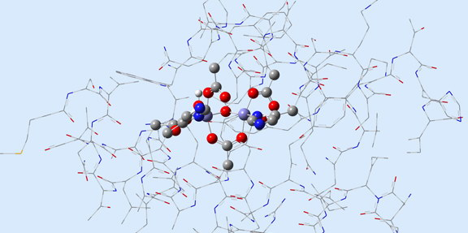

### 5. Gaussian 关键字列表

- Link 0 命令
- Force
- Polar
- #
- Freq
- Population
- ADMP
- G09Defaults
- Pressure
- BD
- Gen and GenECP
- Prop
- BOMD
- GenChk
- Pseudo
- CacheSize
- Geom
- Punch
- CASSCF
- GFInput
- QCI
- CBS 方法
- GFPrint
- Restart
- CBSExtrapolate
- Gn 方法
- SAC-CI
- CCD and CCSD
- Guess
- Scale
- Charge
- GVB
- Scan
- ChkBasis
- HF
- SCF
- CID and CISD
- Huckel
- SCRF
- CIS
- INDO
- 半经验方法
- CNDO
- Integral
- SP
- Complex
- IOp
- Sparse
- Constants
- IRC
- Stable
- Counterpoise
- IRCmax
- Symmetry
- CPHF
- LSDA
- TD
- Density
- MaxDisk
- Temperature
- DensityFit and NoDensityFit
- MINDO3
- Test
- DFT 方法
- MNDO
- TestMO
- DFTB and DFTBA
- MM 方法
- TrackIO
- EET
- MP 方法
- Transformation
- EOMCCSD
- Name
- Units
- EPT
- NMR
- Volume
- External
- ONIOM
- W1 方法
- ExtraBasis & ExtraDensityBasis
- Optimization
- Window 关键字与冻结核选项
- Field
- Output
- ZIndo
- FMM
- PBC

