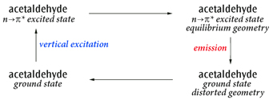

### 5.73 SCRF(自洽反应场)

该关键字要求在溶剂存在下进行计算,即将溶质置于溶剂反应场中的空穴内。极化连续介质模型(PCM)采用积分方程形式变体(IEFPCM),是默认的 SCRF 方法。该方法通过一组相互重叠的球体构造溶质空穴。它最初由 Tomasi 及其同事以及 Pascual-Ahuir 及其同事提出 [685–687],随后由 Tomasi、Barone 和 Mennucci 课题组以及 Gaussian, Inc. 的研究人员和合作者在 Gaussian 中进一步发展 [349, 352, 353, 360, 366, 367, 410, 688–702]。该模型对应 SCRF=PCM。综述见 [703]。Chipman 的模型 [704] 与该方法密切相关 [705]。Gaussian 还提供 Truhlar 及其合作者的 IEFPCM 变体 SMD 模型 [706],通过 SMD 选项调用。该模型是计算溶剂化自由能变化 ∆G 的推荐方法。其他可用模型包括:IPCM,使用静态等密度面构造空穴 [707];自洽等密度 PCM(SCIPCM)模型 [707];以及 Onsager 模型 [708–713],该模型将溶质置于溶剂反应场中的球形空穴内。在 Gaussian 16 中,我们采用连续面电荷形式,以保证反应场的连续性、光滑性和稳健性,并且反应场对原子位置和外部微扰场具有连续的导数 [701]。这是通过将溶质-溶剂界面上积累的表观面电荷展开为球形高斯函数实现的,这些高斯函数位于将空穴表面离散化后的每个表面单元上。通过对球面相交区域进行有效平滑,消除了表面导数的不连续性。该形式最初由 Karplus 和 York 于 1999 年针对导体屏蔽模型提出 [714],但长期未受到应有的关注。我们在 G09 中于 PCM 溶剂化方法家族的框架内对其进行了发展和推广,它是构造溶质空穴并计算反应场的默认方法。Gaussian 16 中的 PCM 方法包含一个外部迭代过程,程序通过该过程使溶剂反应场与溶质静电势自洽,从而计算溶液中的能量(溶质静电势由所用模型化学计算得到的电子密度生成)[715, 716]。与标准方法(基于变分方法或线性响应理论)的区别可以用 MP2 加以说明。默认流程先计算 SCF 密度上的溶剂效应,然后施加 MP2 微扰;而外部迭代方法则相对于 MP2 密度自洽地计算溶剂效应。尽管该技术主要用于研究激发态过程,例如

荧光,它也可用于具有梯度计算能力的理论方法的基态计算,例如后 SCF 方法。使用 ExternalIteration 选项来指定该方法。

溶剂化与激发态 在溶液中为激发态建模有两种基本方法:

- 计算溶剂环境中的最低激发态。该方法在普通激发态计算(如 TD 或 CIS)上添加 SCRF。该技术采用线性响应形式,在激发态方法方程中加入必要的项(从而包含溶剂对激发态的影响)[349, 698]。可以使用 CIS 或 TD 在溶液中优化特定激发态的几何结构 [717]。
- 单个激发态可以通过态特定方法建模。在这种情况下,程序使由激发态密度生成的静电势与溶剂反应场自洽,从而计算溶液中的能量 [715, 716],采用外部迭代技术。对于溶液中的激发态计算,需要区分平衡计算与非平衡计算。溶剂对溶质状态变化的响应分为两种:电子分布的极化,这是非常快的过程;以及溶剂分子的重新取向(例如转动),这是慢得多的过程。平衡计算描述溶剂已有足够时间完全响应溶质(两种方式均包括在内)的情形,例如几何优化(该过程与溶剂中分子运动处于同一时间尺度)。非平衡计算适用于溶剂来不及完全响应的快速过程,例如垂直电子激发。对于 CIS 和 TD-DFT 激发态几何优化,平衡溶剂化是默认设置。对于使用默认 PCM 流程的 CIS 和 TD-DFT 能量计算,非平衡是默认设置;而对于使用外部迭代方法的计算(SCRF=ExternalIteration),平衡是默认设置。关于计算非平衡外部迭代的示例,参见该方法的示例部分。对于溶液中的 EOM-CCSD 计算,可以使用 Cammi 和 Caricato 的溶剂化方法 [360, 366, 367]。PTED 方法可通过 PTED 选项使用。[360] 中讨论的其他方法也可通过 IOp(9/116) 使用。默认情况下,CASSCF PCM [695] 计算对应于相对于溶剂反应场/溶质电子密度极化过程的平衡计算。涉及两个不同电子态的非平衡溶质-溶剂相互作用(例如垂直跃迁的初态与终态)的计算,可以使用 NonEq=*type* PCM 关键字在两个独立的作业步骤中进行(参见 *Input* 部分中的 *PCM*)。

#### 5.73.1 输入

对于 PCM 计算(即默认的 SCRF=PCM 或 SCRF=CPCM),用于指定详细参数的关键字和选项可以放在一个额外的、以空行结束的输入段中,但前提是同时指定了 Read 选项。该段中的关键字遵循 Gaussian 的一般输入规则。可用关键字列于示例之后的单独小节中。对于 Onsager 模型(SCRF=Dipole),溶质半径(单位为埃)和溶剂介电常数以两个自由格式实数的形式从输入流中读取,二者位于同一行。合适的溶质半径可通过气相分子体积计算得到(在单独的作业步骤中进行);参见 Volume 关键字的说明。

对于 IPCM 和 SCIPCM 模型,输入包括一行指定溶剂的介电常数,以及一个可选的等密度值(后者的默认值为 0.0004)。

#### 5.73.2 选项

指定溶剂

**Solvent=_item_**

选择进行计算所用的溶剂。注意,对于不同的 SCRF 方法,也可以通过输入流以多种方式指定溶剂。若未指定,溶剂默认为水。*item* 为从本节末尾所列清单中选取的溶剂名称。

选择 SCRF 方法

**PCM**

进行积分方程形式模型(IEFPCM)的反应场计算。这是默认设置。与 Gaussian 03 相比,该形式和实现的部分细节已有改变,详见 [701]。IEFPCM 是 PCM 的同义词。当将 PCM 用于各向异性或离子溶剂时,必须使用 PCM 输入段中的项,并通过 Read 选项选择适用于这些溶剂类型的各向异性和离子介电模型。连续面电荷形式也不适用于此类溶剂,且无法计算其导数。

**CPCM**

使用 CPCM 极化导体计算模型 [410, 691] 进行 PCM 计算。

**Dipole**

进行 Onsager 模型反应场计算。

**IPCM**

进行 IPCM 模型反应场计算。Isodensity 是 IPCM 的同义词。

**SCIPCM**

进行 SCIPCM 模型反应场计算,即 SCRF 计算使用由等密度面自洽确定的空穴。

SMD 模型

**SMD**

使用 Truhlar 及其合作者的 SMD 溶剂化模型 [706] 的半径和非静电项进行 IEFPCM 计算。这是计算溶剂化自由能变化 ∆G 的推荐选择,其做法是对所研究体系分别进行气相计算和 SCRF=SMD 计算,然后取所得能量之差。通过 SCRF=Read 选项提供额外输入,可以定义用于 SMD 的新溶剂(详见“附加输入”)。

PCM 非平衡溶剂化

**NonEquilibrium=_action_**

保存或读取非平衡溶剂化数据。*action* 为以下之一:

- Save 或 Write:将慢速/惯性电荷保存到检查点文件中(随后可在后续非平衡溶剂化计算中从该文件读取)。
- Read 或 Load:读取慢速/惯性电荷,用于当前的非平衡溶剂化计算。
- CCSave 或 CCWrite:保存慢速/惯性关联电荷,用于后续的非平衡溶剂化耦合簇计算。
- CCRead 或 CCLoad:检索慢速/惯性关联电荷,用于当前的非平衡溶剂化耦合簇计算。

外部迭代 PCM

**ExternalIteration**

通过 Link 124 进行外部迭代,执行自洽 PCM 计算。该方法通过使溶质的静电势与溶剂反应场自洽来计算溶液中的能量 [715, 716]。ExternalIteration 仅适用于能量计算。SelfConsistent 和 SC 是该选项的同义词。

**1stVac**

在溶液中的外部迭代 PCM 计算中执行第一次迭代。1stVac 等同于 DoVacuum,后者现已弃用。

**1stPCM**

在溶液中的外部迭代 PCM 计算中不执行第一次迭代。1stPCM 等同于 SkipVacuum 和 NoVacuum,二者现已弃用。

**Restart**

从检查点文件重启 PCM 外部迭代计算。

IEFPCM 和 CPCM 的其他选项

**SolventAccessibleSurface**

对于 PCM,使用代表溶剂可及表面的空穴。仅适用于单点计算,但对于具有特殊空穴的情形很有用,例如含显式溶剂的分子动力学快照等。SCRF=SAS 是该选项的同义词。

**AsymmetricIEFPCM**

执行非对称各向同性 IEFPCM,而非默认的对称各向同性 IEFPCM。AsymmetricIEFPCM 是 Gaussian 09 中的默认设置。SCRF=AIEFPCM 是该选项的同义词。不适用于 CPCM。

**PTED**

使用微扰理论与密度方法(PTED)实现 PCM-CCSD 耦合 [360, 366],用于溶液中的 EOM-CCSD 计算。[360] 中讨论的其他方案可通过 IOp(9/116) 使用。

**CorrectedLinearResponse**

根据 [718] 对 CIS/RPA/TD-DFT SCRF 激发态的能量进行态特定修正。CorrectedLR 是该选项的同义词。

**Read**

表示应从输入流中读取一段单独的关键字和选项,用于提供计算参数。对于各向异性和离子溶剂,必须指定此选项。

**Checkpoint**

从检查点文件中检索 SCRF 信息。

**Modify**

从检查点文件中检索 SCRF 信息,并从输入流中读取修改内容。

**ONIOMPCM=_k_**

按照代码字母 *k* 所选的方案在溶液中执行 ONIOM 计算 [719, 720]。有效取值如下:

A:反应场使用集成的 ONIOM 密度自洽计算(仅适用于能量计算,且不适用于半经验方法)。B:对于低层级的真实体系计算反应场,并将相应的极化电荷作为外部电荷用于模型体系的子计算(仅适用于能量计算)。C:仅对低层级的真实体系计算反应场,而模型体系的子计算假定反应场为零(即气相)。该选项适用于能量、优化和频率计算。X:每个子计算都始终使用真实体系的空穴单独计算反应场。若同时指定 ONIOM 和 SCRF,则此为默认设置(适用于能量、优化和频率计算)。

**G09Defaults**

将 PCM 溶剂化的默认设置恢复为 Gaussian 09 所用的设置。

**G03Defaults**

修改 PCM 默认设置,以尽可能精确地重现 Gaussian 03 PCM 计算的结果。注意,由于程序的改进,并不总能做到完全一致。

Onsager(SCRF=Dipole)模型选项

**A0=_val_**

设置 route 段中溶质半径 *a* 0 的值(而不是从 SCRF=Dipole 计算的输入流中读取)。若包含此选项,则必须同时包含 Solvent 或 Dielectric。

**Dielectric=_val_**

设置溶剂介电常数的值。若同时指定了 Solvent 和 Dielectric,则 Dielectric 覆盖 Solvent。

IPCM 模型选项

**GradVne**

使用 Vne 盆地进行数值积分。

**GradRho**

使用密度盆地进行数值积分。若存在非核吸引子,作业可能失败。

SCIPCM 模型选项

**UseDensity**

强制在计算密度时使用密度矩阵。

**UseMOs**

强制在计算密度时使用分子轨道。

**GasCavity**

使用气相等密度面定义空穴,而非自洽求解该面。这主要是一个调试选项。

保存/读取 PCM 电荷

**SaveQ**

将 PCM 电荷写入检查点文件。SaveQ 可与 LoadQ 同时指定。WriteQ 是该选项的同义词。

**LoadQ**

读取检查点文件中的 PCM 电荷。注意,要使用保存的电荷,分子几何结构和空穴必须完全一致。SaveQ 可与 LoadQ 同时指定。ReadQ 是该选项的同义词。

生成 COSMO/RS 输入

**COSMORS**

生成 COSMO/RS 及其他程序所用的数据文件。

#### 5.73.3 可用性

下表列出了各种 SCRF=PCM 计算类型在不同理论方法下的可用性:

**MethodEnergy (Ext. Iter.)Energy Opt Freq 3rd Order Props** *a* **NMR**

MMnoyesyesyesnono AM1, PM3, PM3MM, PM6, PDDGnoyesyesyesnono HF, DFTyesyesyesyesyesyes yes *b* yes *b* yes *b* yes *b*,*c* yes *b* MP2yes yes *b* MP3, MP4(SDQ), CCSD, QCISDyesnononono yes *e* no CASSCFyesyesyesno yes *d* yes *d* noyes *d* CISyesno yes *d* yes *d* no TDyesyes *d* no ZIndonoyesnononono *a* 例如 Freq=Raman、ROA 或 VCD;*b* 通过 SCF MO 极化计算;*c* 拉曼强度通过数值方法计算(即与 Freq=NRaman 相同);*d* 使用线性响应方法;*e* 仅数值频率。

使用 PCM 溶剂化的 CASSCF 频率必须用 Freq=Numer 以数值方法计算。**重启 SCRF 计算。** SCRF=ExternalIteration 和 SCRF=IPCM 作业可通过 Restart 选项从读写文件重启。若 SCRF=SCIPCM 计算在 SCF 迭代过程中失败,应通过 SCF=Restart 关键字重启。**非默认方法。** IPCM 模型仅适用于 HF、DFT、MP2、MP3、MP4(SDQ)、QCISD、CCD、CCSD、CID 和 CISD 的能量计算。SCIPCM 模型适用于 HF 和 DFT 能量计算以及

优化和数值频率计算。Onsager(SCRF=Dipole)模型适用于 HF、DFT、MP2、MP3、MP4(SDQ)、QCISD、CCD、CCSD、CID 和 CISD 的能量计算,以及 HF 和 DFT 的优化与频率计算。但是,Opt Freq 关键字组合不能用于 SCRF=Dipole 计算。

#### 5.73.4 相关关键字

SCF、Volume

#### 5.73.5 示例

**PCM 能量。** 一般而言,默认 SCRF 方法的能量输出以常规方式出现在输出文件中。例如,以下为 Hartree-Fock 和 MP2 PCM 计算预测能量所在的输出文件部分:*Hartree-Fock SCRF 计算:*

**SCF Done:E(RHF) =-99.4687828290**`A.U. after8 cycles`

```
Convg=0.2586D-08-V/T=2.0015
```

*MP2 SCRF 计算:*

```
E2 = -0.1192799427D+00 EUMP2 = -0.99584491345297D+02
```

溶液中的预测能量包括所有已计算的修正(与 Gaussian 03 的输出不同)。使用各种 PCM 选项时,可能会出现额外的输出行。例如,以下输出由 HF SCRF=SMD 计算产生:

```
SCFDone:E(RHF)=-99.4687828290A.U.after8cycles
Convg=0.2586D-08-V/T=2.0015
SMD-CDS(non-electrostatic)energy(kcal/mol)=0.54
(includedintotalenergyabove)
```

对于外部迭代 SCRF 计算,最终能量由控制外部迭代的 Link 124 计算,并在单独的输出部分中报告,该部分将出现在输出文件的末尾附近,如以下示例所示:

```
--------------------------------------------------------------------
Self-consistentPCMresults
===========================
<psi(f)| H |psi(f)> (a.u.) = -99.577537 (A)
<psi(f)|H+V(f)/2|psi(f)> (a.u.) = -99.584002 (B)
(Polarized solute)-Solvent (kcal/mol) = -4.06 (C)
--------------------------------------------------------------------
Partitionoverspheres:
SphereonAtomSurfaceChargeGElGCavGDR
1H115.27-0.157-2.360.000.00
2F232.580.157-1.700.000.00
--------------------------------------------------------------------
```

*外部迭代和态特定 SCRF 计算的预测能量值*

```
AfterPCMcorrections,theenergyis-99.5840023899a.u.
```

```
--------------------------------------------------------------------
```

第 (A) 行报告使用极化溶质波函数和气相哈密顿量计算的能量,第 (B) 行报告使用极化溶质波函数和溶液中哈密顿量计算的能量,第 (C) 行报告极化溶质与溶剂之间的相互作用能,其对应于积分 < Ψ(*f*)|*V*(*f*)/2|Ψ(*f*) >(单位为 kcal/mol),最后一行报告包含所有 PCM 修正的预测能量。**荧光示例:乙醛第一激发态(*n* →π∗)的发射(荧光)**

这里研究的循环为:图 5.4:乙醛的激发与发射循环

主要关注的过程是发射,但本示例展示了如何研究包括溶剂效应在内的完整循环。**步骤 1:基态几何优化与频率(平衡溶剂化)。** 这是包含 PCM 平衡溶剂化的基态标准 Opt Freq 计算。

```
%chk=01-ac
#B3LYP/6-31+G(d,p)OptFreqSCRF=(Solvent=Ethanol)
Acetaldehydegroundstate
01
C
C,1,RA
X,2,1.,1,A
O,2,RB,3,A,1,180.,0
X,1,1.,2,90.,3,0.,0
H,1,R1,2,A1,5,0.,0
H,1,R23,2,A23,5,B23,0
H,1,R23,2,A23,5,-B23,0
H,2,R4,1,A4,3,180.,0
RA=1.53643
RB=1.21718
R1=1.08516
R23=1.08688
R4=1.10433
```



```
A=62.1511
A1=110.51212
A23=109.88119
A4=114.26114
B23=120.56468
```

以下为溶液中基态优化几何结构的能量:

```
SCFDone:E(RB3LYP)=-153.851761719A.U.after1cycles
```

**步骤 2:使用线性响应溶剂化计算垂直激发。** 这是在基态平衡几何结构下进行的垂直激发 TD-DFT 计算,溶剂化采用默认的线性响应、非平衡方式。我们进行单点 TD-DFT 计算,其默认采用非平衡溶剂化。该作业的结果将用于确定感兴趣的态及其顺序。这些结果较合理地描述了激发态的溶剂化,但不如态特定溶剂化计算的结果精确。在本例中,我们看到 *n* →π∗ 态是第一激发态。接下来,我们将使用态特定方法,以更好地描述垂直激发步骤。

```
%oldchk=01-ac
%chk=02-ac
#B3LYP/6-31+G(d,p)TD=NStates=6SCRF=(Solvent=Ethanol)Geom=CheckGuess=Read
Acetaldehyde:linearresponseverticalexcitedstates
01
```

非平衡溶剂化线性响应计算得到的到第一激发态的垂直激发(吸收):

```
ExcitedState1:Singlet-A"4.3767eV283.28nmf=0.0000<S**2>=0.000
```

因此,基态到第一激发态的吸收位于 283.28 nm,由线性响应方法计算得到。**步骤 3:垂直激发的态特定溶剂化。** 这需要两个作业步骤:首先进行基态计算,并指定 NonEquilibrium=Save 选项,以基于基态保存非平衡溶剂化的信息。其次,进行实际的态特定计算,使用 NonEquilibrium=Read 选项读取所需的非平衡溶剂化信息,并指定步骤 1 中的检查点文件:

```
%oldchk=01-ac
%chk=03-ac
#B3LYP/6-31+G(d,p)SCRF=(Solvent=Ethanol,NonEquilibrium=Save)
Geom=CheckGuess=Read
Acetaldehyde:prepareforstate-specificnon-eqsolvation
bysavingthesolventreactionfieldfromthegroundstate
01
--link1--
%chk=03-ac
```

```
#B3LYP/6-31+G(d,p)TD(NStates=6,Root=1)Geom=CheckGuess=Read
SCRF=(Solvent=Ethanol,ExternalIteration,NonEquilibrium=Read)
Acetaldehyde:readnon-eqsolvationfromgroundstateand
computeenergyofthefirstexcitedwiththestate-specificmethod
01
```

以下为非平衡溶剂化态特定计算得到的第一激发态能量(位于基态优化几何结构处):

```
AfterPCMcorrections,theenergyis-153.687679826a.u.
```

将该能量减去步骤 1 得到的基态能量,即可得到包含态特定溶剂化修正的基态到第一激发态吸收,位于 277.69 nm。**步骤 4:激发态几何结构的弛豫。** 接下来,我们使用平衡线性响应溶剂化进行 TD-DFT 几何优化,以找到激发态势能面上的最低能量点。由于这是 TD-DFT 优化,程序默认采用平衡溶剂化。与此类情形的典型情况一样,该分子在基态时具有一个对称面,但在激发态时对称性被破坏,因此在优化开始时对基态几何结构进行微小扰动以破坏对称性。我们从步骤 2 的检查点文件中获取几何结构及其他数据:

```
%oldchk=02-ac
%chk=04-ac
#B3LYP/6-31+G(d,p)TD=(Read,NStates=6,Root=1)SCRF=(Solvent=Ethanol)
Geom=ModifyGuess=ReadOpt
Acetaldehyde:excitedstateopt
ModifygeometrytobreakCssymmetry
sincefirstexcitedstateisA"
01
412310.0
5127-50.0
```

以下为溶液中第一激发态几何优化后的结果(平衡几何结构):

```
ExcitedState1:Singlet-A3.2074eV386.55nmf=0.0013<S**2>=0.0
Thisstateforoptimizationand/orsecond-ordercorrection.
TotalEnergy,E(TD-HF/TD-KS)=-153.705918726
```

**步骤 5:激发态结构的振动频率。** 现在我们运行频率计算,以验证步骤 4 中得到的几何结构是否为极小点。如有需要,结果还可用于 Franck-Condon 计算的一部分。这是一个数值频率计算。

```
%oldchk=04-ac
%chk=05-ac
#B3LYP/6-31+G(d,p)TD=(Read,NStates=6,Root=1)Freq
SCRF=(Solvent=Ethanol)Geom=CheckGuess=Read
```

```
Acetaldehydeexcitedstatefreq
01
```

该频率计算用于确认步骤 4 中优化得到的几何结构是激发态势能面上的极小点。**步骤 6:发射态的态特定溶剂化(第 1 部分)。** 该步骤在激发态的平衡几何结构处进行激发态的态特定平衡溶剂化,并通过 NonEquilibrium=Save 选项输出供下一步使用的溶剂化数据。

```
%oldchk=05-ac
%chk=06-ac
#B3LYP/6-31+G(d,p)TD=(Read,NStates=6,Root=1)Geom=CheckGuess=Read
SCRF=(Solvent=Ethanol,ExternalIteration,NonEquilibrium=Save)
Acetaldehydeemissionstate-specificsolvation
atfirstexcitedstateoptimizedgeometry
01
```

以下为平衡溶剂化态特定计算得到的第一激发态能量(位于其优化几何结构处):

```
AfterPCMcorrections,theenergyis-153.707148980a.u.
```

**步骤 7:发射至最终基态(第 2 部分)。** 最后,我们计算基态的能量,采用非平衡溶剂化,几何结构取激发态几何结构,并使用来自激发态的静态溶剂化。

```
%oldchk=06-ac
%chk=07-ac
#B3LYP/6-31+G(d,p)SCRF=(Solvent=Ethanol,NonEquilibrium=Read)
Geom=CheckGuess=Read
Acetaldehyde:groundstatenon-equilibrium
atexcitedstategeometry.
01
```

以下为溶液中非平衡溶剂化计算得到的基态能量,使用第一激发态优化几何结构以及与第一激发态密度处于平衡的溶剂反应场:

```
SCFDone:E(RB3LYP)=-153.822024722A.U.after10cycles
```

步骤 6 与步骤 7 的能量之差即为垂直发射能量。在本例中,包含态特定溶剂化修正的第一激发态到基态发射位于 396.63 nm。步骤 1、2 和 4 足以计算气相中的激发能和发射能(步骤 5 用于确认驻点的性质)。但当包含溶剂效应时,它们并不足够,因为步骤 4 中计算的能量对应于基态溶剂反应场,而发射过程发生在为响应激发态电荷分布而产生的反应场中。步骤 6 和 7 正确地考虑了这一点。

如需计算谱带形状,在气相中可以直接运行一个计算,使用 Freq=(ReadFC,FC,Emission),将步骤 1 的检查点文件作为作业的主检查点文件,并在输入流中提供步骤 5 检查点文件的名称以指定另一个态。对于溶液中的谱带形状,必须使用步骤 1 和步骤 5 的检查点文件,执行 Freq=(ReadFC,FC,Emission,ReadFCHT),同时在 Franck-Condon 计算的输入段中提供态特定发射能量。

#### 5.73.6 附加输入

PCM SCRF 计算(包括使用 SMD 模型的计算)可以指定附加输入关键字。请注意,许多可用参数是为专家用户设计的;对于生产计算,强烈不建议尝试修改标准设置。这些关键字放在单独的输入段中,并像往常一样以空行结束,如下例所示,该例收紧了计算 PCM 极化电荷的迭代收敛阈值,并设置了空穴球半径的静电缩放因子:

```
#B3LYP/6-31G(d)5DSCRF(Solvent=Ethanol,Read)
PCMextrainputexample.
01
```

*分子规格*

`QConv=10` *PCM 关键字输入段*

```
Alpha=1.1
```

*空行结束 PCM 输入*

PCM 输入段像往常一样以空行结束。用于控制 PCM 计算的可用关键字按相关项分组列于下方。

定义溶剂参数 PCM 计算的溶剂通常使用 SCRF 的常规 Solvent 选项指定。您可以使用以下关键字覆盖某些已知溶剂的默认值。

Eps=*x* 指定溶剂的静态(零频率)介电常数。EpsInf=*x* 指定溶剂的动态(光学)介电常数。对于 SMD 计算,应将其设置为溶剂在 293 K 下折射率的平方。RSolv=*x* 指定溶剂半径(单位为埃)。仅在使用 AddSph 或 Surface=SAS 时有效。

未指定的参数默认取通过 Solvent 选项指定的溶剂对应的值(若省略该选项,则默认为水)。

定义 SMD 计算所用的溶剂:SMD 方法所需定义溶剂的各项与其他方法不同。下面是一个 SMD 计算示例,它通过 PCM 输入段手动定义乙醇。注意最后五项是 SMD 特有的关键字。注意全部 7 项都是必需的,且所有数值都必须指定为实数。这些参数的完整细节见 [706]。截至本文撰写时,*Minnesota Solvent Descriptor Database* 中绝大多数溶剂已定义了溶剂关键字(见“溶剂”)。

```
#B3LYP/6-31G(d)5DSCRF(SMD,Solvent=Generic,Read)
Waterinsolutionwithethanol,definedasgenericSMDsolvent.
01
O
H,1,0.94
H,1,0.94,2,104.5
```

*PCM 关键字输入段* `Eps=24.852` ε *n* 2`EpsInf=1.852593` `HbondAcidity=0.37` α β`HbondBasicity=0.48` `SurfaceTensionAtInterface=31.62` γ `CarbonAromaticity=0.`ϕ `ElectronegativeHalogenicity=0.`ψ *空行表示 PCM 输入结束*

计算方法变体

NonEq=*item* 在使用 SCRF(Read) 完成 HF、DFT 或 CASSCF 计算之后,或在任何 SCRF(ExternalIteration,Read) 计算结束时,计算并保存非平衡反应场。NonEq=Write 表示将数据保存到检查点文件中。在后续计算中使用 NonEq=Read 从检查点文件中读取。Dis 使用 Floris 和 Tomasi 的模型 [721, 722] 计算溶质-溶剂色散相互作用能,并将其计入总能量。默认为 NoDis。该选项不能用于 SCRF=SMD 计算。Rep 使用 Floris 和 Tomasi 的模型 [721, 722] 将溶质-溶剂排斥相互作用能计入总能量。默认为 NoRep。该选项不能用于 SCRF=SMD 计算。Cav 使用 Pierotti 的模型 [723] 将溶质空穴形成能计入总能量。默认为 NoCav。该选项不能用于 SCRF=SMD 计算。

CavityFieldEffects 使用 Cammi 及其合作者的模型 [724] 将腔-场相互作用能(也称局域场效应)计入总能量。默认不包含该效应。CF=Eps=*x* 为腔-场能量贡献指定不同的静态介电常数,可用于调节腔-场效应的大小。CF=EpsInf=*x* 为腔-场能量贡献指定不同的动态(光学)介电常数,可用于调节腔-场效应的大小。FitPot 对溶质-溶剂相互作用能进行分析,将其表示为原子或原子基团的加和贡献。该分析包括将原子电荷拟合到溶液中的分子静电势。Iterative 通过迭代方法求解 PCM 静电问题以计算极化电荷。MxIter=*N* 指定静电问题迭代求解允许的最大迭代次数。默认为 400。QConv=*type*|*N* 将 PCM 极化电荷迭代计算的收敛阈值设为 10−*N*,或设为以下预定义类型之一:VeryTight(10−12)、Tight(10−9)和 Sleazy(10−6)。默认为 QConv=Tight。SC=QConv=*x* 指定外部迭代过程中 PCM 极化电荷的收敛标准。MaxExtIt=*x* 指定外部迭代过程中允许的最大迭代次数。

各向异性和离子溶剂

Anisotropic 按照 IEFPCM 形式体系对各向异性溶剂进行 PCM 计算。介电常数的三阶对称张量必须通过以下六个附加关键字指定:EPSX、EPSY、EPSZ、EUPHI、EUTHE 和 EUPSI(它们都接受一个参数,例如 EPSX=*value*)。Ionic 按照 IEFPCM 形式体系对离子溶液进行 PCM 计算。离子强度(单位 mol/dm3)需作为关键字 DISM 的值指定。

指定分子空穴

默认情况下,程序使用 UFF 半径构建空穴,即在每个溶质原子周围放置一个球,球半径乘以 1.1 的缩放因子。此外还提供三种联合原子(UA)模型。空穴可以在 PCM 输入段中进行大幅修改:更改球参数和空穴的总体拓扑结构,在默认构建的空穴上添加额外的球等。用户也可以在输入段中直接提供完整的分子空穴。

**Radii=_model_** : 指定拓扑模型和/或所用的原子半径集。可用的模型和集合为:

- UFF: 使用 UFF 力场的半径。氢原子具有各自独立的球(显式氢)。

这是默认值。

- UA0: 对重原子的 UFF 力场原子半径应用联合原子拓扑模型。氢原子包含在与其成键的重原子的球内。这是 Gaussian 03 中的默认值。
- UAHF: 对针对 HF/6-31G(d) 理论水平优化的半径应用联合原子拓扑模型。
- UAKS: 对针对 PBE1PBE/6-31G(d) 理论水平优化的半径应用联合原子拓扑模型。
- Pauling: 使用 Pauling(实际上是 Merz-Kollman)原子半径(使用显式氢)。
- Bondi: 使用 Bondi 原子半径(使用显式氢)。

**Surface=_type_** : 指定表示溶质-溶剂边界的分子表面类型。可用选项为:

- VDW: 范德华表面。使用(缩放后的)原子半径,并跳过生成用于平滑表面的"附加球"。这是默认值。
- SES: 溶剂排除表面(Solvent Excluding Surface)。表面由原子或基团球以及为平滑表面而自动生成的球("附加球")生成。这是 Gaussian 03 中的默认值。
- SAS: 溶剂可及表面(Solvent Accessible Surface)。溶剂半径被加到原子和/或原子基团未缩放的半径上。

**ModifySph** : 修改一个或多个球的参数。被修改的球可在该关键字之后的 PCM 输入行中指定,格式为:*atom radius [alpha]*,其中 *atom* 为原子序号或元素类型。

**ExtraSph=_N_** : 向空穴中添加 *N* 个用户定义的球。球的参数可在该关键字之后的行中指定,格式为:*X Y Z radius [alpha]*,其中 *X*、*Y*、*Z* 为标准取向下的笛卡尔坐标。

**NSph=_N_** : 空穴仅由用户提供的 *N* 个球构建,球在随后的行中按以下格式指定:*atom_number radius [alpha]* **– 或 –** *X Y Z radius [alpha]*,其中 *X*、*Y*、*Z* 为标准取向下的笛卡尔坐标。按原子序号指定球可模拟标准空穴行为,而按笛卡尔坐标指定则产生一个不随结构移动的固定空穴。

**PDens=_x_** 设置表面上积分点的平均密度,单位为 Å⁻²。默认值为 5.0。增大该值可使表面离散化更精细。

**Alpha=_scale_** 指定静电缩放因子,球半径乘以该因子。默认值为 1.1。

**SphereOnH=_N_** 使用联合原子拓扑模型时,在原子列表中第 *N* 个位置的氢原子上放置一个独立的球。

**SphereOnAcidicHydrogens** 使用联合原子拓扑模型时,在酸性氢原子(与 N、O、S、P、Cl 和 F 原子成键的氢)上放置独立的球。

**OFac=_x_** 指定 SES 附加球的两个相互嵌套的球之间的重叠指数 *Pascual-Ahuir94*。减小该指数会使附加球数量减少。默认值为 0.89。

**RMin=_x_** 设置 SES 附加球的最小半径(单位为埃)。增大该值会使附加球数量减少。默认值为 0.2。

**GeomView** 生成描述空穴的文件 *points.off*。该文件包含 *GeomView* 程序(见 `www.geomview.org`)的输入,可用于可视化分子空穴。

#### 5.73.7 溶剂

以下溶剂关键字可与 SCRF=Solvent 选项一同使用。此处列出 ε 值仅为方便起见,但请注意它只是定义溶剂所用的众多内部参数之一。因此,仅修改 ε 值并不能正确定义新溶剂。

- Water: ε=78.3553
- 2-Heptanone: ε=11.658
- HexanoicAcid: ε=2.6
- Acetonitrile: ε=35.688
- 2-Hexanone: ε=14.136
- IodoBenzene: ε=4.5470
- Methanol: ε=32.613
- 2-MethoxyEthanol: ε=17.2
- IodoEthane: ε=7.6177
- Ethanol: ε=24.852
- 2-Methyl-1-Propanol: ε=16.777
- IodoMethane: ε=6.8650
- IsoQuinoline: ε=11.00
- 2-Methyl-2-Propanol: ε=12.47
- IsoPropylBenzene: ε=2.3712
- Quinoline: ε=9.16
- 2-MethylPentane: ε=1.89
- m-Cresol: ε=12.44
- Chloroform: ε=4.7113
- 2-MethylPyridine: ε=9.9533
- Mesitylene: ε=2.2650
- DiethylEther: ε=4.2400
- 2-NitroPropane: ε=25.654
- MethylBenzoate: ε=6.7367
- Dichloromethane: ε=8.93
- 2-Octanone: ε=9.4678
- MethylButanoate: ε=5.5607
- DiChloroEthane: ε=10.125
- 2-Pentanone: ε=15.200
- MethylCycloHexane: ε=2.024
- CarbonTetraChloride: ε=2.2280
- 2-Propanol: ε=19.264
- MethylEthanoate: ε=6.8615
- Benzene: ε=2.2706
- 2-Propen-1-ol: ε=19.011
- MethylMethanoate: ε=8.8377
- Toluene: ε=2.3741
- 3-MethylPyridine: ε=11.645
- MethylPropanoate: ε=6.0777
- ChloroBenzene: ε=5.6968
- 3-Pentanone: ε=16.78
- m-Xylene: ε=2.3478
- NitroMethane: ε=36.562
- 4-Heptanone: ε=12.257
- n-ButylBenzene: ε=2.36
- Heptane: ε=1.9113
- 4-Methyl-2-Pentanone: ε=12.887
- n-Decane: ε=1.9846
- CycloHexane: ε=2.0165
- 4-MethylPyridine: ε=11.957
- n-Dodecane: ε=2.0060
- Aniline: ε=6.8882
- 5-Nonanone: ε=10.6
- n-Hexadecane: ε=2.0402
- Acetone: ε=20.493
- AceticAcid: ε=6.2528
- n-Hexane: ε=1.8819
- TetraHydroFuran: ε=7.4257
- AcetoPhenone: ε=17.44
- NitroBenzene: ε=34.809
- DiMethylSulfoxide: ε=46.826
- a-ChloroToluene: ε=6.7175
- NitroEthane: ε=28.29
- Argon: ε=1.430
- Anisole: ε=4.2247
- n-MethylAniline: ε=5.9600
- Krypton: ε=1.519
- Benzaldehyde: ε=18.220
- n-MethylFormamide-mixture: ε=181.56
- Xenon: ε=1.706
- BenzoNitrile: ε=25.592
- n,n-DiMethylAcetamide: ε=37.781
- n-Octanol: ε=9.8629
- BenzylAlcohol: ε=12.457
- n,n-DiMethylFormamide: ε=37.219
- 1,1,1-TriChloroEthane: ε=7.0826
- BromoBenzene: ε=5.3954
- n-Nonane: ε=1.9605
- 1,1,2-TriChloroEthane: ε=7.1937
- BromoEthane: ε=9.01
- n-Octane: ε=1.9406
- 1,2,4-TriMethylBenzene: ε=2.3653
- Bromoform: ε=4.2488
- n-Pentadecane: ε=2.0333
- 1,2-DiBromoEthane: ε=4.9313
- Butanal: ε=13.45
- n-Pentane: ε=1.8371
- 1,2-EthaneDiol: ε=40.245
- ButanoicAcid: ε=2.9931
- n-Undecane: ε=1.9910
- 1,4-Dioxane: ε=2.2099
- Butanone: ε=18.246
- o-ChloroToluene: ε=4.6331
- 1-Bromo-2-MethylPropane: ε=7.7792
- ButanoNitrile: ε=24.291
- o-Cresol: ε=6.76
- 1-BromoOctane: ε=5.0244
- ButylAmine: ε=4.6178
- o-DiChloroBenzene: ε=9.9949
- 1-BromoPentane: ε=6.269
- ButylEthanoate: ε=4.9941
- o-NitroToluene: ε=25.669
- 1-BromoPropane: ε=8.0496
- CarbonDiSulfide: ε=2.6105
- o-Xylene: ε=2.5454
- 1-Butanol: ε=17.332
- Cis-1,2-DiMethylCycloHexane: ε=2.06
- Pentanal: ε=10.0
- 1-ChloroHexane: ε=5.9491
- Cis-Decalin: ε=2.2139
- PentanoicAcid: ε=2.6924
- 1-ChloroPentane: ε=6.5022
- CycloHexanone: ε=15.619
- PentylAmine: ε=4.2010
- 1-ChloroPropane: ε=8.3548
- CycloPentane: ε=1.9608
- PentylEthanoate: ε=4.7297
- 1-Decanol: ε=7.5305
- CycloPentanol: ε=16.989
- PerFluoroBenzene: ε=2.029
- 1-FluoroOctane: ε=3.89
- CycloPentanone: ε=13.58
- p-IsoPropylToluene: ε=2.2322
- 1-Heptanol: ε=11.321
- Decalin-mixture: ε=2.196
- Propanal: ε=18.5
- 1-Hexanol: ε=12.51
- DiBromomEthane: ε=7.2273
- PropanoicAcid: ε=3.44
- 1-Hexene: ε=2.0717
- DiButylEther: ε=3.0473
- PropanoNitrile: ε=29.324
- 1-Hexyne: ε=2.615
- DiEthylAmine: ε=3.5766
- PropylAmine: ε=4.9912
- 1-IodoButane: ε=6.173
- DiEthylSulfide: ε=5.723
- PropylEthanoate: ε=5.5205
- 1-IodoHexaDecane: ε=3.5338
- DiIodoMethane: ε=5.32
- p-Xylene: ε=2.2705
- 1-IodoPentane: ε=5.6973
- DiIsoPropylEther: ε=3.38
- Pyridine: ε=12.978
- 1-IodoPropane: ε=6.9626
- DiMethylDiSulfide: ε=9.6
- sec-ButylBenzene: ε=2.3446
- 1-NitroPropane: ε=23.73
- DiPhenylEther: ε=3.73
- tert-ButylBenzene: ε=2.3447
- 1-Nonanol: ε=8.5991
- DiPropylAmine: ε=2.9112
- TetraChloroEthene: ε=2.268
- 1-Pentanol: ε=15.13
- e-1,2-DiChloroEthene: ε=2.14
- TetraHydroThiophene-s,s-dioxide: ε=43.962
- 1-Pentene: ε=1.9905
- e-2-Pentene: ε=2.051
- Tetralin: ε=2.771
- 1-Propanol: ε=20.524
- EthaneThiol: ε=6.667
- Thiophene: ε=2.7270
- 2,2,2-TriFluoroEthanol: ε=26.726
- EthylBenzene: ε=2.4339
- Thiophenol: ε=4.2728
- 2,2,4-TriMethylPentane: ε=1.9358
- EthylEthanoate: ε=5.9867
- trans-Decalin: ε=2.1781
- 2,4-DiMethylPentane: ε=1.8939
- EthylMethanoate: ε=8.3310
- TriButylPhosphate: ε=8.1781
- 2,4-DiMethylPyridine: ε=9.4176
- EthylPhenylEther: ε=4.1797
- TriChloroEthene: ε=3.422
- 2,6-DiMethylPyridine: ε=7.1735
- FluoroBenzene: ε=5.42
- TriEthylAmine: ε=2.3832
- 2-BromoPropane: ε=9.3610
- Formamide: ε=108.94
- Xylene-mixture: ε=2.3879
- 2-Butanol: ε=15.944
- FormicAcid: ε=51.1
- z-1,2-DiChloroEthene: ε=9.2
- 2-ChloroButane: ε=8.3930
